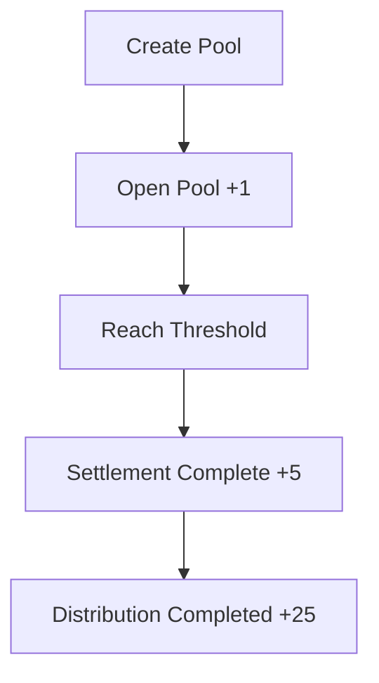
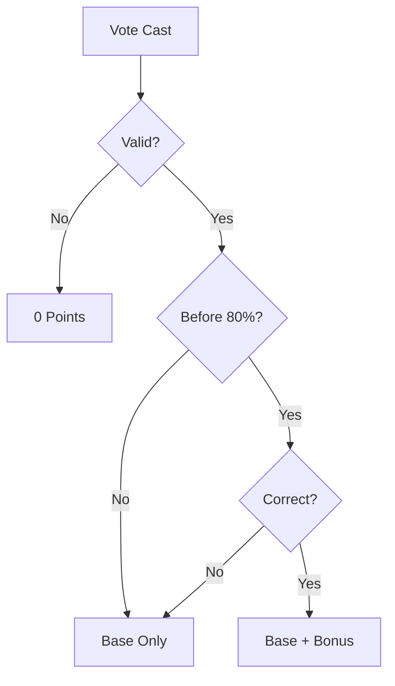
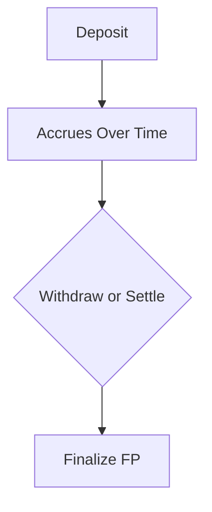
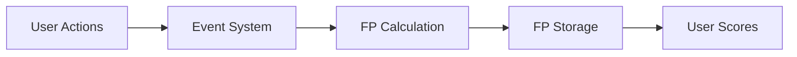

# 🐟 Fish Points (Unredeemable Template)
### Reputation System for Fish Pools

---

## Overview

Fish Points (FP) is a **non-transferable reputation system** designed to measure how users contribute to Fish Pools.

It answers a simple question:

> *How valuable is this participant to the network—based on what they commit and how they behave?*

Fish Points are:
- non-transferable  
- non-financial  
- wallet-based  
- earned through real actions  

They are not tokens or rewards.  
They are a **reputation layer**.

---

## Core Concept

Fish Points combine two signals:

```math
FP_{total} = FP_{capital} + FP_{participation} 
````

* **FP(capital)** → economic commitment
* **FP(participation)** → behavior and outcomes
---

## System Scope

### Included

* Fish Pools only
* Organizer + Fish roles
* Capital-based scoring
* Participation-based scoring
* Event-driven architecture

### Not Included

* Tokenization or transferability
* Advanced identity systems
* Multi-role hierarchies
* External reward systems

---

## Roles

### Organizer

* Creates and manages Pools
* Earns reputation via lifecycle milestones

### Fish

* Joins Pools
* Contributes capital
* Votes on proposals

---

## Pool Lifecycle


Reputation is tied to **real lifecycle milestones**, not abstract activity.

---

## Organizer Reputation

| Action             | Points |
| ------------------ | ------ |
| Open Pool          | +1     |
| Successful Close   | +5     |
| First Distribution | +25    |

### Logic



### Key Idea

* Open = intent
* Close = execution
* Distribution = **real outcome**

---

## Participation (Voting)

### Rules

* One vote per user per Pool
* Votes can be updated
* Only final vote counts

---

### Scoring Formula

```math
FP_{vote} = (1 + AccuracyBonus) \times TimingMultiplier
```

### Constants

* Base = 1
* Accuracy Bonus = 2

---

### Timing Multipliers

| Timing            | Multiplier |
| ----------------- | ---------- |
| Early (0–33%)     | 1.5×       |
| Standard (33–80%) | 1.0×       |
| Late (80–100%)    | 0.75×      |

---

### Accuracy Rules

Accuracy bonus applies only if:

* Pool reaches **settled**
* Vote matches outcome
* Vote is before final 20%

---

### Voting Flow



---

## Capital Reputation

### Formula

```math
FP_{capital} = Deposit \times \frac{days\_held}{30}
```

---

### Behavior

* Larger deposits → more points
* Longer duration → more points
* Stops accruing at:

  * withdrawal
  * OR settlement

---

### Capital Flow



---

## Anti-Gaming Rules

### Organizer

* 14-day cooldown between pools
* Max 3 active pools
* Must meet setup requirements

### Fish

* Wallet must be verified
* Must join before voting starts
* Only final vote counts

### No Slashing

* No penalties in v1
* Positive reputation only

---

## Score Types

### Lifetime Score

* Total accumulated reputation

### Rolling Score (180 days)

* Recent activity signal

---

## System Architecture



Events include:

* pool_opened
* pool_settled
* distribution_completed
* vote_finalized
* capital_withdrawn

---

## Design Philosophy

Fish Points are designed to:

* reward **outcomes over activity**
* reward **quality over quantity**
* reward **early conviction over late consensus**
* separate **capital from behavior**

---

## What This Is

* Reputation system
* Coordination layer
* Trust signal

## What This Is Not

* Token
* Financial reward
* Tradable asset

---

## Summary

Fish Points (Unredeemable) provides a **simple but powerful reputation system** for Fish Pools.

It combines:

* capital commitment
* participation quality
* execution outcomes

into a single, interpretable signal.

---

## Future Compatibility

This system is designed to expand into:

* richer identity systems
* additional roles
* more advanced scoring layers

Without changing its core structure.

---


