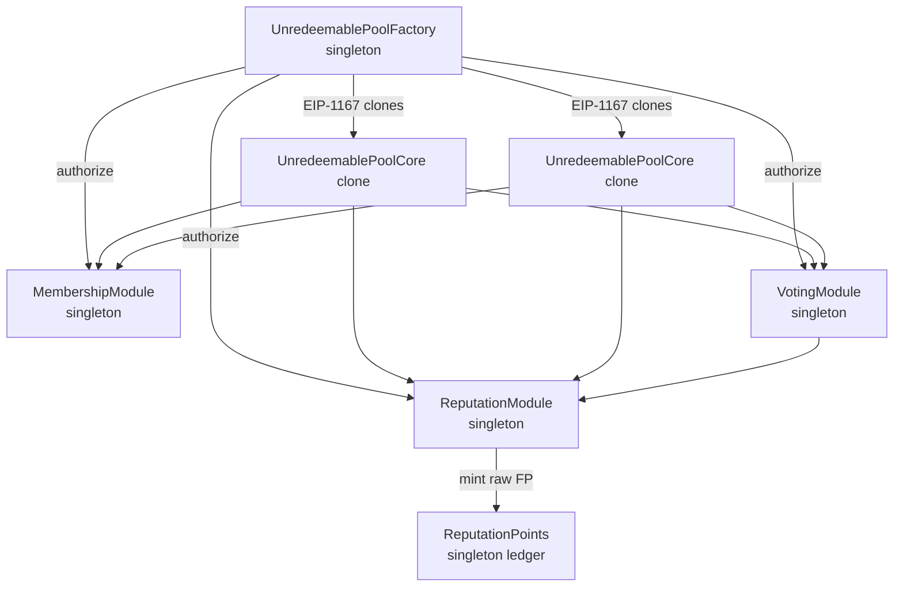
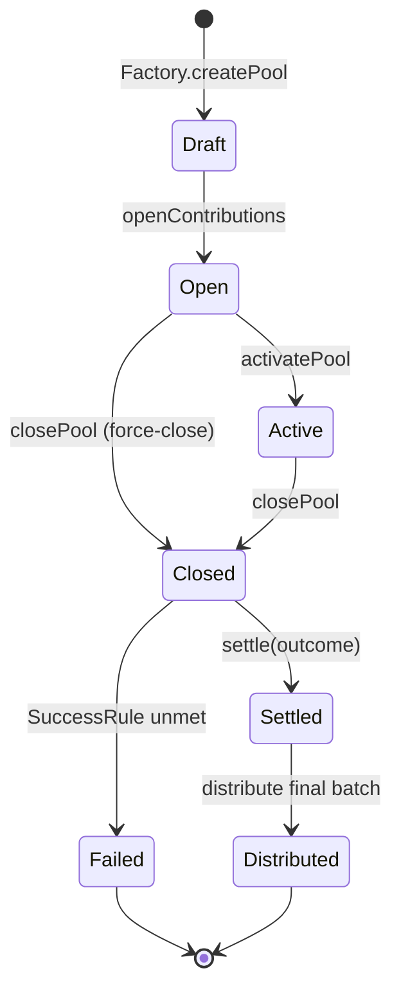
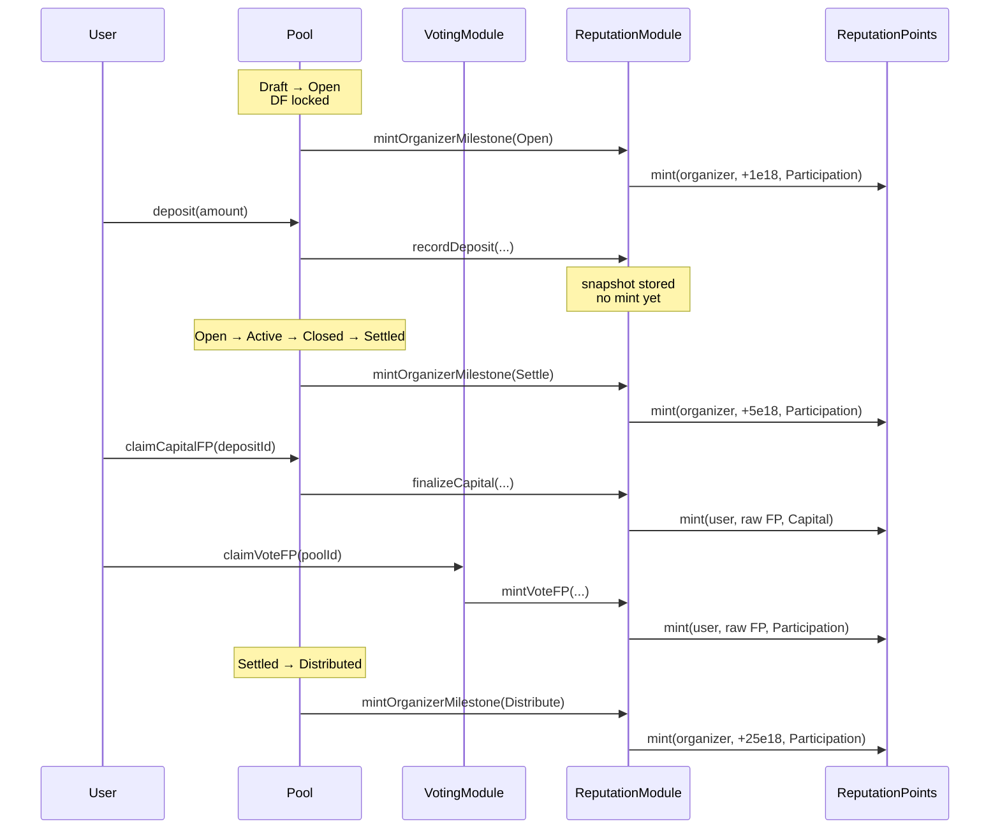
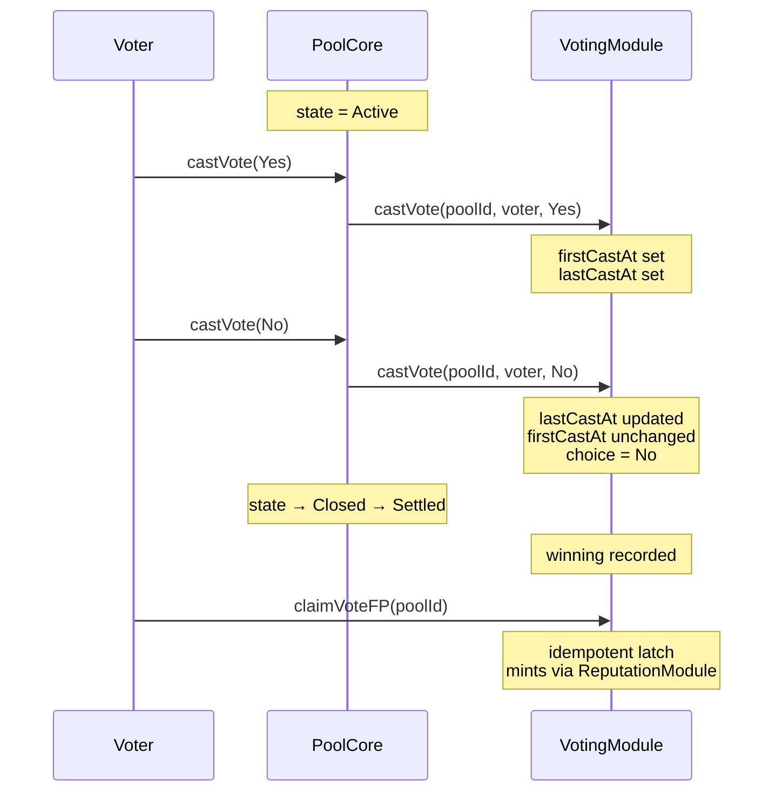
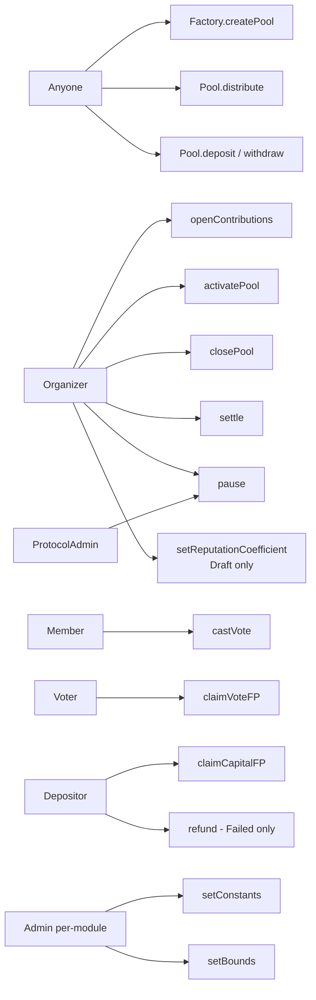

# Fish Network Protocol

Open-source smart-contract suite for **reputation-driven capital pooling**. Anyone can spin up an unredeemable pool, accept deposits, run a binary outcome vote, distribute pro-rata, and accrue non-transferable reputation (Fish Points) for participants — without depending on any toolchain or external library.

This repository contains the Solidity source files only. No npm, no Foundry, no Hardhat. Import the `.sol` files into your own dev environment (Remix, Foundry, Hardhat) to deploy.

# Reputation-based Capital Pooling

Community-driven investing faltered not because blockchain failed to deliver on its trust-less nature. It faltered because there was missing trust infrastructure amongst the humans using the blockchain.

Dating back to 2021, investor groups used NFTs to track membership, and ERC-20 to track financial units. It was a seemingly complete solution at the time; infrastructure was cheap to use, and many Venture DAO experiments proliferated with small amounts of capital. The average size of these pooled investment clubs was ~$1000 total. Why?

Because even though the infrastructure was scalable, investor trust was not accounted for, and therefore capital did not scale with the system itself. Outside of crypto, private markets scale because investors trust the system. They trust lawyers, and well-understood, widely adopted financial frameworks that most people simply accept via herd mentality. Even though investor trust is technically a non-financial asset attributable to both individuals and institutions, we believe it impacts just about every single private market transaction.

This led us to believe there was a missing primitive - until now.

# Introducing Fish Pools

A Fish Pool is the basic, minimal capital pooling smart contract unit designed to support a single off-chain asset. This enables private investor groups to leverage the primitive for their own deals, while maintaining 100% control. It also enables smaller individual investors to get exposure to asset classes they would otherwise be locked out of. Furthermore, the open source version of a Fish Pool provides the lowest cost infrastructure for people to pool and distribute capital together for any use case outside financial services.

# Introducing Fish Points

Fish Network introduces a new standard to track investor reputation and track record on-chain. This is a delibrate attempt to codify and standardize an abstract, non-financial metric. Even though investor trust is a simple concept in theory, and well-understood by the market, there is no agreed-upon mechanism today to evaluate, reward, track, or record investor trust in a distributed and determinstic way. Fish Protocol attempts to standardize the approach to investor reputation, so that reputation can scale with capital and vice versa.

## Documentation map

| Audience | Read |
|---|---|
| Concept overview | [docs/fish-protocol/FishNetwork-README.md](docs/fish-protocol/FishNetwork-README.md), [docs/fish-protocol/FishNetwork-Protocol.md](docs/fish-protocol/FishNetwork-Protocol.md) |
| Pools detail | [docs/fish-protocol/FishNetwork-Pools.md](docs/fish-protocol/FishNetwork-Pools.md) |
| Fish Points (reputation) | [docs/fish-points/FishPoints-Overview.md](docs/fish-points/FishPoints-Overview.md), [docs/fish-points/FishPoints-Details.md](docs/fish-points/FishPoints-Details.md), [docs/fish-points/FishPoints-Examples.md](docs/fish-points/FishPoints-Examples.md) |
| Developer integration | [docs/fish-points/FishPoints-DeveloperDocs.md](docs/fish-points/FishPoints-DeveloperDocs.md) |
| Legal positioning (Points) | [docs/fish-points/FishPoints-LegalSummary.md](docs/fish-points/FishPoints-LegalSummary.md) |
| Legal positioning (Pools) | [docs/fish-protocol/FishNetwork-LegalSummaryPools.md](docs/fish-protocol/FishNetwork-LegalSummaryPools.md) |
| Contract state machine | [contracts/docs/FishNetwork-StateMachine.md](contracts/docs/FishNetwork-StateMachine.md) |
| Storage layout reference | [contracts/docs/FishNetwork-StorageLayout.md](contracts/docs/FishNetwork-StorageLayout.md) |
| Manual test plan | [contracts/docs/FishNetwork-TestPlan.md](contracts/docs/FishNetwork-TestPlan.md) |
| Design spec (v1) | [docs/superpowers/specs/2026-05-18-fish-protocol-v1-contracts-design.md](docs/superpowers/specs/2026-05-18-fish-protocol-v1-contracts-design.md) |

## System architecture



## Pool lifecycle



See [contracts/docs/FishNetwork-StateMachine.md](contracts/docs/FishNetwork-StateMachine.md) for the full transition reference.

## Fish Points issuance flow



## Voting flow



## Roles & permissions



## Discount Factor (DF)

Every pool carries a Discount Factor — a per-pool multiplier on FP issued in that pool.

```text
FP_total = (FP_capital + FP_participation) × DF
```

- **Default:** `DF = 1.0×` (10000 bps). Doc examples assume this.
- **Set:** by the organizer at pool creation, mutable during `Draft`.
- **Locked:** at `Draft → Open`. Immutable thereafter.
- **Bounds:** `[minCoeffBps, maxCoeffBps]` enforced by the Factory (default `0.1× – 5.0×`).

Raw `FP_capital` and `FP_participation` are stored unscaled. Only the effective total is DF-scaled. Per-pool invariant:

```text
getPoolTotal(u, p) == (getPoolCapital(u, p) + getPoolParticipation(u, p)) × poolDF(p) / 10_000
```

## Build / use

This repo intentionally ships pure `.sol` files. To compile:

**Option A — Remix:**
1. Open <https://remix.ethereum.org/>.
2. Create a workspace; mirror this directory tree.
3. Compile with Solidity ^0.8.24.

**Option B — Local Foundry:**
```bash
forge init --no-commit fish-protocol
cp -r contracts/* fish-protocol/src/
cd fish-protocol && forge build
```

**Option C — Local Hardhat:**
1. `npm init -y && npm install --save-dev hardhat`
2. `npx hardhat init`
3. Copy `contracts/*` into `contracts/` of the new project.
4. `npx hardhat compile`.

No deployment scripts are included; consult [contracts/docs/FishNetwork-TestPlan.md](contracts/docs/FishNetwork-TestPlan.md) for the recommended deploy order.

## Contracts at a glance

| Contract | File | Role | Singleton? |
|---|---|---|---|
| `UnredeemablePoolFactory` | `contracts/UnredeemablePoolFactory.sol` | Deploy pool clones; anti-gaming counters | ✓ |
| `UnredeemablePoolCore` | `contracts/UnredeemablePoolCore.sol` | Lifecycle + capital + voting wiring | ✗ (one clone per pool) |
| `MembershipModule` | `contracts/MembershipModule.sol` | Pool-scoped membership NFTs | ✓ |
| `VotingModule` | `contracts/voting/VotingModule.sol` | Vote registry, timing, finalize trigger | ✓ |
| `ReputationModule` | `contracts/reputation/ReputationModule.sol` | FP formula engine + idempotency | ✓ |
| `ReputationPoints` | `contracts/reputation/ReputationPoints.sol` | Mint-only, non-transferable FP ledger | ✓ |

## Anti-gaming

The Factory enforces two on-chain rules:

- **Organizer cooldown:** 14 days minimum between consecutive `openContributions()` calls per organizer.
- **Max active pools per organizer:** 3 simultaneous pools in any non-terminal state. Paused pools still count.

Both are tunable by the Factory admin. Wallet verification (Sybil resistance) is intentionally off-chain — the membership NFT serves as the on-chain signal that an off-chain verification step happened.

# Release Timeline

Fish Protocol will be released pending the closure of our Seed round. We have developed the MVP, but currently do not have the resources to support an ecosystem that the protocol deserves.

## License

Apache-2.0 — see [LICENSE](LICENSE).

## Contributing

Open a PR or issue. Design questions go to the canonical spec under `docs/superpowers/specs/`.
