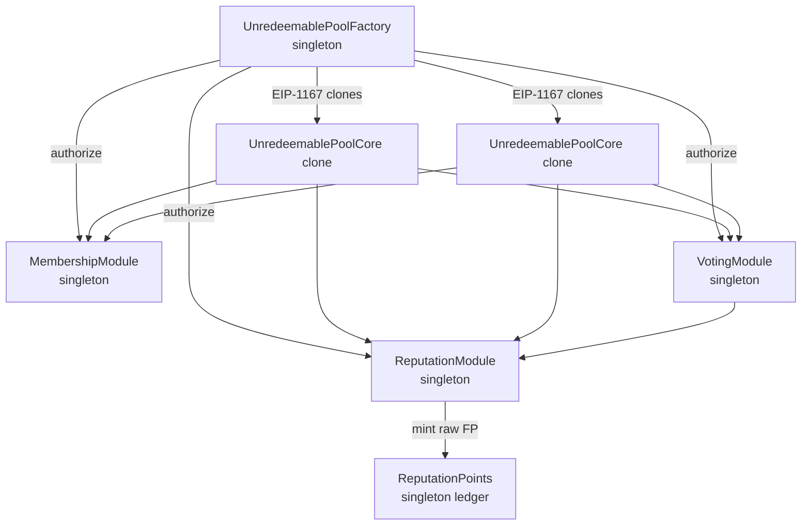
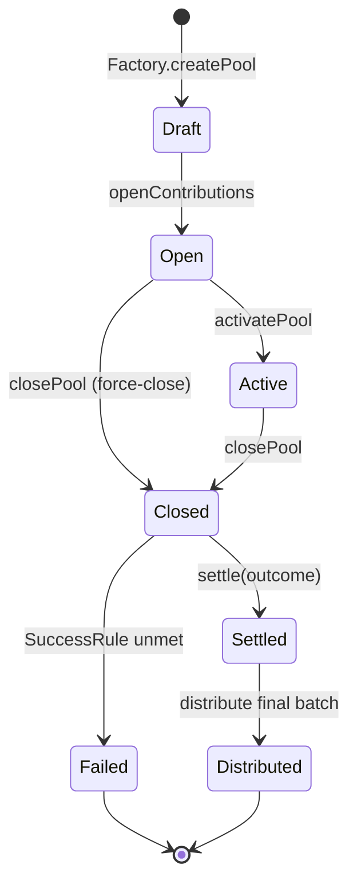
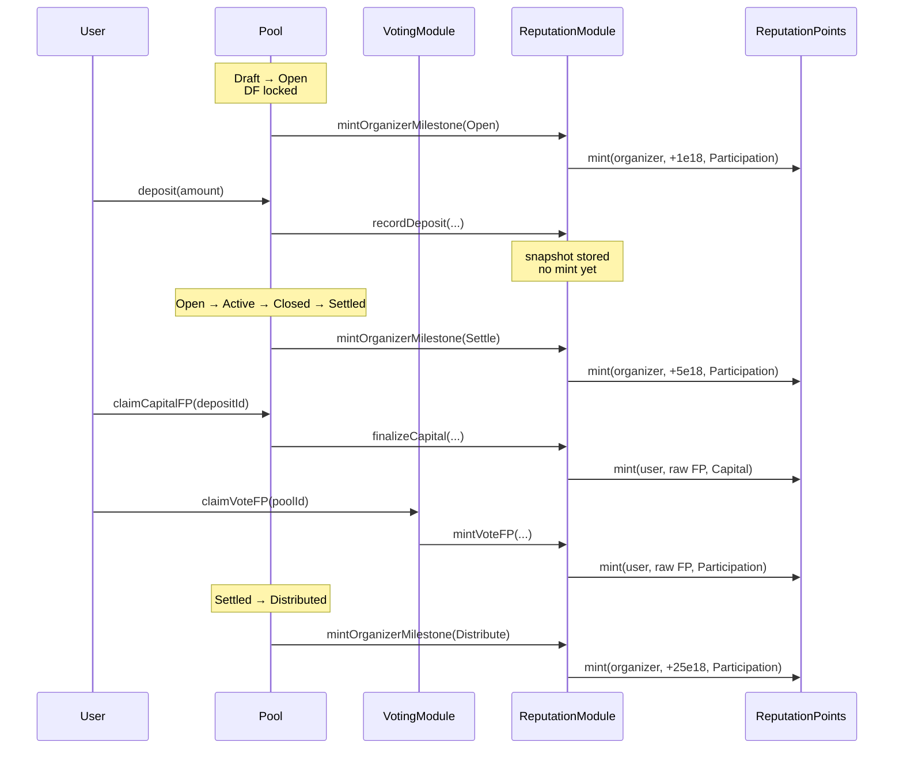
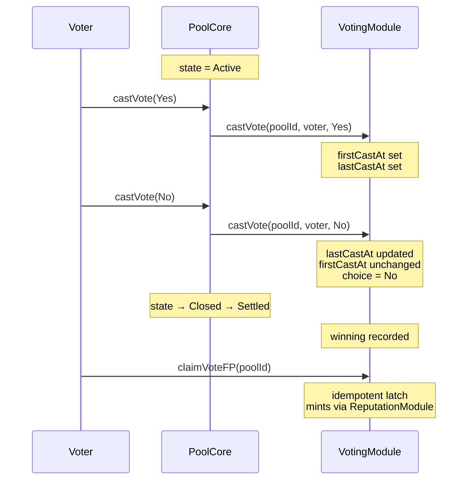
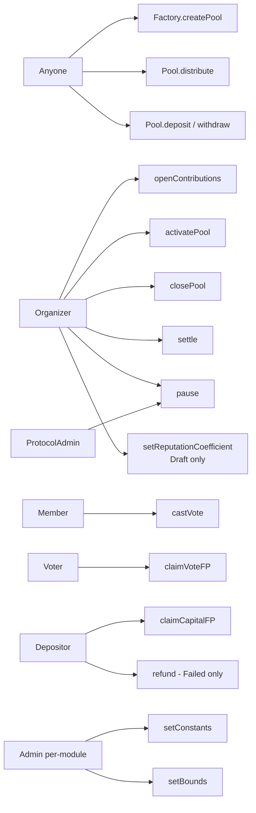

# Fish Network Protocol

Open-source smart-contract suite for **reputation-driven capital pooling**. Anyone can spin up an unredeemable pool, accept deposits, run a binary outcome vote, distribute pro-rata, and accrue non-transferable reputation (Fish Points) for participants — without depending on any toolchain or external library.

This repository contains the Solidity source files only. No npm, no Foundry, no Hardhat. Import the `.sol` files into your own dev environment (Remix, Foundry, Hardhat) to deploy.

## Documentation map

| Audience | Read |
|---|---|
| Concept overview | [FishNetworkREADME.md](FishNetworkREADME.md), [FishProtocol-v.01.md](FishProtocol-v.01.md) |
| Pools detail | [Poolsreadme.md](Poolsreadme.md) |
| Fish Points (reputation) | [Points.md](Points.md), [FishPointsOverview.md](FishPointsOverview.md), [PointsExamples.md](PointsExamples.md) |
| Developer integration | [DeveloperDocs.md](DeveloperDocs.md) |
| Legal positioning | [LegalSummary.md](LegalSummary.md) |
| Contract state machine | [contracts/statemachine.md](contracts/statemachine.md) |
| Storage layout reference | [contracts/storagelayout.md](contracts/storagelayout.md) |
| Manual test plan | [contracts/TestPlan.md](contracts/TestPlan.md) |
| Design spec (v1) | [docs/superpowers/specs/2026-05-18-fish-protocol-v1-contracts-design.md](docs/superpowers/specs/2026-05-18-fish-protocol-v1-contracts-design.md) |

## System architecture



## Pool lifecycle



See [contracts/statemachine.md](contracts/statemachine.md) for the full transition reference.

## Fish Points issuance flow



## Voting flow



## Roles & permissions



## Discount Factor (DF)

Every pool carries a Discount Factor — a per-pool multiplier on FP issued in that pool.

```text
FP_total = (FP_capital + FP_participation) × DF
```

- **Default:** `DF = 1.0×` (10000 bps). Doc examples assume this.
- **Set:** by the organizer at pool creation, mutable during `Draft`.
- **Locked:** at `Draft → Open`. Immutable thereafter.
- **Bounds:** `[minCoeffBps, maxCoeffBps]` enforced by the Factory (default `0.1× – 5.0×`).

Raw `FP_capital` and `FP_participation` are stored unscaled. Only the effective total is DF-scaled. Per-pool invariant:

```text
getPoolTotal(u, p) == (getPoolCapital(u, p) + getPoolParticipation(u, p)) × poolDF(p) / 10_000
```

## Repository layout

```
contracts/
  UnredeemablePoolFactory.sol     ← singleton, deploys pool clones
  UnredeemablePoolCore.sol         ← clone implementation
  MembershipModule.sol             ← pool-scoped NFTs
  voting/
    VotingModule.sol               ← vote registry + finalize
  reputation/
    ReputationModule.sol           ← formula engine
    ReputationPoints.sol           ← canonical FP ledger
  interfaces/                      ← one file per interface
  types/                           ← enums and structs
  libraries/                       ← vendored helpers (SafeERC20, ReentrancyGuard, FishMath, FishKeys, MinimalClones)
  TestPlan.md
  statemachine.md
  storagelayout.md
```

## Build / use

This repo intentionally ships pure `.sol` files. To compile:

**Option A — Remix:**
1. Open <https://remix.ethereum.org/>.
2. Create a workspace; mirror this directory tree.
3. Compile with Solidity ^0.8.24.

**Option B — Local Foundry:**
```bash
forge init --no-commit fish-protocol
cp -r contracts/* fish-protocol/src/
cd fish-protocol && forge build
```

**Option C — Local Hardhat:**
1. `npm init -y && npm install --save-dev hardhat`
2. `npx hardhat init`
3. Copy `contracts/*` into `contracts/` of the new project.
4. `npx hardhat compile`.

No deployment scripts are included; consult [contracts/TestPlan.md](contracts/TestPlan.md) for the recommended deploy order.

## Contracts at a glance

| Contract | Role | Singleton? |
|---|---|---|
| `UnredeemablePoolFactory` | Deploy pool clones; anti-gaming counters | ✓ |
| `UnredeemablePoolCore` | Lifecycle + capital + voting wiring | ✗ (one clone per pool) |
| `MembershipModule` | Pool-scoped membership NFTs | ✓ |
| `VotingModule` | Vote registry, timing, finalize trigger | ✓ |
| `ReputationModule` | FP formula engine + idempotency | ✓ |
| `ReputationPoints` | Mint-only, non-transferable FP ledger | ✓ |

## Anti-gaming

The Factory enforces two on-chain rules:

- **Organizer cooldown:** 14 days minimum between consecutive `openContributions()` calls per organizer.
- **Max active pools per organizer:** 3 simultaneous pools in any non-terminal state. Paused pools still count.

Both are tunable by the Factory admin. Wallet verification (Sybil resistance) is intentionally off-chain — the membership NFT serves as the on-chain signal that an off-chain verification step happened.

## License

Apache-2.0 — see [LICENSE](LICENSE).

## Contributing

Open a PR or issue. Design questions go to the canonical spec under `docs/superpowers/specs/`.
