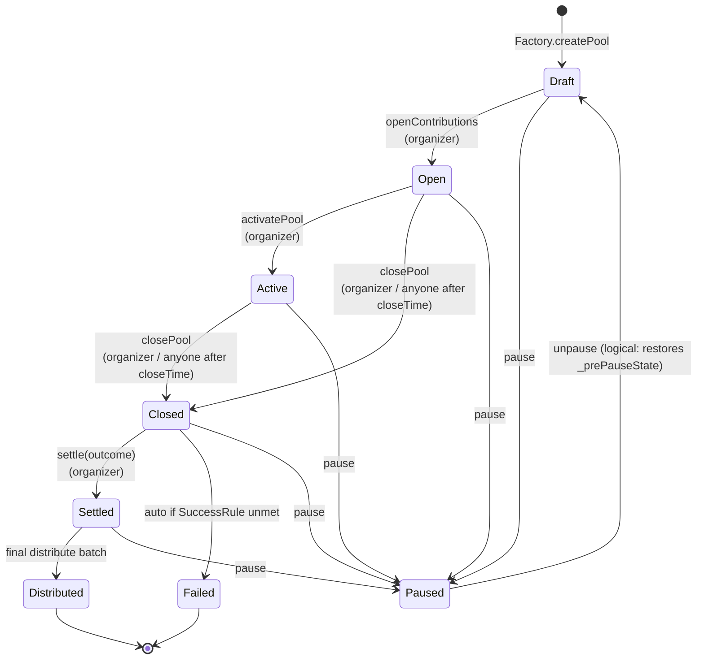

# Fish Pool — Lifecycle State Machine

This document is the canonical reference for the Pool's lifecycle. It expands on the brief diagrams in `README.md` and the design spec.

## States

| State | Terminal? | Description |
|---|---|---|
| `Draft` | no | Pool created, configuration mutable, DF mutable. No deposits. No FP yet. |
| `Open` | no | Deposits accepted. Voting NOT open. DF locked. Organizer +1 FP fired. |
| `Active` | no | Deposits FROZEN. Voting OPEN. Active-start anchors voter timing math. |
| `Closed` | no | Window over. SuccessRule evaluated. Routes to Settled (success) or Failed. |
| `Settled` | no | Outcome attested. Lazy FP claims open. Distribution can begin. Organizer +5 FP. |
| `Distributed` | yes | All depositors paid pro-rata. Organizer +25 FP fired. Active slot freed. |
| `Failed` | yes | SuccessRule unmet. Refunds open. No +5 / +25. Active slot freed. |
| `Paused` | no (orthogonal) | Any non-terminal state can be paused; unpause restores. |

## Transitions

## Per-transition reference

### `Draft → Open` (openContributions)

- **Caller:** organizer only.
- **Preconditions:** `block.timestamp >= openTime` (if set); Factory cooldown elapsed; activePoolCount < max.
- **Side effects:**
  1. `Factory.registerPoolOpen(organizer)` — bumps `lastOpenedAt`, increments `activePoolCount`.
  2. `ReputationModule.lockPoolDF(poolId, dfBps)` proxies to `ReputationPoints.lockPoolDF` — DF immutable from here.
  3. `lifecycleState = Open`.
  4. `ReputationModule.mintOrganizerMilestone(Open)` — +1e18 raw FP to organizer.
- **Events:** `PoolOpenRegistered`, `PoolDFLocked`, `PoolStateTransitioned(Draft, Open)`, `OrganizerMilestoneFired(Open)`, `PointsMinted`.
- **Idempotency key fired:** `FishKeys.organizerMilestone(poolId, Open)`.

### `Open → Active` (activatePool)

- **Caller:** organizer only.
- **Side effects:**
  1. `VotingModule.openRound(poolId, block.timestamp)` — round opens NOW.
  2. `lifecycleState = Active`.
- **Why deposits freeze here:** the voting round window must be locked to make timing-bucket math deterministic. If deposits stayed open, a late depositor could vote inside the round window and falsely earn an early-bird multiplier. Open ≠ Active enforces the separation.

### `Active → Closed` (closePool) and `Open → Closed` (force-close path)

- **Caller:** organizer always; anyone after `closeTime`.
- **Behavior:**
  1. If the pool reached Active, `VotingModule.closeRound(poolId, block.timestamp)`. When force-closing from Open, the round was never opened so `closeRound` is skipped.
  2. `successRule` evaluated → success/failure decided.
  3. `lifecycleState = Closed`.
  4. If failure: immediately `_transitionToFailed()` which decrements `activePoolCount`, records `Outcome.None` on voting, emits `PoolFailed`.

### `Closed → Settled` (settle)

- **Caller:** organizer only.
- **Preconditions:** `lifecycleState == Closed`; `winningOutcome != None` argument.
- **Side effects:**
  1. Snapshot `poolBalanceAtSettle` and `totalSupplyAtSettle` (frozen for distribute math).
  2. `VotingModule.recordWinningOutcome(poolId, winning)` — unlocks voter accuracy bonus claim.
  3. `ReputationModule.mintOrganizerMilestone(Settle)` — +5e18 raw FP.
- **Why snapshot at settle:** later token balance changes (rebases, external transfers) must not affect distribution. The pool pays out the snapshotted amount.
- **No per-depositor loop:** balances are frozen the instant Settled is reached (deposit/withdraw/refund all require different states), so `distribute` reads `_balances[d]` directly.

### `Settled → Distributed` (distribute, paginated)

- **Caller:** anyone.
- **Mechanism:** `distribute(offset, count)` processes a slice of depositors. Idempotent per-depositor via `_distributed` mapping. `nonReentrant` modifier applied.
- **First-batch milestone:** the first call that moves money fires `OrganizerMilestone.Distribute` (+25e18), keyed for idempotency.
- **Terminal transition:** when `_processedCount == _depositors.length`, state → `Distributed` and `Factory.registerPoolFinalized(organizer)`.

### `Closed → Failed` (automatic)

- **Trigger:** internal to `closePool()` when SuccessRule unmet.
- **Side effects:**
  1. `lifecycleState = Failed`.
  2. `Factory.registerPoolFinalized(organizer)`.
  3. `VotingModule.recordWinningOutcome(poolId, Outcome.None)` — unlocks `claimVoteFP` for base × timing only (no accuracy bonus per FP rules).
- **Recovery for depositors:** call `refund(depositId)` to retrieve capital; finalizes capital FP using days-held.

### `* → Paused` (pause)

- **Caller:** organizer or protocolAdmin.
- **Forbidden from:** `Distributed`, `Failed` (terminal). Reverts `PausedOrTerminal`.
- **Behavior:** snapshots prior state into `_prePauseState`, sets `lifecycleState = Paused`. All state-gated actions revert because their `inState(...)` modifiers don't match Paused.

### `Paused → prev` (unpause)

- **Caller:** organizer or protocolAdmin.
- **Behavior:** `lifecycleState = _prePauseState` exactly. The mermaid diagram shows the arrow to `Draft` for layout; the real target is whatever was stored.

## Anti-patterns

These look like valid transitions but are not. Code reviewers should reject any PR that introduces them.

- **`Open → Active → Open`** — no path back from Active to Open. Deposits cannot re-open after the round has started.
- **`Settled → Active`** — settlement is one-way. No "re-vote" mechanism.
- **`Failed → Settled`** — a failed pool cannot retroactively succeed.
- **`Distributed → *`** — terminal.
- **`Paused → Distributed`** — must unpause first.
- **DF change after Open** — `setReputationCoefficient` requires state `Draft`.

## Allowed actions per state

| State | deposit | withdraw | vote | distribute | refund | claimVoteFP | claimCapFP |
|---|---|---|---|---|---|---|---|
| Draft | ✗ | ✗ | ✗ | ✗ | ✗ | ✗ | ✗ |
| Open | ✓ | ✓ | ✗ | ✗ | ✗ | ✗ | ✗ |
| Active | ✗ | ✓ | ✓ | ✗ | ✗ | ✗ | ✗ |
| Closed | ✗ | ✗ | ✗ | ✗ | ✗ | ✗ | ✗ |
| Settled | ✗ | ✗ | ✗ | ✓ | ✗ | ✓ | ✓ |
| Distributed | ✗ | ✗ | ✗ | ✗ | ✗ | ✓ | ✓ |
| Failed | ✗ | ✗ | ✗ | ✗ | ✓ | ✓ | (refund finalizes) |
| Paused | ✗ | ✗ | ✗ | ✗ | ✗ | ✗ | ✗ |
