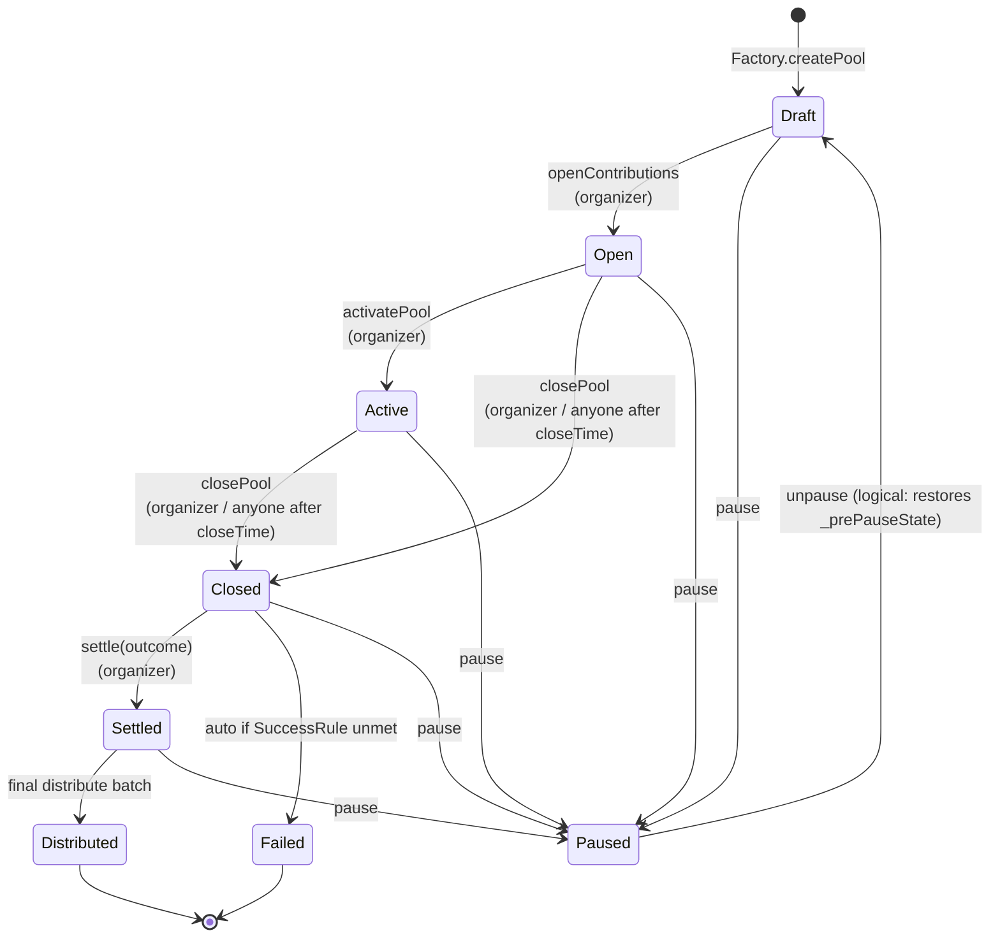
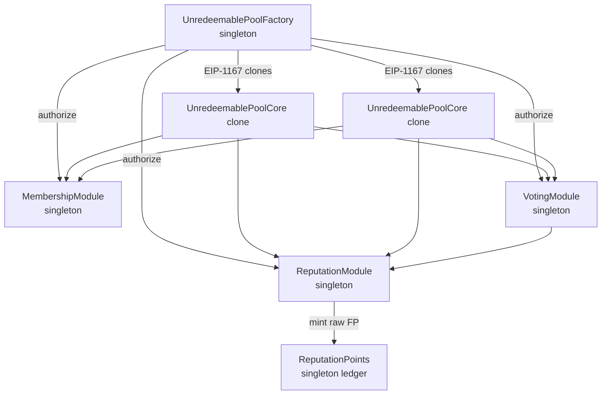
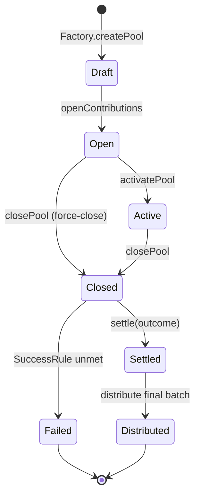
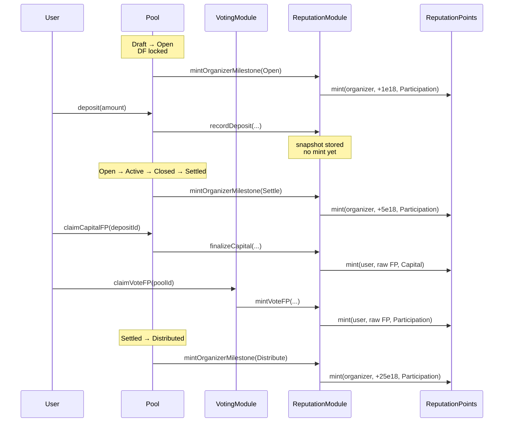
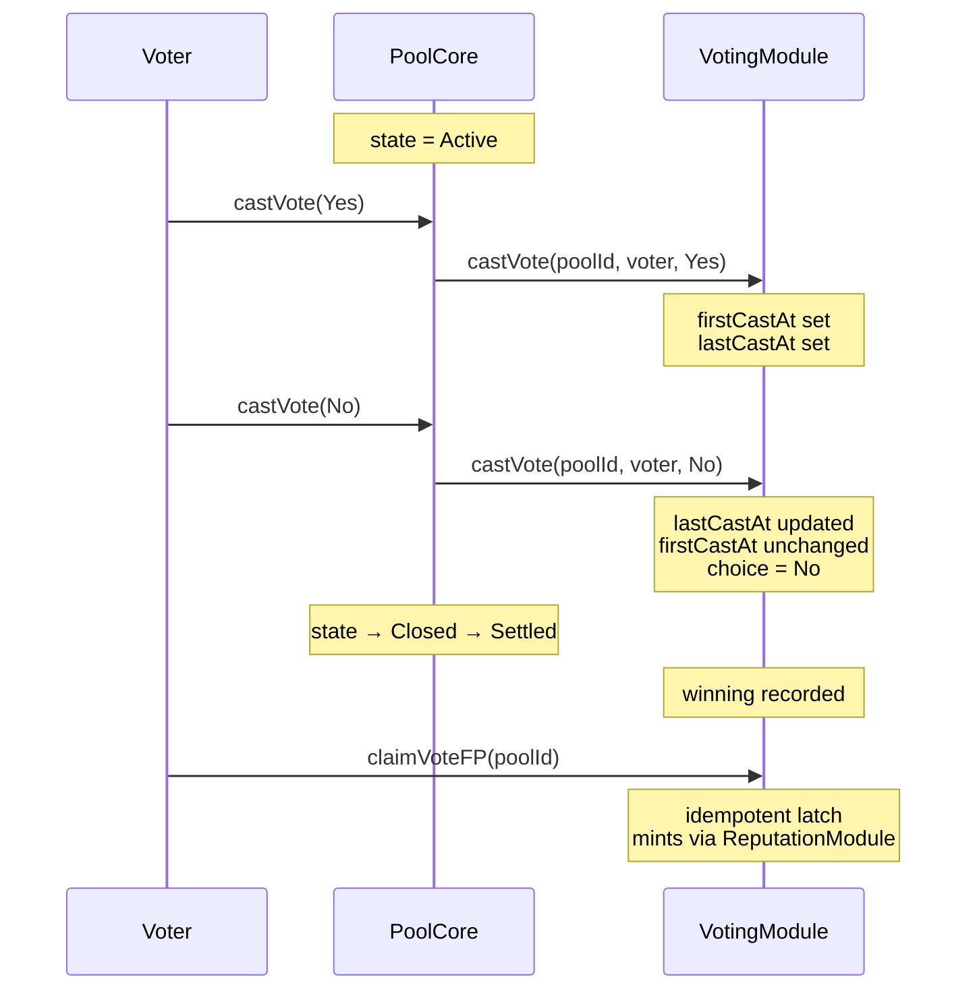
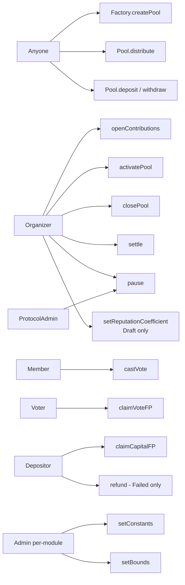

# Fish Protocol v1 Contracts — Implementation Plan

> **For agentic workers:** REQUIRED SUB-SKILL: Use superpowers:subagent-driven-development (recommended) or superpowers:executing-plans to implement this plan task-by-task. Steps use checkbox (`- [ ]`) syntax for tracking.

**Goal:** Implement the full v1 Fish Protocol smart-contract suite — Factory, Pool Core (cloned), Membership, Voting, Reputation Module, Reputation Points ledger — plus a discount factor on FP issuance, plus full documentation.

**Architecture:** Singleton modules (Factory, Membership, Voting, ReputationModule, ReputationPoints) + EIP-1167 minimal-clone PoolCore instances. Aggressively extracted types / interfaces / libraries — each contract file contains only its contract and error declarations. Discount Factor (DF) per pool, immutable after pool transitions to Open. RAW + cached-effective-total storage on the ledger.

**Tech Stack:** Solidity ^0.8.24, no toolchain (pure `.sol` files), vendored helpers (no OpenZeppelin / npm).

**Source spec:** [docs/superpowers/specs/2026-05-18-fish-protocol-v1-contracts-design.md](../specs/2026-05-18-fish-protocol-v1-contracts-design.md)

**No-toolchain note:** Because the repo has no Foundry / Hardhat, "verify" steps mean **compile-checking the affected file(s) in Remix** (paste contents into a Remix workspace under the same paths and confirm the compiler reports no errors) and **inspecting the diff against the spec section referenced**. The `contracts/TestPlan.md` deliverable (Phase 11) is where comprehensive manual scenario tests live.

**Commit convention:** No `Co-Authored-By:` trailers (durable user preference saved to memory).

---

## Phase 0 — Preflight

### Task 0.1: Clean baseline

**Files:**
- Read: working tree state

- [ ] **Step 1: Survey current state**

Run:
```bash
git status
git diff --stat HEAD -- contracts/
```

This plan replaces the entire `contracts/` directory tree. If there are uncommitted modifications or untracked files in `contracts/`, they will conflict with subsequent tasks.

- [ ] **Step 2: Decide on in-flight changes**

If `git status` shows modifications or untracked files under `contracts/`:

Option A — stash them for later reference:
```bash
git stash push -u -m "pre-plan-baseline-stash" -- contracts/
```

Option B — commit them as an "in-flight WIP" snapshot first:
```bash
git add contracts/ && git commit -m "wip: snapshot before v1 contracts rewrite"
```

Confirm with the user before choosing. Do NOT discard with `git checkout --` or `git clean -f` without their explicit say-so.

- [ ] **Step 3: Verify clean baseline**

Run:
```bash
git status --short -- contracts/
```

Expected: no output (clean).

- [ ] **Step 4: Confirm branch**

Run:
```bash
git branch --show-current
```

Expected: `sai/feat/smart-contracts` (or a fresh branch off it if user prefers).

---

## Phase 1 — Types

Five type files. Each lives in `contracts/types/`. None contain implementation — only enums and structs. Each file ~10-40 lines.

### Task 1.1: PoolLifecycle types

**Files:**
- Create: `contracts/types/PoolLifecycle.sol`

- [ ] **Step 1: Create the file**

```solidity
// SPDX-License-Identifier: Apache-2.0
pragma solidity ^0.8.24;

/// @notice High-level pool lifecycle states.
/// @dev Paused is orthogonal — when entered, the prior state is stored in _prePauseState on the Pool.
enum LifecycleState {
    Draft,
    Open,
    Active,
    Closed,
    Settled,
    Distributed,
    Failed,
    Paused
}

/// @notice Rule used by Pool.closePool() to decide success vs failure.
enum SuccessRule {
    MinContributionReached,
    AnyCapitalRaised,
    FullCapOnly
}
```

- [ ] **Step 2: Verify**

Paste into Remix at the same path; compiler reports no errors. Confirm enum ordering matches spec Section 4 state-machine.

- [ ] **Step 3: Commit**

```bash
git add contracts/types/PoolLifecycle.sol
git commit -m "feat(types): add PoolLifecycle enums"
```

### Task 1.2: PoolConfig types

**Files:**
- Create: `contracts/types/PoolConfig.sol`

- [ ] **Step 1: Create the file**

```solidity
// SPDX-License-Identifier: Apache-2.0
pragma solidity ^0.8.24;

import {SuccessRule} from "./PoolLifecycle.sol";

/// @notice Flat config passed by the Factory at pool creation. Pool snapshots all fields at init.
struct UnredeemablePoolConfig {
    uint256 templateVersion;
    address acceptedAsset;        // ERC20 stablecoin etc.
    string  name;
    bytes32 metadataHash;         // off-chain metadata pointer (IPFS, etc.)
    uint64  openTime;             // earliest time openContributions() may be called
    uint64  closeTime;            // earliest time anyone-can-close kicks in
    uint128 minContribution;
    uint128 maxContribution;      // 0 = unbounded per-tx
    uint128 poolCap;              // hard cap on totalAssetsCommitted; required > 0
    SuccessRule successRule;
}

/// @notice Singleton module addresses bound to a pool at init.
struct UnredeemableModuleSet {
    address membershipModule;
    address votingModule;
    address reputationModule;
    address reputationPoints;
}
```

- [ ] **Step 2: Verify**

Compile in Remix; confirm `SuccessRule` import resolves.

- [ ] **Step 3: Commit**

```bash
git add contracts/types/PoolConfig.sol
git commit -m "feat(types): add PoolConfig structs"
```

### Task 1.3: Voting types

**Files:**
- Create: `contracts/types/Voting.sol`

- [ ] **Step 1: Create the file**

```solidity
// SPDX-License-Identifier: Apache-2.0
pragma solidity ^0.8.24;

/// @notice Binary outcome per pool. None = not yet decided.
enum Outcome { None, Yes, No }

/// @notice Per-(pool, voter) vote record.
/// @dev firstCastAt drives timing math; lastCastAt is audit-only.
struct Vote {
    Outcome choice;
    uint64  firstCastAt;
    uint64  lastCastAt;
}
```

- [ ] **Step 2: Verify**

Compile in Remix.

- [ ] **Step 3: Commit**

```bash
git add contracts/types/Voting.sol
git commit -m "feat(types): add Voting types"
```

### Task 1.4: Reputation types

**Files:**
- Create: `contracts/types/Reputation.sol`

- [ ] **Step 1: Create the file**

```solidity
// SPDX-License-Identifier: Apache-2.0
pragma solidity ^0.8.24;

/// @notice Bucket a mint is attributed to. Drives whether it accrues to capitalPoints or participationPoints.
enum FPCategory { Capital, Participation }

/// @notice Which lifecycle milestone is firing the organizer mint.
enum OrganizerMilestone { Open, Settle, Distribute }

/// @notice All governance-mutable scoring constants live in one struct on ReputationModule.
struct FPConstants {
    uint128 baseVote;               // default 1e18
    uint128 accuracyBonus;          // default 2e18
    uint16  earlyEndBps;            // default 3300  (33%)
    uint16  lateStartBps;           // default 8000  (80%)
    uint16  earlyMultBps;           // default 15000 (1.5x)
    uint16  standardMultBps;        // default 10000 (1.0x)
    uint16  lateMultBps;            // default 7500  (0.75x)
    uint128 organizerOpenFP;        // default 1e18
    uint128 organizerSettleFP;      // default 5e18
    uint128 organizerDistributeFP;  // default 25e18
    uint32  capitalDayDivisor;      // default 30
    uint16  minCoeffBps;            // default 1000  (0.1x)
    uint16  maxCoeffBps;            // default 50000 (5.0x)
}
```

- [ ] **Step 2: Verify**

Compile in Remix. Constants table matches spec Section 7.

- [ ] **Step 3: Commit**

```bash
git add contracts/types/Reputation.sol
git commit -m "feat(types): add Reputation types"
```

### Task 1.5: Deposit type

**Files:**
- Create: `contracts/types/Deposit.sol`

- [ ] **Step 1: Create the file**

```solidity
// SPDX-License-Identifier: Apache-2.0
pragma solidity ^0.8.24;

/// @notice One row per deposit on a pool. finalizedAt == 0 means still live.
struct Deposit {
    uint128 amount;
    uint64  depositedAt;
    uint64  finalizedAt;
}
```

- [ ] **Step 2: Verify**

Compile in Remix.

- [ ] **Step 3: Commit**

```bash
git add contracts/types/Deposit.sol
git commit -m "feat(types): add Deposit struct"
```

---

## Phase 2 — Libraries

### Task 2.1: SafeERC20

**Files:**
- Create: `contracts/libraries/SafeERC20.sol`

- [ ] **Step 1: Create the file**

```solidity
// SPDX-License-Identifier: Apache-2.0
pragma solidity ^0.8.24;

import {IERC20} from "../interfaces/IERC20.sol";

/// @notice Minimal SafeERC20 helper. Reverts on false-return tokens and non-contract addresses.
library SafeERC20 {
    error SafeERC20Failed();
    error SafeERC20NotContract();

    function safeTransfer(IERC20 token, address to, uint256 amount) internal {
        _callOptionalReturn(address(token), abi.encodeWithSelector(token.transfer.selector, to, amount));
    }

    function safeTransferFrom(IERC20 token, address from, address to, uint256 amount) internal {
        _callOptionalReturn(address(token), abi.encodeWithSelector(token.transferFrom.selector, from, to, amount));
    }

    function _callOptionalReturn(address token, bytes memory data) private {
        uint256 size;
        assembly { size := extcodesize(token) }
        if (size == 0) revert SafeERC20NotContract();

        (bool ok, bytes memory ret) = token.call(data);
        if (!ok) revert SafeERC20Failed();
        if (ret.length > 0 && !abi.decode(ret, (bool))) revert SafeERC20Failed();
    }
}
```

- [ ] **Step 2: Verify**

Compile in Remix; `IERC20` import will resolve once Phase 3 lands. For this commit, depend on the import path existing as a stub — create a minimal `IERC20` first **as part of this task** if the interface file does not yet exist:

```solidity
// contracts/interfaces/IERC20.sol (stub — full version comes in Phase 3)
// SPDX-License-Identifier: Apache-2.0
pragma solidity ^0.8.24;
interface IERC20 {
    function transfer(address to, uint256 amount) external returns (bool);
    function transferFrom(address from, address to, uint256 amount) external returns (bool);
}
```

Both files compile together.

- [ ] **Step 3: Commit**

```bash
git add contracts/libraries/SafeERC20.sol contracts/interfaces/IERC20.sol
git commit -m "feat(libs): add SafeERC20 + IERC20 stub"
```

### Task 2.2: ReentrancyGuard

**Files:**
- Create: `contracts/libraries/ReentrancyGuard.sol`

- [ ] **Step 1: Create the file**

```solidity
// SPDX-License-Identifier: Apache-2.0
pragma solidity ^0.8.24;

/// @notice Minimal reentrancy guard. Inherit and use the nonReentrant modifier.
abstract contract ReentrancyGuard {
    error ReentrantCall();

    uint256 private constant _NOT_ENTERED = 1;
    uint256 private constant _ENTERED     = 2;
    uint256 private _status = _NOT_ENTERED;

    modifier nonReentrant() {
        if (_status == _ENTERED) revert ReentrantCall();
        _status = _ENTERED;
        _;
        _status = _NOT_ENTERED;
    }
}
```

- [ ] **Step 2: Verify**

Compile in Remix.

- [ ] **Step 3: Commit**

```bash
git add contracts/libraries/ReentrancyGuard.sol
git commit -m "feat(libs): add ReentrancyGuard"
```

### Task 2.3: FishMath

**Files:**
- Create: `contracts/libraries/FishMath.sol`

- [ ] **Step 1: Create the file**

```solidity
// SPDX-License-Identifier: Apache-2.0
pragma solidity ^0.8.24;

/// @notice Pure helper math for FP scoring.
library FishMath {
    /// @notice value * bps / 10_000.
    function applyBps(uint256 value, uint256 bps) internal pure returns (uint256) {
        return (value * bps) / 10_000;
    }

    /// @notice (end - start) / 1 days, integer truncation. Returns 0 if end <= start.
    function daysBetween(uint64 start, uint64 end) internal pure returns (uint256) {
        if (end <= start) return 0;
        unchecked { return uint256(end - start) / 1 days; }
    }

    /// @notice Min(value, ceil).
    function clampToBps(uint256 value, uint256 ceil) internal pure returns (uint256) {
        return value > ceil ? ceil : value;
    }

    /// @notice Maps a basis-point progress into the matching timing multiplier (in bps).
    function timingBucket(
        uint256 progressBps,
        uint16  earlyEnd,
        uint16  lateStart,
        uint16  earlyMult,
        uint16  standardMult,
        uint16  lateMult
    ) internal pure returns (uint16) {
        if (progressBps <= earlyEnd)  return earlyMult;
        if (progressBps <  lateStart) return standardMult;
        return lateMult;
    }
}
```

- [ ] **Step 2: Verify**

Compile in Remix. Function names match spec Section 10 library spec.

- [ ] **Step 3: Commit**

```bash
git add contracts/libraries/FishMath.sol
git commit -m "feat(libs): add FishMath"
```

### Task 2.4: FishKeys

**Files:**
- Create: `contracts/libraries/FishKeys.sol`

- [ ] **Step 1: Create the file**

```solidity
// SPDX-License-Identifier: Apache-2.0
pragma solidity ^0.8.24;

import {OrganizerMilestone} from "../types/Reputation.sol";

/// @notice Idempotency-key derivations for FP issuance.
library FishKeys {
    function capitalFin(uint256 poolId, uint256 depositId) internal pure returns (bytes32) {
        return keccak256(abi.encodePacked("FP:capital:fin", poolId, depositId));
    }

    function voteFP(uint256 poolId, address user) internal pure returns (bytes32) {
        return keccak256(abi.encodePacked("FP:vote", poolId, user));
    }

    function organizerMilestone(uint256 poolId, OrganizerMilestone m) internal pure returns (bytes32) {
        return keccak256(abi.encodePacked("FP:org", poolId, uint8(m)));
    }
}
```

- [ ] **Step 2: Verify**

Compile in Remix.

- [ ] **Step 3: Commit**

```bash
git add contracts/libraries/FishKeys.sol
git commit -m "feat(libs): add FishKeys idempotency derivations"
```

### Task 2.5: MinimalClones — keep as-is

**Files:**
- Read: `contracts/libraries/MinimalClones.sol`

- [ ] **Step 1: Verify no change needed**

Open the existing file. Confirm it has SPDX, pragma, and the EIP-1167 clone routine. No changes required.

- [ ] **Step 2: No commit**

This task is just a verification gate. Skip commit.

---

## Phase 3 — Interfaces

Eight interface files. Events are declared on the interface that owns the concept; implementations re-emit via that interface.

### Task 3.1: IERC20 (replace stub from Task 2.1)

**Files:**
- Modify: `contracts/interfaces/IERC20.sol`

- [ ] **Step 1: Replace contents**

```solidity
// SPDX-License-Identifier: Apache-2.0
pragma solidity ^0.8.24;

interface IERC20 {
    event Transfer(address indexed from, address indexed to, uint256 value);
    event Approval(address indexed owner, address indexed spender, uint256 value);

    function totalSupply() external view returns (uint256);
    function balanceOf(address account) external view returns (uint256);
    function allowance(address owner, address spender) external view returns (uint256);
    function transfer(address to, uint256 amount) external returns (bool);
    function approve(address spender, uint256 amount) external returns (bool);
    function transferFrom(address from, address to, uint256 amount) external returns (bool);
}
```

- [ ] **Step 2: Verify**

Compile in Remix. `SafeERC20` should still compile against the expanded interface.

- [ ] **Step 3: Commit**

```bash
git add contracts/interfaces/IERC20.sol
git commit -m "feat(interfaces): expand IERC20 to full surface"
```

### Task 3.2: IERC20Metadata

**Files:**
- Create: `contracts/interfaces/IERC20Metadata.sol`

- [ ] **Step 1: Create**

```solidity
// SPDX-License-Identifier: Apache-2.0
pragma solidity ^0.8.24;

import {IERC20} from "./IERC20.sol";

interface IERC20Metadata is IERC20 {
    function name() external view returns (string memory);
    function symbol() external view returns (string memory);
    function decimals() external view returns (uint8);
}
```

- [ ] **Step 2: Verify + Commit**

```bash
git add contracts/interfaces/IERC20Metadata.sol
git commit -m "feat(interfaces): add IERC20Metadata"
```

### Task 3.3: IMembershipModule

**Files:**
- Create: `contracts/interfaces/IMembershipModule.sol`

- [ ] **Step 1: Create**

```solidity
// SPDX-License-Identifier: Apache-2.0
pragma solidity ^0.8.24;

interface IMembershipModule {
    event MembershipIssued(uint256 indexed poolId, address indexed to, uint256 indexed tokenId, uint64 mintedAt);
    event PoolMinterUpdated(address indexed minter, bool allowed);
    event PoolBaseURISet(uint256 indexed poolId, string baseURI);

    function hasMembership(uint256 poolId, address user) external view returns (bool);
    function mintedAt(uint256 poolId, address user) external view returns (uint64);
    function membershipTokenId(uint256 poolId, address user) external view returns (uint256);
    function isPoolMinter(address minter) external view returns (bool);

    function mintMembership(uint256 poolId, address to) external returns (uint256 tokenId);
    function setPoolMinter(address minter, bool allowed) external;
    function setPoolBaseURI(uint256 poolId, string calldata baseURI) external;

    function factory() external view returns (address);
    function admin() external view returns (address);
}
```

- [ ] **Step 2: Verify + Commit**

```bash
git add contracts/interfaces/IMembershipModule.sol
git commit -m "feat(interfaces): rewrite IMembershipModule with mintedAt + factory"
```

### Task 3.4: IVotingModule

**Files:**
- Create: `contracts/interfaces/IVotingModule.sol`

- [ ] **Step 1: Create**

```solidity
// SPDX-License-Identifier: Apache-2.0
pragma solidity ^0.8.24;

import {Outcome, Vote} from "../types/Voting.sol";

interface IVotingModule {
    event PoolAuthorized(uint256 indexed poolId, address indexed pool);
    event RoundOpened(uint256 indexed poolId, uint64 roundStart);
    event RoundClosed(uint256 indexed poolId, uint64 roundEnd);
    event VoteCast(uint256 indexed poolId, address indexed voter, Outcome choice, uint64 castAt);
    event WinningOutcomeRecorded(uint256 indexed poolId, Outcome winning);
    event VoteFPClaimed(uint256 indexed poolId, address indexed voter, uint256 raw);

    // Called by Factory at pool creation.
    function authorizePool(address pool, uint256 poolId) external;

    // Called by the authorized Pool only.
    function openRound(uint256 poolId, uint64 roundStart) external;
    function closeRound(uint256 poolId, uint64 roundEnd) external;
    function castVote(uint256 poolId, address voter, Outcome choice) external;
    function recordWinningOutcome(uint256 poolId, Outcome winning) external;

    // Called by any voter post-settle (or post-fail).
    function claimVoteFP(uint256 poolId) external;

    // Views
    function getVote(uint256 poolId, address voter) external view returns (Vote memory);
    function getWinning(uint256 poolId) external view returns (Outcome);
    function getRound(uint256 poolId) external view returns (uint64 roundStart, uint64 roundEnd, bool finalized);
    function hasClaimedFP(uint256 poolId, address voter) external view returns (bool);

    function factory() external view returns (address);
    function admin() external view returns (address);
}
```

- [ ] **Step 2: Verify + Commit**

```bash
git add contracts/interfaces/IVotingModule.sol
git commit -m "feat(interfaces): add IVotingModule"
```

### Task 3.5: IReputationModule

**Files:**
- Create: `contracts/interfaces/IReputationModule.sol`

- [ ] **Step 1: Create**

```solidity
// SPDX-License-Identifier: Apache-2.0
pragma solidity ^0.8.24;

import {FPCategory, OrganizerMilestone, FPConstants} from "../types/Reputation.sol";
import {Outcome} from "../types/Voting.sol";

interface IReputationModule {
    event PoolAuthorized(uint256 indexed poolId, address indexed pool, uint16 dfBps);
    event DepositRecorded(address indexed user, uint256 indexed poolId, uint256 indexed depositId, uint256 amount, uint64 depositedAt);
    event CapitalFinalized(address indexed user, uint256 indexed poolId, uint256 indexed depositId, uint256 raw);
    event VoteFPMinted(address indexed user, uint256 indexed poolId, uint256 raw);
    event OrganizerMilestoneFired(address indexed organizer, uint256 indexed poolId, OrganizerMilestone milestone, uint256 raw);
    event FPConstantsUpdated();
    event IdempotentReplayIgnored(bytes32 key);

    // Authorization
    function authorizePool(address pool, uint256 poolId, uint16 dfBps) external;

    // DF lifecycle (called by Pool at openContributions, before any mint into the pool).
    // Implementations proxy to ReputationPoints.lockPoolDF since this module is the only
    // address authorized to mint into the ledger.
    function lockPoolDF(uint256 poolId, uint16 dfBps) external;

    // Capital path
    function recordDeposit(address user, uint256 poolId, uint256 depositId, uint256 amount, uint64 depositedAt) external;
    function finalizeCapital(address user, uint256 poolId, uint256 depositId, uint64 finalizedAt) external;

    // Vote path (called by VotingModule)
    function mintVoteFP(
        address user,
        uint256 poolId,
        uint64  firstCastAt,
        uint64  roundStart,
        uint64  roundEnd,
        Outcome choice,
        Outcome winning
    ) external;

    // Organizer milestones (called by Pool)
    function mintOrganizerMilestone(address organizer, uint256 poolId, OrganizerMilestone milestone) external;

    // Views
    function getConstants() external view returns (FPConstants memory);
    function isAuthorizedPool(address pool, uint256 poolId) external view returns (bool);

    function factory() external view returns (address);
    function admin() external view returns (address);
}
```

- [ ] **Step 2: Verify + Commit**

```bash
git add contracts/interfaces/IReputationModule.sol
git commit -m "feat(interfaces): rewrite IReputationModule for new formula model"
```

### Task 3.6: IReputationPoints

**Files:**
- Create: `contracts/interfaces/IReputationPoints.sol`

- [ ] **Step 1: Create**

```solidity
// SPDX-License-Identifier: Apache-2.0
pragma solidity ^0.8.24;

import {FPCategory} from "../types/Reputation.sol";

interface IReputationPoints {
    event PointsMinted(
        address indexed user,
        uint256 indexed poolId,
        uint256 rawAmount,
        FPCategory category,
        uint256 effectiveDelta,
        uint256 newEffectiveTotal
    );
    event PoolDFLocked(uint256 indexed poolId, uint16 dfBps);
    event MinterAuthorizationUpdated(address indexed minter, bool authorized);
    event AdminUpdated(address indexed oldAdmin, address indexed newAdmin);

    function mint(address user, uint256 poolId, uint256 rawAmount, FPCategory category) external;
    function lockPoolDF(uint256 poolId, uint16 dfBps) external;

    // Raw getters (pre-DF)
    function getCapitalPoints(address user) external view returns (uint256);
    function getParticipationPoints(address user) external view returns (uint256);
    function getPoolCapital(address user, uint256 poolId) external view returns (uint256);
    function getPoolParticipation(address user, uint256 poolId) external view returns (uint256);

    // Effective (DF-scaled)
    function getTotalPoints(address user) external view returns (uint256);
    function getPoolTotal(address user, uint256 poolId) external view returns (uint256);

    function poolDF(uint256 poolId) external view returns (uint16);
    function poolDFLocked(uint256 poolId) external view returns (bool);

    // Admin
    function setMinter(address minter, bool authorized) external;
    function setAdmin(address newAdmin) external;
    function isMinter(address minter) external view returns (bool);

    function factory() external view returns (address);
    function admin() external view returns (address);
}
```

- [ ] **Step 2: Verify + Commit**

```bash
git add contracts/interfaces/IReputationPoints.sol
git commit -m "feat(interfaces): rewrite IReputationPoints with raw+effective ledger"
```

### Task 3.7: IUnredeemablePoolCore

**Files:**
- Create: `contracts/interfaces/IUnredeemablePoolCore.sol`

- [ ] **Step 1: Create**

```solidity
// SPDX-License-Identifier: Apache-2.0
pragma solidity ^0.8.24;

import {UnredeemablePoolConfig, UnredeemableModuleSet} from "../types/PoolConfig.sol";
import {Outcome} from "../types/Voting.sol";
import {LifecycleState} from "../types/PoolLifecycle.sol";

interface IUnredeemablePoolCore {
    event PoolInitialized(uint256 indexed poolId, address indexed pool, address acceptedAsset, uint16 dfBps);
    event PoolStateTransitioned(uint256 indexed poolId, LifecycleState previousState, LifecycleState newState);
    event PoolPaused(uint256 indexed poolId, LifecycleState prePauseState);
    event PoolUnpaused(uint256 indexed poolId, LifecycleState restoredState);
    event ReputationCoefficientUpdated(uint256 indexed poolId, uint16 oldBps, uint16 newBps);

    event DepositMade(uint256 indexed poolId, address indexed depositor, uint256 indexed depositId, uint256 amount, uint64 depositedAt);
    event Withdrawn(uint256 indexed poolId, address indexed depositor, uint256 indexed depositId, uint256 amount, uint64 finalizedAt);
    event Refunded(uint256 indexed poolId, address indexed depositor, uint256 indexed depositId, uint256 amount, uint64 finalizedAt);
    event PoolSettled(uint256 indexed poolId, Outcome winningOutcome, uint64 settledAt, uint256 balanceAtSettle, uint256 supplyAtSettle);
    event DistributedTo(uint256 indexed poolId, address indexed depositor, uint256 share);
    event PoolDistributed(uint256 indexed poolId);
    event PoolFailed(uint256 indexed poolId);

    function initialize(
        uint256 poolId,
        UnredeemablePoolConfig calldata config,
        UnredeemableModuleSet calldata modules,
        address organizer,
        uint16  dfBps,
        address factoryAddress
    ) external;

    // Lifecycle
    function setReputationCoefficient(uint16 newBps) external;
    function openContributions() external;
    function activatePool() external;
    function closePool() external;
    function settle(Outcome winningOutcome) external;
    function distribute(uint256 offset, uint256 count) external;
    function pause() external;
    function unpause() external;

    // Capital
    function deposit(uint256 amount, address receiver) external;
    function withdraw(uint256 depositId) external;
    function refund(uint256 depositId) external;
    function claimCapitalFP(uint256 depositId) external;

    // Voting
    function castVote(Outcome choice) external;

    // Views
    function poolId() external view returns (uint256);
    function lifecycleState() external view returns (LifecycleState);
    function organizer() external view returns (address);
    function totalAssetsCommitted() external view returns (uint256);
    function reputationCoefficientBps() external view returns (uint16);
    function getDepositCount(address user) external view returns (uint256);
}
```

- [ ] **Step 2: Verify + Commit**

```bash
git add contracts/interfaces/IUnredeemablePoolCore.sol
git commit -m "feat(interfaces): rewrite IUnredeemablePoolCore matching new lifecycle"
```

### Task 3.8: IUnredeemablePoolFactory

**Files:**
- Create: `contracts/interfaces/IUnredeemablePoolFactory.sol`

- [ ] **Step 1: Create**

```solidity
// SPDX-License-Identifier: Apache-2.0
pragma solidity ^0.8.24;

import {UnredeemablePoolConfig} from "../types/PoolConfig.sol";

interface IUnredeemablePoolFactory {
    event PoolCreated(uint256 indexed poolId, address indexed pool, address indexed organizer, address acceptedAsset, uint16 dfBps);
    event PoolOpenRegistered(address indexed organizer, address indexed pool, uint64 lastOpenedAt, uint16 activeCount);
    event PoolFinalizedRegistered(address indexed organizer, address indexed pool, uint16 activeCount);
    event ModulesUpdated(address membership, address voting, address rep, address points, address impl);
    event CooldownUpdated(uint64 newSeconds);
    event MaxActivePoolsUpdated(uint16 newMax);
    event CoefficientBoundsUpdated(uint16 minBps, uint16 maxBps);
    event CreatePauseUpdated(bool paused);
    event AdminTransferred(address indexed oldAdmin, address indexed newAdmin);

    function createPool(UnredeemablePoolConfig calldata config, uint16 initialDFBps)
        external
        returns (address pool, uint256 poolId);

    // Called by pool clones
    function registerPoolOpen(address organizer) external;
    function registerPoolFinalized(address organizer) external;

    // Admin
    function setModules(address membership, address voting, address rep, address points, address impl) external;
    function setCooldownDuration(uint64 newSeconds) external;
    function setMaxActivePools(uint16 newMax) external;
    function setCoefficientBounds(uint16 minBps, uint16 maxBps) external;
    function setCreatePaused(bool paused) external;
    function transferAdmin(address newAdmin) external;

    // Views
    function poolById(uint256 poolId) external view returns (address);
    function poolIdByAddress(address pool) external view returns (uint256);
    function activePoolCount(address organizer) external view returns (uint16);
    function lastOpenedAt(address organizer) external view returns (uint64);
    function cooldownDuration() external view returns (uint64);
    function maxActivePoolsPerOrganizer() external view returns (uint16);
    function minCoeffBps() external view returns (uint16);
    function maxCoeffBps() external view returns (uint16);
    function admin() external view returns (address);
}
```

- [ ] **Step 2: Verify + Commit**

```bash
git add contracts/interfaces/IUnredeemablePoolFactory.sol
git commit -m "feat(interfaces): add IUnredeemablePoolFactory"
```

---

## Phase 4 — ReputationPoints (canonical ledger)

### Task 4.1: ReputationPoints contract

**Files:**
- Create: `contracts/reputation/ReputationPoints.sol`

- [ ] **Step 1: Create the file**

```solidity
// SPDX-License-Identifier: Apache-2.0
pragma solidity ^0.8.24;

import {IReputationPoints} from "../interfaces/IReputationPoints.sol";
import {FPCategory} from "../types/Reputation.sol";

/// @notice Canonical, wallet-bound, non-transferable FP ledger.
/// @dev Stores RAW per-pool per-category; caches DF-scaled effective total.
contract ReputationPoints is IReputationPoints {
    error NotAdmin();
    error NotFactory();
    error NotMinter();
    error ZeroAddress();
    error ZeroAmount();
    error PoolDFAlreadyLocked(uint256 poolId);
    error PoolDFNotLocked(uint256 poolId);
    error DFBoundsViolated(uint16 dfBps);

    address public override admin;
    address public immutable override factory;

    mapping(address => mapping(uint256 => uint256)) public rawCapital;
    mapping(address => mapping(uint256 => uint256)) public rawParticipation;
    mapping(address => uint256) public sumRawCapital;
    mapping(address => uint256) public sumRawParticipation;
    mapping(address => uint256) public effectiveTotal;

    mapping(uint256 => uint16) public override poolDF;
    mapping(uint256 => bool)   public override poolDFLocked;

    mapping(address => bool) private _minters;

    modifier onlyAdmin()   { if (msg.sender != admin)   revert NotAdmin();   _; }
    modifier onlyFactory() { if (msg.sender != factory) revert NotFactory(); _; }
    modifier onlyMinter()  { if (!_minters[msg.sender]) revert NotMinter();  _; }

    constructor(address initialAdmin, address factory_) {
        if (initialAdmin == address(0) || factory_ == address(0)) revert ZeroAddress();
        admin   = initialAdmin;
        factory = factory_;
        emit AdminUpdated(address(0), initialAdmin);
    }

    function mint(address user, uint256 poolId, uint256 rawAmount, FPCategory category)
        external override onlyMinter
    {
        if (user == address(0)) revert ZeroAddress();
        if (rawAmount == 0)     revert ZeroAmount();
        if (!poolDFLocked[poolId]) revert PoolDFNotLocked(poolId);

        if (category == FPCategory.Capital) {
            rawCapital[user][poolId] += rawAmount;
            sumRawCapital[user]      += rawAmount;
        } else {
            rawParticipation[user][poolId] += rawAmount;
            sumRawParticipation[user]      += rawAmount;
        }

        uint256 effDelta = (rawAmount * uint256(poolDF[poolId])) / 10_000;
        effectiveTotal[user] += effDelta;

        emit PointsMinted(user, poolId, rawAmount, category, effDelta, effectiveTotal[user]);
    }

    function lockPoolDF(uint256 poolId, uint16 dfBps) external override onlyMinter {
        if (poolDFLocked[poolId]) revert PoolDFAlreadyLocked(poolId);
        // Bounds enforced upstream by Factory; safety floor here.
        if (dfBps == 0) revert DFBoundsViolated(dfBps);
        poolDF[poolId] = dfBps;
        poolDFLocked[poolId] = true;
        emit PoolDFLocked(poolId, dfBps);
    }

    // Views
    function getCapitalPoints(address user) external view override returns (uint256) { return sumRawCapital[user]; }
    function getParticipationPoints(address user) external view override returns (uint256) { return sumRawParticipation[user]; }
    function getPoolCapital(address user, uint256 poolId) external view override returns (uint256) { return rawCapital[user][poolId]; }
    function getPoolParticipation(address user, uint256 poolId) external view override returns (uint256) { return rawParticipation[user][poolId]; }
    function getTotalPoints(address user) external view override returns (uint256) { return effectiveTotal[user]; }
    function getPoolTotal(address user, uint256 poolId) external view override returns (uint256) {
        return ((rawCapital[user][poolId] + rawParticipation[user][poolId]) * uint256(poolDF[poolId])) / 10_000;
    }

    // Admin
    function setMinter(address minter, bool authorized) external override onlyAdmin {
        if (minter == address(0)) revert ZeroAddress();
        _minters[minter] = authorized;
        emit MinterAuthorizationUpdated(minter, authorized);
    }

    function setAdmin(address newAdmin) external override onlyAdmin {
        if (newAdmin == address(0)) revert ZeroAddress();
        address old = admin;
        admin = newAdmin;
        emit AdminUpdated(old, newAdmin);
    }

    function isMinter(address minter) external view override returns (bool) { return _minters[minter]; }
}
```

- [ ] **Step 2: Verify**

Compile in Remix. Confirm:
- `getCapitalPoints + getParticipationPoints` returns raw sums (not DF-scaled).
- `getTotalPoints` returns the cached `effectiveTotal`.
- `mint` reverts unless `poolDFLocked[poolId]` is true.

- [ ] **Step 3: Commit**

```bash
git add contracts/reputation/ReputationPoints.sol
git commit -m "feat(reputation): rewrite ReputationPoints with raw+effective ledger and per-pool DF"
```

---

## Phase 5 — ReputationModule (formula engine)

### Task 5.1: ReputationModule storage + auth + constants

**Files:**
- Create: `contracts/reputation/ReputationModule.sol`

- [ ] **Step 1: Create the file with storage + admin surface**

```solidity
// SPDX-License-Identifier: Apache-2.0
pragma solidity ^0.8.24;

import {IReputationModule} from "../interfaces/IReputationModule.sol";
import {IReputationPoints} from "../interfaces/IReputationPoints.sol";
import {FPCategory, OrganizerMilestone, FPConstants} from "../types/Reputation.sol";
import {Deposit} from "../types/Deposit.sol";
import {Outcome} from "../types/Voting.sol";
import {FishMath} from "../libraries/FishMath.sol";
import {FishKeys} from "../libraries/FishKeys.sol";

/// @notice Formula engine for FP. Mints raw FP into ReputationPoints under FPCategory.Capital or .Participation.
contract ReputationModule is IReputationModule {
    error NotAdmin();
    error NotFactory();
    error NotAuthorizedPool();
    error ZeroAddress();
    error InvalidConfig();
    error DepositAlreadyRecorded(uint256 poolId, uint256 depositId);
    error DepositNotRecorded(uint256 poolId, uint256 depositId);

    address public override admin;
    address public immutable override factory;
    IReputationPoints public immutable reputationPoints;
    address public votingModule;

    FPConstants internal _constants;

    // poolId => authorized Pool address
    mapping(uint256 => address) public authorizedPoolByPoolId;
    // (poolId, depositId) => snapshot
    mapping(uint256 => mapping(uint256 => Deposit)) public deposits;
    // idempotency executed set
    mapping(bytes32 => bool) public executed;

    modifier onlyAdmin()   { if (msg.sender != admin) revert NotAdmin(); _; }
    modifier onlyFactory() { if (msg.sender != factory) revert NotFactory(); _; }
    modifier onlyVotingModule() {
        if (msg.sender != votingModule) revert NotAuthorizedPool();
        _;
    }
    modifier onlyAuthorizedPool(uint256 poolId) {
        if (authorizedPoolByPoolId[poolId] != msg.sender) revert NotAuthorizedPool();
        _;
    }

    constructor(address initialAdmin, address factory_, address reputationPoints_) {
        if (initialAdmin == address(0) || factory_ == address(0) || reputationPoints_ == address(0)) revert ZeroAddress();
        admin            = initialAdmin;
        factory          = factory_;
        reputationPoints = IReputationPoints(reputationPoints_);

        _constants = FPConstants({
            baseVote:               1e18,
            accuracyBonus:          2e18,
            earlyEndBps:            3300,
            lateStartBps:           8000,
            earlyMultBps:           15000,
            standardMultBps:        10000,
            lateMultBps:            7500,
            organizerOpenFP:        1e18,
            organizerSettleFP:      5e18,
            organizerDistributeFP:  25e18,
            capitalDayDivisor:      30,
            minCoeffBps:            1000,
            maxCoeffBps:            50000
        });
    }

    function authorizePool(address pool, uint256 poolId, uint16 dfBps) external override onlyFactory {
        if (pool == address(0)) revert ZeroAddress();
        authorizedPoolByPoolId[poolId] = pool;
        emit PoolAuthorized(poolId, pool, dfBps);
    }

    /// @notice Called by the authorized Pool during openContributions(). Proxies to ReputationPoints.lockPoolDF.
    /// @dev This module is the only registered minter on ReputationPoints, so it's the canonical
    ///      caller for lockPoolDF. The Pool calls through here instead of touching the ledger directly.
    function lockPoolDF(uint256 poolId, uint16 dfBps) external override onlyAuthorizedPool(poolId) {
        reputationPoints.lockPoolDF(poolId, dfBps);
    }

    function isAuthorizedPool(address pool, uint256 poolId) external view override returns (bool) {
        return authorizedPoolByPoolId[poolId] == pool;
    }

    function getConstants() external view override returns (FPConstants memory) {
        return _constants;
    }

    function setConstants(FPConstants calldata newConstants) external onlyAdmin {
        // Light validation only — admin is trusted.
        if (newConstants.earlyEndBps >= newConstants.lateStartBps) revert InvalidConfig();
        if (newConstants.capitalDayDivisor == 0) revert InvalidConfig();
        if (newConstants.minCoeffBps > newConstants.maxCoeffBps) revert InvalidConfig();
        _constants = newConstants;
        emit FPConstantsUpdated();
    }

    function setAdmin(address newAdmin) external onlyAdmin {
        if (newAdmin == address(0)) revert ZeroAddress();
        admin = newAdmin;
    }

    /// @notice One-time wire-up of the singleton VotingModule, called by admin after both contracts are deployed.
    function setVotingModule(address voting) external onlyAdmin {
        if (voting == address(0)) revert ZeroAddress();
        votingModule = voting;
    }
}
```

- [ ] **Step 2: Verify**

Compile in Remix.

- [ ] **Step 3: Commit**

```bash
git add contracts/reputation/ReputationModule.sol
git commit -m "feat(reputation): scaffold ReputationModule storage and admin surface"
```

### Task 5.2: ReputationModule mint paths

**Files:**
- Modify: `contracts/reputation/ReputationModule.sol`

- [ ] **Step 1: Append the three mint paths above the closing brace**

Insert before the last `}`:

```solidity
    // ===== Capital path =====

    function recordDeposit(
        address user,
        uint256 poolId,
        uint256 depositId,
        uint256 amount,
        uint64  depositedAt
    ) external override onlyAuthorizedPool(poolId) {
        if (user == address(0)) revert ZeroAddress();
        Deposit storage d = deposits[poolId][depositId];
        if (d.amount != 0) revert DepositAlreadyRecorded(poolId, depositId);
        d.amount       = uint128(amount);
        d.depositedAt  = depositedAt;
        d.finalizedAt  = 0;
        emit DepositRecorded(user, poolId, depositId, amount, depositedAt);
    }

    function finalizeCapital(
        address user,
        uint256 poolId,
        uint256 depositId,
        uint64  finalizedAt
    ) external override onlyAuthorizedPool(poolId) {
        bytes32 key = FishKeys.capitalFin(poolId, depositId);
        if (executed[key]) { emit IdempotentReplayIgnored(key); return; }

        Deposit storage d = deposits[poolId][depositId];
        if (d.amount == 0) revert DepositNotRecorded(poolId, depositId);
        if (finalizedAt < d.depositedAt) finalizedAt = d.depositedAt;
        d.finalizedAt = finalizedAt;

        uint256 daysHeld = FishMath.daysBetween(d.depositedAt, finalizedAt);
        uint256 raw = (uint256(d.amount) * daysHeld) / uint256(_constants.capitalDayDivisor);

        executed[key] = true;
        if (raw > 0) {
            reputationPoints.mint(user, poolId, raw, FPCategory.Capital);
        }
        emit CapitalFinalized(user, poolId, depositId, raw);
    }

    // ===== Vote path =====

    function mintVoteFP(
        address user,
        uint256 poolId,
        uint64  firstCastAt,
        uint64  roundStart,
        uint64  roundEnd,
        Outcome choice,
        Outcome winning
    ) external override onlyVotingModule {
        bytes32 key = FishKeys.voteFP(poolId, user);
        if (executed[key]) { emit IdempotentReplayIgnored(key); return; }

        uint256 raw = _computeVoteFP(firstCastAt, roundStart, roundEnd, choice, winning);
        executed[key] = true;
        if (raw > 0) {
            reputationPoints.mint(user, poolId, raw, FPCategory.Participation);
        }
        emit VoteFPMinted(user, poolId, raw);
    }

    function _computeVoteFP(
        uint64  firstCastAt,
        uint64  roundStart,
        uint64  roundEnd,
        Outcome choice,
        Outcome winning
    ) internal view returns (uint256) {
        if (roundEnd <= roundStart) return 0;
        uint256 progressBps = (uint256(firstCastAt - roundStart) * 10_000) / uint256(roundEnd - roundStart);
        progressBps = FishMath.clampToBps(progressBps, 10_000);

        uint16 timingMult = FishMath.timingBucket(
            progressBps,
            _constants.earlyEndBps,
            _constants.lateStartBps,
            _constants.earlyMultBps,
            _constants.standardMultBps,
            _constants.lateMultBps
        );

        bool isCorrect = (winning != Outcome.None)
                      && (choice == winning)
                      && (progressBps < _constants.lateStartBps);

        uint256 base = uint256(_constants.baseVote)
                     + (isCorrect ? uint256(_constants.accuracyBonus) : 0);

        return FishMath.applyBps(base, timingMult);
    }

    // ===== Organizer milestone path =====

    function mintOrganizerMilestone(
        address organizer,
        uint256 poolId,
        OrganizerMilestone milestone
    ) external override onlyAuthorizedPool(poolId) {
        bytes32 key = FishKeys.organizerMilestone(poolId, milestone);
        if (executed[key]) { emit IdempotentReplayIgnored(key); return; }

        uint256 raw =
              milestone == OrganizerMilestone.Open       ? uint256(_constants.organizerOpenFP)
            : milestone == OrganizerMilestone.Settle     ? uint256(_constants.organizerSettleFP)
            : milestone == OrganizerMilestone.Distribute ? uint256(_constants.organizerDistributeFP)
            : 0;

        executed[key] = true;
        if (raw > 0) {
            reputationPoints.mint(organizer, poolId, raw, FPCategory.Participation);
        }
        emit OrganizerMilestoneFired(organizer, poolId, milestone, raw);
    }
```

- [ ] **Step 2: Verify**

Compile in Remix. Spot-check the vote FP math against `PointsExamples.md`:
- Early correct (progress=10%, choice==winning): `(1+2)·1.5 = 4.5`.
- Late correct (90%): `1·0.75 = 0.75` (no bonus, since progress ≥ lateStartBps).
- Pool failed (winning == None): `1·timing` only.

Compute in 18-decimal: `4.5e18`, `0.75e18`, etc.

- [ ] **Step 3: Commit**

```bash
git add contracts/reputation/ReputationModule.sol
git commit -m "feat(reputation): implement capital, vote, and organizer milestone mint paths"
```

---

## Phase 6 — MembershipModule (patch)

### Task 6.1: MembershipModule rewrite with mintedAt + factory

**Files:**
- Create (replace if exists): `contracts/MembershipModule.sol`

- [ ] **Step 1: Replace existing file contents**

```solidity
// SPDX-License-Identifier: Apache-2.0
pragma solidity ^0.8.24;

import {IMembershipModule} from "./interfaces/IMembershipModule.sol";

/// @notice Pool-scoped membership NFT registry. Mints driven by authorized pools or admin.
contract MembershipModule is IMembershipModule {
    error NotAdmin();
    error NotFactory();
    error NotAuthorized();
    error ZeroAddress();
    error AlreadyHasMembership(uint256 poolId, address user);
    error TokenDoesNotExist(uint256 tokenId);
    error NotTokenOwner(address from, uint256 tokenId);

    event Transfer(address indexed from, address indexed to, uint256 indexed tokenId);
    event Approval(address indexed owner, address indexed approved, uint256 indexed tokenId);
    event ApprovalForAll(address indexed owner, address indexed operator, bool approved);

    address public override admin;
    address public immutable override factory;

    string public name;
    string public symbol;
    uint256 private _nextTokenId = 1;

    mapping(uint256 => mapping(address => uint256)) private _poolMemberTokenId;
    mapping(uint256 => mapping(address => uint64))  private _mintedAt;
    mapping(uint256 => uint256) private _tokenPool;
    mapping(uint256 => string)  private _poolBaseURI;

    mapping(uint256 => address) private _ownerOf;
    mapping(address => uint256) private _balanceOf;
    mapping(uint256 => address) private _tokenApprovals;
    mapping(address => mapping(address => bool)) private _operatorApprovals;

    mapping(address => bool) public override isPoolMinter;

    modifier onlyAdmin()   { if (msg.sender != admin)   revert NotAdmin();   _; }
    modifier onlyFactory() { if (msg.sender != factory) revert NotFactory(); _; }
    modifier onlyAuthorizedMinter() {
        if (msg.sender != admin && !isPoolMinter[msg.sender]) revert NotAuthorized();
        _;
    }

    constructor(string memory name_, string memory symbol_, address initialAdmin, address factory_) {
        if (initialAdmin == address(0) || factory_ == address(0)) revert ZeroAddress();
        admin   = initialAdmin;
        factory = factory_;
        name    = name_;
        symbol  = symbol_;
    }

    // ===== Auth-gated mint =====

    function mintMembership(uint256 poolId, address to) external override onlyAuthorizedMinter returns (uint256 tokenId) {
        if (to == address(0)) revert ZeroAddress();
        if (_poolMemberTokenId[poolId][to] != 0) revert AlreadyHasMembership(poolId, to);

        tokenId = _nextTokenId++;
        _ownerOf[tokenId] = to;
        _balanceOf[to]   += 1;
        _tokenPool[tokenId] = poolId;
        _poolMemberTokenId[poolId][to] = tokenId;
        _mintedAt[poolId][to] = uint64(block.timestamp);

        emit Transfer(address(0), to, tokenId);
        emit MembershipIssued(poolId, to, tokenId, _mintedAt[poolId][to]);
    }

    function setPoolMinter(address minter, bool allowed) external override onlyFactory {
        if (minter == address(0)) revert ZeroAddress();
        isPoolMinter[minter] = allowed;
        emit PoolMinterUpdated(minter, allowed);
    }

    function setPoolBaseURI(uint256 poolId, string calldata baseURI) external override onlyAdmin {
        _poolBaseURI[poolId] = baseURI;
        emit PoolBaseURISet(poolId, baseURI);
    }

    function setAdmin(address newAdmin) external onlyAdmin {
        if (newAdmin == address(0)) revert ZeroAddress();
        admin = newAdmin;
    }

    // ===== Views =====

    function hasMembership(uint256 poolId, address user) external view override returns (bool) {
        return _poolMemberTokenId[poolId][user] != 0;
    }

    function mintedAt(uint256 poolId, address user) external view override returns (uint64) {
        return _mintedAt[poolId][user];
    }

    function membershipTokenId(uint256 poolId, address user) external view override returns (uint256) {
        return _poolMemberTokenId[poolId][user];
    }

    function tokenURI(uint256 tokenId) external view returns (string memory) {
        if (_ownerOf[tokenId] == address(0)) revert TokenDoesNotExist(tokenId);
        uint256 pId = _tokenPool[tokenId];
        return string(abi.encodePacked(_poolBaseURI[pId], _toString(tokenId)));
    }

    function ownerOf(uint256 tokenId) public view returns (address) {
        address o = _ownerOf[tokenId];
        if (o == address(0)) revert TokenDoesNotExist(tokenId);
        return o;
    }

    function balanceOf(address user) external view returns (uint256) {
        if (user == address(0)) revert ZeroAddress();
        return _balanceOf[user];
    }

    function poolOfToken(uint256 tokenId) external view returns (uint256) {
        if (_ownerOf[tokenId] == address(0)) revert TokenDoesNotExist(tokenId);
        return _tokenPool[tokenId];
    }

    // ===== ERC721 transfer surface =====

    function approve(address to, uint256 tokenId) external {
        address o = ownerOf(tokenId);
        if (msg.sender != o && !_operatorApprovals[o][msg.sender]) revert NotAuthorized();
        _tokenApprovals[tokenId] = to;
        emit Approval(o, to, tokenId);
    }

    function getApproved(uint256 tokenId) external view returns (address) {
        if (_ownerOf[tokenId] == address(0)) revert TokenDoesNotExist(tokenId);
        return _tokenApprovals[tokenId];
    }

    function setApprovalForAll(address operator, bool approved) external {
        _operatorApprovals[msg.sender][operator] = approved;
        emit ApprovalForAll(msg.sender, operator, approved);
    }

    function isApprovedForAll(address o, address op) external view returns (bool) {
        return _operatorApprovals[o][op];
    }

    function transferFrom(address from, address to, uint256 tokenId) public {
        if (to == address(0)) revert ZeroAddress();
        address o = ownerOf(tokenId);
        if (o != from) revert NotTokenOwner(from, tokenId);
        if (msg.sender != o && msg.sender != _tokenApprovals[tokenId]
            && !_operatorApprovals[o][msg.sender]) revert NotAuthorized();

        uint256 pId = _tokenPool[tokenId];
        if (_poolMemberTokenId[pId][to] != 0) revert AlreadyHasMembership(pId, to);

        _tokenApprovals[tokenId] = address(0);
        _poolMemberTokenId[pId][from] = 0;
        _poolMemberTokenId[pId][to]   = tokenId;
        // mintedAt stays anchored to the original mint timestamp — transferring an NFT does not give the recipient
        // "pre-round" status. Anti-gaming property.

        _ownerOf[tokenId] = to;
        _balanceOf[from] -= 1;
        _balanceOf[to]   += 1;

        emit Approval(from, address(0), tokenId);
        emit Transfer(from, to, tokenId);
    }

    function safeTransferFrom(address from, address to, uint256 tokenId) external { transferFrom(from, to, tokenId); }
    function safeTransferFrom(address from, address to, uint256 tokenId, bytes calldata) external { transferFrom(from, to, tokenId); }

    function supportsInterface(bytes4 interfaceId) external pure returns (bool) {
        return interfaceId == 0x80ac58cd // ERC721
            || interfaceId == 0x5b5e139f // ERC721Metadata
            || interfaceId == 0x01ffc9a7 // ERC165
            || interfaceId == type(IMembershipModule).interfaceId;
    }

    function _toString(uint256 v) private pure returns (string memory) {
        if (v == 0) return "0";
        uint256 t = v;
        uint256 d;
        while (t != 0) { d++; t /= 10; }
        bytes memory b = new bytes(d);
        while (v != 0) { d -= 1; b[d] = bytes1(uint8(48 + uint256(v % 10))); v /= 10; }
        return string(b);
    }
}
```

- [ ] **Step 2: Verify**

Compile in Remix. The `public override isPoolMinter` mapping should satisfy the interface's `isPoolMinter(address) returns (bool)` function — Solidity generates the getter automatically.

- [ ] **Step 3: Commit**

```bash
git add contracts/MembershipModule.sol contracts/interfaces/IMembershipModule.sol
git commit -m "feat(membership): rewrite with mintedAt tracking and factory-bound auth"
```

---

## Phase 7 — VotingModule

### Task 7.1: VotingModule

**Files:**
- Create: `contracts/voting/VotingModule.sol`

- [ ] **Step 1: Create the file**

```solidity
// SPDX-License-Identifier: Apache-2.0
pragma solidity ^0.8.24;

import {IVotingModule} from "../interfaces/IVotingModule.sol";
import {IReputationModule} from "../interfaces/IReputationModule.sol";
import {Outcome, Vote} from "../types/Voting.sol";

/// @notice Singleton vote registry keyed by poolId. Owns the per-pool round window and the per-voter Vote record.
contract VotingModule is IVotingModule {
    error NotAdmin();
    error NotFactory();
    error NotAuthorizedPool();
    error ZeroAddress();
    error RoundAlreadyOpen();
    error RoundNotOpen();
    error RoundAlreadyClosed();
    error AlreadyFinalized();
    error NotFinalized();
    error InvalidOutcome();
    error AlreadyClaimed();
    error NoVote();

    struct PoolVoting {
        uint64  roundStart;
        uint64  roundEnd;
        Outcome winning;
        bool    finalized;
    }

    address public override admin;
    address public immutable override factory;
    IReputationModule public immutable reputationModule;

    mapping(uint256 => address)    public authorizedPool;
    mapping(uint256 => PoolVoting) internal _pools;
    mapping(uint256 => mapping(address => Vote)) internal _votes;
    mapping(uint256 => address[])  internal _voterList;
    mapping(uint256 => mapping(address => bool)) internal _inVoterList;
    mapping(uint256 => mapping(address => bool)) internal _fpClaimed;

    modifier onlyAdmin()   { if (msg.sender != admin)   revert NotAdmin();   _; }
    modifier onlyFactory() { if (msg.sender != factory) revert NotFactory(); _; }
    modifier onlyAuthorizedPool(uint256 poolId) {
        if (authorizedPool[poolId] != msg.sender) revert NotAuthorizedPool();
        _;
    }

    constructor(address initialAdmin, address factory_, address reputationModule_) {
        if (initialAdmin == address(0) || factory_ == address(0) || reputationModule_ == address(0)) revert ZeroAddress();
        admin            = initialAdmin;
        factory          = factory_;
        reputationModule = IReputationModule(reputationModule_);
    }

    function authorizePool(address pool, uint256 poolId) external override onlyFactory {
        if (pool == address(0)) revert ZeroAddress();
        authorizedPool[poolId] = pool;
        emit PoolAuthorized(poolId, pool);
    }

    function openRound(uint256 poolId, uint64 roundStart) external override onlyAuthorizedPool(poolId) {
        if (_pools[poolId].roundStart != 0) revert RoundAlreadyOpen();
        _pools[poolId].roundStart = roundStart;
        emit RoundOpened(poolId, roundStart);
    }

    function closeRound(uint256 poolId, uint64 roundEnd) external override onlyAuthorizedPool(poolId) {
        PoolVoting storage p = _pools[poolId];
        if (p.roundStart == 0) revert RoundNotOpen();
        if (p.roundEnd != 0)   revert RoundAlreadyClosed();
        p.roundEnd = roundEnd;
        emit RoundClosed(poolId, roundEnd);
    }

    function castVote(uint256 poolId, address voter, Outcome choice)
        external override onlyAuthorizedPool(poolId)
    {
        if (voter == address(0)) revert ZeroAddress();
        if (choice == Outcome.None) revert InvalidOutcome();
        PoolVoting storage p = _pools[poolId];
        if (p.roundStart == 0) revert RoundNotOpen();
        if (p.roundEnd != 0)   revert RoundAlreadyClosed();

        Vote storage v = _votes[poolId][voter];
        if (v.firstCastAt == 0) v.firstCastAt = uint64(block.timestamp);
        v.lastCastAt = uint64(block.timestamp);
        v.choice = choice;

        if (!_inVoterList[poolId][voter]) {
            _inVoterList[poolId][voter] = true;
            _voterList[poolId].push(voter);
        }
        emit VoteCast(poolId, voter, choice, uint64(block.timestamp));
    }

    function recordWinningOutcome(uint256 poolId, Outcome winning)
        external override onlyAuthorizedPool(poolId)
    {
        PoolVoting storage p = _pools[poolId];
        if (p.finalized) revert AlreadyFinalized();
        // For Failed pools, callers may pass Outcome.None to indicate "no outcome". Accept it.
        p.winning = winning;
        p.finalized = true;
        emit WinningOutcomeRecorded(poolId, winning);
    }

    function claimVoteFP(uint256 poolId) external override {
        PoolVoting storage p = _pools[poolId];
        if (!p.finalized) revert NotFinalized();
        if (_fpClaimed[poolId][msg.sender]) revert AlreadyClaimed();
        Vote storage v = _votes[poolId][msg.sender];
        if (v.firstCastAt == 0) revert NoVote();

        _fpClaimed[poolId][msg.sender] = true;
        // ReputationModule applies idempotency too; double-bookkeeping is intentional.
        reputationModule.mintVoteFP(
            msg.sender,
            poolId,
            v.firstCastAt,
            p.roundStart,
            p.roundEnd,
            v.choice,
            p.winning
        );
        emit VoteFPClaimed(poolId, msg.sender, 0); // raw amount is in the RepModule event
    }

    // Views
    function getVote(uint256 poolId, address voter) external view override returns (Vote memory) {
        return _votes[poolId][voter];
    }
    function getWinning(uint256 poolId) external view override returns (Outcome) { return _pools[poolId].winning; }
    function getRound(uint256 poolId) external view override returns (uint64, uint64, bool) {
        PoolVoting storage p = _pools[poolId];
        return (p.roundStart, p.roundEnd, p.finalized);
    }
    function hasClaimedFP(uint256 poolId, address voter) external view override returns (bool) {
        return _fpClaimed[poolId][voter];
    }

    function setAdmin(address newAdmin) external onlyAdmin {
        if (newAdmin == address(0)) revert ZeroAddress();
        admin = newAdmin;
    }
}
```

- [ ] **Step 2: Verify**

Compile in Remix. Confirm:
- `openRound` then `castVote` works; second `castVote` from same wallet updates `lastCastAt` but not `firstCastAt`.
- `closeRound` blocks further votes.
- `recordWinningOutcome` and `claimVoteFP` flow integrate cleanly with ReputationModule.

- [ ] **Step 3: Commit**

```bash
git add contracts/voting/VotingModule.sol
git commit -m "feat(voting): add VotingModule with timing-aware claim flow"
```

---

## Phase 8 — UnredeemablePoolCore (clone implementation)

Largest contract. Split into three tasks.

### Task 8.1: PoolCore scaffolding (storage, init, ERC20 LP units stub, modifiers)

**Files:**
- Create: `contracts/UnredeemablePoolCore.sol`

- [ ] **Step 1: Create the file**

```solidity
// SPDX-License-Identifier: Apache-2.0
pragma solidity ^0.8.24;

import {IUnredeemablePoolCore} from "./interfaces/IUnredeemablePoolCore.sol";
import {IUnredeemablePoolFactory} from "./interfaces/IUnredeemablePoolFactory.sol";
import {IMembershipModule} from "./interfaces/IMembershipModule.sol";
import {IVotingModule} from "./interfaces/IVotingModule.sol";
import {IReputationModule} from "./interfaces/IReputationModule.sol";
import {IReputationPoints} from "./interfaces/IReputationPoints.sol";
import {IERC20} from "./interfaces/IERC20.sol";
import {IERC20Metadata} from "./interfaces/IERC20Metadata.sol";
import {SafeERC20} from "./libraries/SafeERC20.sol";
import {ReentrancyGuard} from "./libraries/ReentrancyGuard.sol";
import {UnredeemablePoolConfig, UnredeemableModuleSet} from "./types/PoolConfig.sol";
import {LifecycleState, SuccessRule} from "./types/PoolLifecycle.sol";
import {Outcome} from "./types/Voting.sol";
import {Deposit} from "./types/Deposit.sol";
import {OrganizerMilestone} from "./types/Reputation.sol";

contract UnredeemablePoolCore is IUnredeemablePoolCore, ReentrancyGuard {
    using SafeERC20 for IERC20;

    error AlreadyInitialized();
    error ZeroAddress();
    error InvalidConfig();
    error NotOrganizer();
    error NotOrganizerOrAdmin();
    error NotMember();
    error WrongState(LifecycleState expected, LifecycleState actual);
    error PausedOrTerminal();
    error CapExceeded();
    error MinContribution();
    error MaxContribution();
    error DepositNotFound(uint256 depositId);
    error DepositAlreadyFinalized(uint256 depositId);
    error NotDepositor();
    error CooldownNotElapsed();
    error InvalidDFBps();
    error DistributionOOB();
    error DistributionAlreadyComplete();
    error NotTransferable();

    // ===== Immutable / one-shot init =====

    bool   public initialized;
    uint256 public override poolId;
    uint256 public templateVersion;
    address public acceptedAsset;
    string  public name;
    string  public symbol;
    bytes32 public metadataHash;

    uint64  public openTime;
    uint64  public closeTime;
    uint128 public minContribution;
    uint128 public maxContribution;
    uint128 public poolCap;
    SuccessRule public successRule;

    address public override organizer;
    address public factory_;
    address public protocolAdmin;

    address public membershipModule;
    address public votingModule;
    address public reputationModule;
    address public reputationPoints;

    uint16 public override reputationCoefficientBps;

    LifecycleState public override lifecycleState;
    LifecycleState private _prePauseState;

    // ===== Capital state =====

    uint256 public override totalAssetsCommitted;
    uint256 public poolBalanceAtSettle;
    uint256 public totalSupplyAtSettle;
    uint64  public settledAt;
    bool    public firstDistributePinged;
    Outcome public winningOutcome;

    // LP unit accounting (non-transferable)
    uint8   public decimals;
    uint256 internal _totalSupply;
    mapping(address => uint256) internal _balances;

    // Deposits per user
    mapping(address => Deposit[]) internal _userDeposits;

    // Depositor enumeration for distribution
    address[] internal _depositors;
    mapping(address => bool) internal _isDepositor;
    mapping(address => uint256) internal _unitsAtSettle;
    mapping(address => bool) internal _distributed;
    uint256 internal _processedCount;

    // ===== Modifiers =====

    modifier onlyOrganizer() {
        if (msg.sender != organizer) revert NotOrganizer();
        _;
    }

    modifier onlyOrganizerOrAdmin() {
        if (msg.sender != organizer && msg.sender != protocolAdmin) revert NotOrganizerOrAdmin();
        _;
    }

    modifier inState(LifecycleState expected) {
        if (lifecycleState != expected) revert WrongState(expected, lifecycleState);
        _;
    }

    function initialize(
        uint256 poolId_,
        UnredeemablePoolConfig calldata config,
        UnredeemableModuleSet calldata modules,
        address organizer_,
        uint16  dfBps,
        address factoryAddress
    ) external override {
        if (initialized) revert AlreadyInitialized();
        if (config.acceptedAsset == address(0)
            || modules.membershipModule == address(0)
            || modules.votingModule == address(0)
            || modules.reputationModule == address(0)
            || modules.reputationPoints == address(0)
            || organizer_ == address(0)
            || factoryAddress == address(0)) revert ZeroAddress();
        if (bytes(config.name).length == 0)  revert InvalidConfig();
        if (config.poolCap == 0)             revert InvalidConfig();

        initialized      = true;
        poolId           = poolId_;
        templateVersion  = config.templateVersion;
        acceptedAsset    = config.acceptedAsset;
        name             = config.name;
        symbol           = "FISH-U";
        metadataHash     = config.metadataHash;
        openTime         = config.openTime;
        closeTime        = config.closeTime;
        minContribution  = config.minContribution;
        maxContribution  = config.maxContribution;
        poolCap          = config.poolCap;
        successRule      = config.successRule;

        organizer        = organizer_;
        factory_         = factoryAddress;
        protocolAdmin    = IUnredeemablePoolFactory(factoryAddress).admin();

        membershipModule = modules.membershipModule;
        votingModule     = modules.votingModule;
        reputationModule = modules.reputationModule;
        reputationPoints = modules.reputationPoints;

        reputationCoefficientBps = dfBps;
        lifecycleState   = LifecycleState.Draft;

        decimals = IERC20Metadata(config.acceptedAsset).decimals();

        emit PoolInitialized(poolId_, address(this), config.acceptedAsset, dfBps);
    }

    // ===== Pause (orthogonal) =====

    function pause() external override onlyOrganizerOrAdmin {
        if (lifecycleState == LifecycleState.Paused
         || lifecycleState == LifecycleState.Distributed
         || lifecycleState == LifecycleState.Failed) revert PausedOrTerminal();
        _prePauseState = lifecycleState;
        LifecycleState prev = lifecycleState;
        lifecycleState = LifecycleState.Paused;
        emit PoolStateTransitioned(poolId, prev, LifecycleState.Paused);
        emit PoolPaused(poolId, prev);
    }

    function unpause() external override onlyOrganizerOrAdmin inState(LifecycleState.Paused) {
        LifecycleState restored = _prePauseState;
        lifecycleState = restored;
        emit PoolStateTransitioned(poolId, LifecycleState.Paused, restored);
        emit PoolUnpaused(poolId, restored);
    }

    // ===== DF (mutable in Draft only) =====

    function setReputationCoefficient(uint16 newBps)
        external override onlyOrganizer inState(LifecycleState.Draft)
    {
        uint16 minBps = IUnredeemablePoolFactory(factory_).minCoeffBps();
        uint16 maxBps = IUnredeemablePoolFactory(factory_).maxCoeffBps();
        if (newBps < minBps || newBps > maxBps) revert InvalidDFBps();
        uint16 old = reputationCoefficientBps;
        reputationCoefficientBps = newBps;
        emit ReputationCoefficientUpdated(poolId, old, newBps);
    }

    // ===== LP unit views (non-transferable) =====

    function totalSupply() external view returns (uint256) { return _totalSupply; }
    function balanceOf(address a) external view returns (uint256) { return _balances[a]; }
    function transfer(address, uint256) external pure returns (bool) { revert NotTransferable(); }
    function transferFrom(address, address, uint256) external pure returns (bool) { revert NotTransferable(); }
    function approve(address, uint256) external pure returns (bool) { revert NotTransferable(); }
    function allowance(address, address) external pure returns (uint256) { return 0; }

    function getDepositCount(address user) external view override returns (uint256) {
        return _userDeposits[user].length;
    }

    function _transitionTo(LifecycleState next) internal {
        LifecycleState prev = lifecycleState;
        lifecycleState = next;
        emit PoolStateTransitioned(poolId, prev, next);
    }
}
```

- [ ] **Step 2: Verify**

Compile in Remix. The contract should compile even without lifecycle functions present — those go in Task 8.2.

- [ ] **Step 3: Commit**

```bash
git add contracts/UnredeemablePoolCore.sol
git commit -m "feat(pool): scaffold UnredeemablePoolCore (storage, init, pause, DF, non-transferable units)"
```

### Task 8.2: PoolCore lifecycle transitions

**Files:**
- Modify: `contracts/UnredeemablePoolCore.sol`

- [ ] **Step 1: Append lifecycle functions before the closing brace**

Insert before the final `}`:

```solidity
    // ===== Lifecycle transitions =====

    function openContributions()
        external override onlyOrganizer inState(LifecycleState.Draft)
    {
        if (openTime != 0 && block.timestamp < openTime) revert CooldownNotElapsed();

        // Factory cooldown + max-active check.
        IUnredeemablePoolFactory(factory_).registerPoolOpen(organizer);
        // Lock DF before minting +1 (RepPoints requires DF lock to mint).
        // Routed via ReputationModule because ONLY that module is registered as a minter on RepPoints.
        IReputationModule(reputationModule).lockPoolDF(poolId, reputationCoefficientBps);
        _transitionTo(LifecycleState.Open);
        IReputationModule(reputationModule).mintOrganizerMilestone(organizer, poolId, OrganizerMilestone.Open);
    }

    function activatePool()
        external override onlyOrganizer inState(LifecycleState.Open)
    {
        IVotingModule(votingModule).openRound(poolId, uint64(block.timestamp));
        _transitionTo(LifecycleState.Active);
    }

    function closePool() external override {
        // Allowed callers: organizer always; anyone if past closeTime.
        if (msg.sender != organizer && (closeTime == 0 || block.timestamp < closeTime)) revert NotOrganizer();
        if (lifecycleState != LifecycleState.Open && lifecycleState != LifecycleState.Active)
            revert WrongState(LifecycleState.Active, lifecycleState);

        IVotingModule(votingModule).closeRound(poolId, uint64(block.timestamp));

        bool success = _evaluateSuccess();
        _transitionTo(LifecycleState.Closed);

        if (!success) {
            _transitionToFailed();
        }
    }

    function _evaluateSuccess() internal view returns (bool) {
        if (successRule == SuccessRule.MinContributionReached) {
            return totalAssetsCommitted >= minContribution;
        }
        if (successRule == SuccessRule.AnyCapitalRaised) {
            return totalAssetsCommitted > 0;
        }
        if (successRule == SuccessRule.FullCapOnly) {
            return totalAssetsCommitted == uint256(poolCap);
        }
        return false;
    }

    function _transitionToFailed() internal {
        _transitionTo(LifecycleState.Failed);
        IUnredeemablePoolFactory(factory_).registerPoolFinalized(organizer);
        // Record None as the "winning outcome" so claimVoteFP can still pay out base × timing.
        IVotingModule(votingModule).recordWinningOutcome(poolId, Outcome.None);
        emit PoolFailed(poolId);
    }

    function settle(Outcome winning)
        external override onlyOrganizer inState(LifecycleState.Closed)
    {
        if (winning == Outcome.None) revert InvalidConfig();

        settledAt           = uint64(block.timestamp);
        poolBalanceAtSettle = IERC20(acceptedAsset).balanceOf(address(this));
        totalSupplyAtSettle = _totalSupply;
        winningOutcome      = winning;

        // Snapshot per-depositor units for distribution math.
        for (uint256 i = 0; i < _depositors.length; i++) {
            _unitsAtSettle[_depositors[i]] = _balances[_depositors[i]];
        }

        _transitionTo(LifecycleState.Settled);
        IVotingModule(votingModule).recordWinningOutcome(poolId, winning);
        IReputationModule(reputationModule).mintOrganizerMilestone(organizer, poolId, OrganizerMilestone.Settle);

        emit PoolSettled(poolId, winning, settledAt, poolBalanceAtSettle, totalSupplyAtSettle);
    }

    function distribute(uint256 offset, uint256 count)
        external override inState(LifecycleState.Settled)
    {
        uint256 n = _depositors.length;
        uint256 end = offset + count;
        if (end > n) revert DistributionOOB();
        if (_processedCount >= n) revert DistributionAlreadyComplete();

        for (uint256 i = offset; i < end; i++) {
            address d = _depositors[i];
            if (_distributed[d]) continue;
            uint256 units = _unitsAtSettle[d];
            if (units == 0) { _distributed[d] = true; _processedCount += 1; continue; }
            uint256 share = (units * poolBalanceAtSettle) / totalSupplyAtSettle;
            _distributed[d] = true;
            _processedCount += 1;
            if (share > 0) {
                IERC20(acceptedAsset).safeTransfer(d, share);
                emit DistributedTo(poolId, d, share);
            }
        }

        if (!firstDistributePinged && _processedCount > 0) {
            firstDistributePinged = true;
            IReputationModule(reputationModule).mintOrganizerMilestone(organizer, poolId, OrganizerMilestone.Distribute);
        }

        if (_processedCount == n) {
            _transitionTo(LifecycleState.Distributed);
            IUnredeemablePoolFactory(factory_).registerPoolFinalized(organizer);
            emit PoolDistributed(poolId);
        }
    }
```

- [ ] **Step 2: Verify**

Compile in Remix. Trace each transition: `Draft → Open → Active → Closed → Settled → Distributed`.

- [ ] **Step 3: Commit**

```bash
git add contracts/UnredeemablePoolCore.sol
git commit -m "feat(pool): add lifecycle transitions (open, activate, close, settle, distribute)"
```

### Task 8.3: PoolCore capital + voting actions

**Files:**
- Modify: `contracts/UnredeemablePoolCore.sol`

- [ ] **Step 1: Append capital + voting action functions before the closing brace**

```solidity
    // ===== Capital actions =====

    function deposit(uint256 amount, address receiver)
        external override nonReentrant inState(LifecycleState.Open)
    {
        if (receiver == address(0)) revert ZeroAddress();
        if (amount == 0)             revert MinContribution();
        if (amount < minContribution) revert MinContribution();
        if (maxContribution > 0 && amount > maxContribution) revert MaxContribution();

        uint256 newTotal = totalAssetsCommitted + amount;
        if (newTotal > uint256(poolCap)) revert CapExceeded();

        // Membership auto-mint
        if (!IMembershipModule(membershipModule).hasMembership(poolId, receiver)) {
            IMembershipModule(membershipModule).mintMembership(poolId, receiver);
        }

        IERC20(acceptedAsset).safeTransferFrom(msg.sender, address(this), amount);

        // Mint LP units (non-transferable)
        _balances[receiver] += amount;
        _totalSupply        += amount;
        totalAssetsCommitted = newTotal;

        if (!_isDepositor[receiver]) {
            _isDepositor[receiver] = true;
            _depositors.push(receiver);
        }

        uint256 depositId = _userDeposits[receiver].length;
        _userDeposits[receiver].push(Deposit({
            amount: uint128(amount),
            depositedAt: uint64(block.timestamp),
            finalizedAt: 0
        }));

        IReputationModule(reputationModule).recordDeposit(
            receiver, poolId, _packId(receiver, depositId), amount, uint64(block.timestamp)
        );

        emit DepositMade(poolId, receiver, depositId, amount, uint64(block.timestamp));
    }

    function withdraw(uint256 depositId) external override nonReentrant {
        if (lifecycleState != LifecycleState.Open && lifecycleState != LifecycleState.Active)
            revert WrongState(LifecycleState.Open, lifecycleState);
        Deposit storage d = _findDeposit(msg.sender, depositId);
        if (d.finalizedAt != 0) revert DepositAlreadyFinalized(depositId);
        uint128 amount = d.amount;
        d.finalizedAt = uint64(block.timestamp);

        _balances[msg.sender] -= amount;
        _totalSupply          -= amount;
        totalAssetsCommitted  -= uint256(amount);

        IERC20(acceptedAsset).safeTransfer(msg.sender, uint256(amount));

        IReputationModule(reputationModule).finalizeCapital(
            msg.sender, poolId, _packId(msg.sender, depositId), uint64(block.timestamp)
        );

        emit Withdrawn(poolId, msg.sender, depositId, uint256(amount), uint64(block.timestamp));
    }

    function refund(uint256 depositId)
        external override nonReentrant inState(LifecycleState.Failed)
    {
        Deposit storage d = _findDeposit(msg.sender, depositId);
        if (d.finalizedAt != 0) revert DepositAlreadyFinalized(depositId);
        uint128 amount = d.amount;
        d.finalizedAt = uint64(block.timestamp);

        _balances[msg.sender] -= amount;
        _totalSupply          -= amount;
        totalAssetsCommitted  -= uint256(amount);

        IERC20(acceptedAsset).safeTransfer(msg.sender, uint256(amount));

        IReputationModule(reputationModule).finalizeCapital(
            msg.sender, poolId, _packId(msg.sender, depositId), uint64(block.timestamp)
        );

        emit Refunded(poolId, msg.sender, depositId, uint256(amount), uint64(block.timestamp));
    }

    function claimCapitalFP(uint256 depositId) external override {
        if (lifecycleState != LifecycleState.Settled && lifecycleState != LifecycleState.Distributed)
            revert WrongState(LifecycleState.Settled, lifecycleState);
        Deposit storage d = _findDeposit(msg.sender, depositId);
        if (d.finalizedAt != 0) revert DepositAlreadyFinalized(depositId);
        d.finalizedAt = settledAt;

        IReputationModule(reputationModule).finalizeCapital(
            msg.sender, poolId, _packId(msg.sender, depositId), settledAt
        );
    }

    function _findDeposit(address user, uint256 depositId) internal view returns (Deposit storage) {
        if (depositId >= _userDeposits[user].length) revert DepositNotFound(depositId);
        return _userDeposits[user][depositId];
    }

    /// @dev Compose a unique (poolId, user, idx) → depositId by hashing. Single uint256 keyspace for RepModule.
    function _packId(address user, uint256 idx) internal pure returns (uint256) {
        return uint256(keccak256(abi.encodePacked(user, idx)));
    }

    // ===== Voting =====

    function castVote(Outcome choice) external override inState(LifecycleState.Active) {
        if (!IMembershipModule(membershipModule).hasMembership(poolId, msg.sender)) revert NotMember();
        // Anti-front-run: caller must have joined before the round opened.
        (uint64 roundStart, , ) = IVotingModule(votingModule).getRound(poolId);
        uint64 joined = IMembershipModule(membershipModule).mintedAt(poolId, msg.sender);
        if (joined == 0 || joined > roundStart) revert NotMember();

        IVotingModule(votingModule).castVote(poolId, msg.sender, choice);
    }
```

- [ ] **Step 2: Verify**

Compile in Remix. Walk the spec's Section 5 deposit/withdraw/refund/claim flow against this code.

- [ ] **Step 3: Commit**

```bash
git add contracts/UnredeemablePoolCore.sol
git commit -m "feat(pool): add capital actions (deposit, withdraw, refund, claim) and castVote"
```

---

## Phase 9 — UnredeemablePoolFactory

### Task 9.1: Factory contract

**Files:**
- Create (replace): `contracts/UnredeemablePoolFactory.sol`

- [ ] **Step 1: Replace file contents**

```solidity
// SPDX-License-Identifier: Apache-2.0
pragma solidity ^0.8.24;

import {IUnredeemablePoolFactory} from "./interfaces/IUnredeemablePoolFactory.sol";
import {IUnredeemablePoolCore} from "./interfaces/IUnredeemablePoolCore.sol";
import {IMembershipModule} from "./interfaces/IMembershipModule.sol";
import {IVotingModule} from "./interfaces/IVotingModule.sol";
import {IReputationModule} from "./interfaces/IReputationModule.sol";
import {UnredeemablePoolConfig, UnredeemableModuleSet} from "./types/PoolConfig.sol";
import {MinimalClones} from "./libraries/MinimalClones.sol";

contract UnredeemablePoolFactory is IUnredeemablePoolFactory {
    error NotAdmin();
    error NotRegisteredPool();
    error ZeroAddress();
    error InvalidConfig();
    error CreatePaused();
    error DFOutOfBounds();
    error CooldownActive();
    error MaxActiveReached();
    error UnderflowOnFinalize();
    error BoundsInvalid();

    address public override admin;
    address public membershipModule;
    address public votingModule;
    address public reputationModule;
    address public reputationPoints;
    address public poolImplementation;

    uint64  public override cooldownDuration = 14 days;
    uint16  public override maxActivePoolsPerOrganizer = 3;
    uint16  public override minCoeffBps = 1000;
    uint16  public override maxCoeffBps = 50_000;
    uint256 public nextPoolId = 1;
    bool    public createPaused_;

    mapping(uint256 => address) public override poolById;
    mapping(address => uint256) public override poolIdByAddress;
    mapping(address => uint16)  public override activePoolCount;
    mapping(address => uint64)  public override lastOpenedAt;
    address[] public allPools;

    modifier onlyAdmin() { if (msg.sender != admin) revert NotAdmin(); _; }
    modifier onlyRegisteredPool() { if (poolIdByAddress[msg.sender] == 0) revert NotRegisteredPool(); _; }

    constructor(address initialAdmin) {
        if (initialAdmin == address(0)) revert ZeroAddress();
        admin = initialAdmin;
        // Modules are wired up via setModules() AFTER they're deployed (which depend on this Factory's address).
        // createPool will revert until setModules has been called.
    }

    function createPool(UnredeemablePoolConfig calldata config, uint16 initialDFBps)
        external override returns (address pool, uint256 poolId)
    {
        if (createPaused_) revert CreatePaused();
        if (poolImplementation == address(0)) revert ZeroAddress();
        if (initialDFBps < minCoeffBps || initialDFBps > maxCoeffBps) revert DFOutOfBounds();
        if (config.acceptedAsset == address(0)) revert InvalidConfig();
        if (config.poolCap == 0)                revert InvalidConfig();
        if (bytes(config.name).length == 0)     revert InvalidConfig();

        poolId = nextPoolId++;
        pool   = MinimalClones.clone(poolImplementation);

        poolById[poolId]         = pool;
        poolIdByAddress[pool]    = poolId;
        allPools.push(pool);

        UnredeemableModuleSet memory modules = UnredeemableModuleSet({
            membershipModule: membershipModule,
            votingModule:     votingModule,
            reputationModule: reputationModule,
            reputationPoints: reputationPoints
        });

        IUnredeemablePoolCore(pool).initialize(poolId, config, modules, msg.sender, initialDFBps, address(this));

        IMembershipModule(membershipModule).setPoolMinter(pool, true);
        IVotingModule(votingModule).authorizePool(pool, poolId);
        IReputationModule(reputationModule).authorizePool(pool, poolId, initialDFBps);

        emit PoolCreated(poolId, pool, msg.sender, config.acceptedAsset, initialDFBps);
    }

    function registerPoolOpen(address organizer) external override onlyRegisteredPool {
        uint64 last = lastOpenedAt[organizer];
        if (last != 0 && block.timestamp < uint256(last) + uint256(cooldownDuration)) revert CooldownActive();
        if (activePoolCount[organizer] >= maxActivePoolsPerOrganizer) revert MaxActiveReached();

        lastOpenedAt[organizer] = uint64(block.timestamp);
        activePoolCount[organizer] += 1;
        emit PoolOpenRegistered(organizer, msg.sender, lastOpenedAt[organizer], activePoolCount[organizer]);
    }

    function registerPoolFinalized(address organizer) external override onlyRegisteredPool {
        if (activePoolCount[organizer] == 0) revert UnderflowOnFinalize();
        activePoolCount[organizer] -= 1;
        emit PoolFinalizedRegistered(organizer, msg.sender, activePoolCount[organizer]);
    }

    // ===== Admin =====

    function setModules(address membership, address voting, address rep, address points, address impl)
        external override onlyAdmin
    {
        _setModules(membership, voting, rep, points, impl);
    }

    function _setModules(address membership, address voting, address rep, address points, address impl) internal {
        if (membership == address(0) || voting == address(0) || rep == address(0) || points == address(0) || impl == address(0))
            revert ZeroAddress();
        membershipModule   = membership;
        votingModule       = voting;
        reputationModule   = rep;
        reputationPoints   = points;
        poolImplementation = impl;
        emit ModulesUpdated(membership, voting, rep, points, impl);
    }

    function setCooldownDuration(uint64 newSeconds) external override onlyAdmin {
        cooldownDuration = newSeconds;
        emit CooldownUpdated(newSeconds);
    }

    function setMaxActivePools(uint16 newMax) external override onlyAdmin {
        maxActivePoolsPerOrganizer = newMax;
        emit MaxActivePoolsUpdated(newMax);
    }

    function setCoefficientBounds(uint16 minBps, uint16 maxBps) external override onlyAdmin {
        if (minBps > maxBps) revert BoundsInvalid();
        minCoeffBps = minBps;
        maxCoeffBps = maxBps;
        emit CoefficientBoundsUpdated(minBps, maxBps);
    }

    function setCreatePaused(bool paused) external override onlyAdmin {
        createPaused_ = paused;
        emit CreatePauseUpdated(paused);
    }

    function transferAdmin(address newAdmin) external override onlyAdmin {
        if (newAdmin == address(0)) revert ZeroAddress();
        address old = admin;
        admin = newAdmin;
        emit AdminTransferred(old, newAdmin);
    }
}
```

- [ ] **Step 2: Verify**

Compile in Remix. Confirm `createPool` end-to-end clones the implementation and wires up modules.

- [ ] **Step 3: Commit**

```bash
git add contracts/UnredeemablePoolFactory.sol
git commit -m "feat(factory): add UnredeemablePoolFactory with clone deployment and anti-gaming"
```

---

## Phase 10 — Documentation updates (existing docs)

### Task 10.1: Update Points.md with DF

**Files:**
- Modify: `Points.md`

- [ ] **Step 1: Insert DF section after the "Core Concept" block**

Add a new `## Discount Factor (DF)` section after the existing core formula:

```markdown
## Discount Factor (DF)

Each pool carries a **Discount Factor** (DF) — a multiplier on the FP issued in that pool.

```math
FP_{total} = (FP_{capital} + FP_{participation}) \times DF
```

- **Default:** DF = 1.0× (no change vs. the base formula).
- **Range:** DF is bounded by protocol-level `minCoeffBps` and `maxCoeffBps` (default 0.1× – 5.0×).
- **Set by:** the organizer when creating the pool; mutable while the pool is in `Draft`.
- **Locked:** DF becomes **immutable** the moment the pool transitions to `Open` (the first organizer milestone). After lock, no setter exists; even the protocol admin cannot change it.
- **Storage:** `FP_capital` and `FP_participation` are stored **raw** (pre-DF). The effective DF-scaled total is cached on-chain for fast reads.

This lets the protocol tune the reputation weight of individual pools without retroactively rewriting history.
```

- [ ] **Step 2: Verify**

Visual check: open `Points.md` and confirm the new section is well-placed and the formula is unambiguous.

- [ ] **Step 3: Commit**

```bash
git add Points.md
git commit -m "docs(points): add Discount Factor section"
```

### Task 10.2: Update FishPointsOverview.md

**Files:**
- Modify: `FishPointsOverview.md`

- [ ] **Step 1: Add DF paragraph near "Core Model"**

Append after the existing core model block:

```markdown
### Discount Factor (DF)

Each pool has a per-pool **Discount Factor** that scales the FP earned in that pool.

```text
FP(total) = (FP(capital) + FP(participation)) × DF
```

DF defaults to 1.0× (no change to existing examples). It is set per pool at creation, locked once the pool opens, and bounded by protocol-level minimum/maximum. See `Points.md` for full details.
```

- [ ] **Step 2: Verify + Commit**

```bash
git add FishPointsOverview.md
git commit -m "docs(overview): mention Discount Factor"
```

### Task 10.3: Update DeveloperDocs.md

**Files:**
- Modify: `DeveloperDocs.md`

- [ ] **Step 1: Add new sections**

Insert after "Core Model":

```markdown
## Discount Factor (DF)

DF is a per-pool multiplier applied to all FP issued in that pool.

- Set at pool creation (within `[minCoeffBps, maxCoeffBps]` bounds).
- Mutable in `Draft`; locked at `Draft → Open` transition.
- Applied at READ time via the cached `effectiveTotal` field; raw FP is stored unscaled.

## New ReputationPoints API

```text
getCapitalPoints(user)         → raw FP_capital sum across all pools
getParticipationPoints(user)   → raw FP_participation sum across all pools
getTotalPoints(user)           → cached effective total (Σ raw × DF per pool)
getPoolCapital(user, poolId)   → raw capital in one pool
getPoolParticipation(user, p)  → raw participation in one pool
getPoolTotal(user, poolId)     → (raw cap + raw part) × DF for one pool
poolDF(poolId)                 → DF for the pool, 0 if not yet locked
poolDFLocked(poolId)           → whether DF is finalized
```

**Invariant per pool:** `getPoolTotal == (getPoolCapital + getPoolParticipation) × DF / 10_000`.

**Invariant across pools:** `getTotalPoints == Σ over pools p of (rawCap(u,p) + rawPart(u,p)) × DF(p) / 10_000`. Collapses to `(getCap + getPart) × DF` only when every participated pool has the same DF.
```

Update "Stability Guarantees" to add:
- `poolDF` is immutable once locked.
- `getTotalPoints` is computed by accumulator, not iteration — gas-safe for arbitrarily many pools per wallet.

Update the idempotency-key examples to match `FishKeys`:

```text
keccak256("FP:capital:fin", poolId, depositId)
keccak256("FP:vote",        poolId, user)
keccak256("FP:org",         poolId, milestoneEnum)
```

- [ ] **Step 2: Verify + Commit**

```bash
git add DeveloperDocs.md
git commit -m "docs(developer): document DF, new ledger API, and updated idempotency keys"
```

### Task 10.4: Update PointsExamples.md

**Files:**
- Modify: `PointsExamples.md`

- [ ] **Step 1: Add Example 11**

Append after Example 10:

```markdown
---

# 11. Combined Example with DF = 0.5×

## Scenario

Same setup as Example 8 — a Fish who:

* deposits $2,000 for 30 days
* votes early and correctly
* in a pool where the organizer set DF = 0.5× (5000 bps)

### Capital (raw)

FP_capital_raw = 2000 × (30 / 30) = 2000

### Participation (raw)

FP_vote_raw = (1 + 2) × 1.5 = 4.5

### Apply DF

```
FP_pool_total = (2000 + 4.5) × 0.5 = 1002.25
```

### What the contracts show

* `getPoolCapital(user, poolId)`         = 2000
* `getPoolParticipation(user, poolId)`   = 4.5
* `getPoolTotal(user, poolId)`           = 1002.25
* `getCapitalPoints(user)`               = 2000 (raw, no DF applied)
* `getParticipationPoints(user)`         = 4.5 (raw, no DF applied)
* `getTotalPoints(user)`                 = 1002.25 (effective, DF applied)

### Interpretation

* Raw counters preserve audit history.
* DF scales the *effective* total — the value used for reputation comparisons and access.
* DF = 0.5× discounts the entire pool's reputation by half.
* DF = 2.0× would double it; DF = 1.0× (default) leaves it unchanged.

---
```

- [ ] **Step 2: Verify + Commit**

```bash
git add PointsExamples.md
git commit -m "docs(examples): add Example 11 (DF = 0.5x)"
```

### Task 10.5: Update Poolsreadme.md

**Files:**
- Modify: `Poolsreadme.md`

- [ ] **Step 1: Clarify lifecycle phrasing**

Find the lifecycle states section and replace the descriptions for `open` and `active`:

```markdown
* **open**
  Deposits are accepted. Voting is NOT yet open. Membership NFTs auto-mint on first deposit.

* **active**
  Deposits are FROZEN. Voting is OPEN. The active-start timestamp anchors the timing-bucket math for voter FP.
```

Also add a note near "Lifecycle Phases":

```markdown
### Open ≠ Active

The Pool deliberately separates deposits and voting into two distinct phases. Open accepts deposits; Active accepts votes. This prevents the late-deposit-for-early-vote-bonus race condition. The transition between them is a manual organizer action (`activatePool()`) that freezes deposits and opens the round in one step.
```

Add a note near "Distribution":

```markdown
### Paginated distribution

`distribute(offset, count)` pays out a slice of depositors per call. Pools with many depositors use multiple `distribute` transactions; the pool transitions to `Distributed` automatically when the last batch completes. The first batch that actually moves money fires the organizer's +25 milestone.
```

- [ ] **Step 2: Verify + Commit**

```bash
git add Poolsreadme.md
git commit -m "docs(pools): clarify Open vs Active and paginated distribution"
```

---

## Phase 11 — New deep-dive docs in `contracts/`

### Task 11.1: TestPlan.md

**Files:**
- Create: `contracts/TestPlan.md`

- [ ] **Step 1: Create with the following content**

```markdown
# Fish Protocol — Manual Test Plan

This document defines manual verification scenarios for the v1 contracts. Because the repo has no in-repo toolchain, all scenarios are run externally — in Remix or a local fork into Foundry/Hardhat.

## 0. Environment setup

1. Clone this repo into a Foundry project (or paste each `.sol` file into a Remix workspace at the same path).
2. Deploy in this order. Each subsequent module needs the previous addresses:
   1. `UnredeemablePoolFactory(admin)` — only takes admin. Record address as `FACTORY`.
   2. `ReputationPoints(admin, FACTORY)`. Record as `POINTS`.
   3. `ReputationModule(admin, FACTORY, POINTS)`. Record as `REP`.
   4. `MembershipModule("Fish Membership", "FISHM", admin, FACTORY)`. Record as `MEMBERSHIP`.
   5. `VotingModule(admin, FACTORY, REP)`. Record as `VOTING`.
   6. `UnredeemablePoolCore()` (no args; never initialized directly — it's the clone template). Record as `IMPL`.
3. Wire-up calls (all by admin):
   1. `Factory.setModules(MEMBERSHIP, VOTING, REP, POINTS, IMPL)`.
   2. `ReputationModule.setVotingModule(VOTING)`.
   3. `ReputationPoints.setMinter(REP, true)`.
4. Verify wiring:
   - `Factory.poolImplementation()` returns `IMPL`.
   - `ReputationModule.votingModule()` returns `VOTING`.
   - `ReputationPoints.isMinter(REP)` returns `true`.

`createPool` reverts with `ZeroAddress` until `Factory.setModules` has been called. This is intentional — it prevents accidentally deploying a pool with a missing implementation.

## 1. Smoke tests (per contract)

| Contract | Check |
|---|---|
| All | Each contract has `admin == deployer` after constructor. |
| All | `factory` view returns the Factory address (where applicable). |
| ReputationPoints | `mint` reverts with `PoolDFNotLocked` if called before `lockPoolDF`. |
| ReputationModule | `getConstants()` returns the defaults from Task 5.1. |
| MembershipModule | `mintMembership` reverts with `NotAuthorized` if caller is not admin or in `isPoolMinter`. |
| VotingModule | `castVote` reverts with `RoundNotOpen` before `openRound`. |
| Factory | `createPool` reverts with `CreatePaused` after `setCreatePaused(true)`. |

## 2. Lifecycle happy path

Setup a pool with `minContribution = 100`, `poolCap = 1000`, `successRule = MinContributionReached`, DF = 1.0× (10000 bps).

1. `createPool` from EOA `O` → pool clone deployed at address `P`.
2. `P.openContributions()` from `O` → state Open; organizer FP `O` shows `+1e18` participation in `poolId`.
3. Two depositors `A` (300) and `B` (400) call `deposit`. Capital recorded. `totalAssetsCommitted = 700`.
4. `P.activatePool()` from `O` → state Active; voting round opens.
5. `A.castVote(Yes)`, `B.castVote(No)` → recorded.
6. `P.closePool()` from `O` → state Closed (success since 700 ≥ 100).
7. `P.settle(Yes)` from `O` → state Settled; +5 FP fires; `winningOutcome = Yes`.
8. `A.claimVoteFP(poolId)` (via VotingModule) → `A` gets `(1+2) × earlyMult = 4.5e18` FP (assuming early).
9. `B.claimVoteFP(poolId)` → `B` gets `1 × earlyMult = 1.5e18` (wrong vote, no bonus).
10. `A.claimCapitalFP(0)` → A's capital FP minted using `daysHeld = (settledAt - depositedAt)/1 days`.
11. `P.distribute(0, 2)` → 300 USDC back to A, 400 USDC back to B; +25 FP fires once.
12. State → Distributed; Factory's `activePoolCount[O]` decremented to 0.

Verify all FP totals match expected formulas with DF = 1.0×.

## 3. Failed pool path

1. Create pool with `minContribution = 1000`.
2. `openContributions` → +1 FP to organizer.
3. Single deposit of 200 from `A`.
4. `closePool` → state Failed (200 < 1000).
5. `A.refund(0)` → 200 back; capital FP minted with `daysHeld = refundTime - depositTime`.
6. `A.claimVoteFP` succeeds only if A voted; produces `base × timing` (no accuracy, since `winning == None`).

## 4. Force-close from Open

1. Create pool with `closeTime = now + 1 hour`.
2. `openContributions` → state Open.
3. Wait 1 hour (or `vm.warp` if Foundry).
4. Any address calls `closePool` → routes to Failed (no deposits, threshold unmet).

## 5. Pause / unpause

For each non-terminal state (Draft, Open, Active, Closed, Settled):

1. Enter state.
2. `pause()` → state Paused.
3. Any state-restricted action (deposit, vote, etc.) reverts.
4. `unpause()` → state restored to pre-pause.

Confirm `_prePauseState` is correctly preserved through nested-looking calls (only one pause-depth allowed in v1).

## 6. Anti-gaming (Factory)

1. `O` opens pool 1, 2, 3 within `maxActivePoolsPerOrganizer` (3). All succeed.
2. `O` tries to open pool 4 (without finishing 1–3) → reverts with `MaxActiveReached`.
3. `O` settles + distributes pool 1 → `activePoolCount[O] = 2`.
4. `O` immediately tries to open pool 4 → reverts with `CooldownActive` (14 days haven't passed).
5. `vm.warp(14 days)` then open pool 4 → succeeds.

## 7. DF behavior

Run the lifecycle happy path three times with DF = 5000 (0.5×), 10000 (1.0×), 20000 (2.0×).

- Verify `getPoolCapital` and `getPoolParticipation` return the SAME raw values across all three runs.
- Verify `getPoolTotal` and `getTotalPoints` scale linearly with DF.
- Verify `lockPoolDF` is idempotent-blocked (a second call reverts with `PoolDFAlreadyLocked`).
- Try `setReputationCoefficient` after pool transitions to Open → reverts with `WrongState`.

## 8. Idempotency

For each idempotency-keyed call (`finalizeCapital`, `mintVoteFP`, `mintOrganizerMilestone`):

1. Trigger the natural flow → mint happens.
2. Trigger the same flow again (e.g., via direct re-call from the authorized caller) → emits `IdempotentReplayIgnored` with the matching key; no double-mint.

## 9. Capital math

1. `A` deposits 1000 at t0; withdraws at t0 + 15 days → expected FP_capital_raw = `1000 × 15 / 30 = 500`.
2. `A` deposits 500 at t0 and another 500 at t0+10 days; settles at t0+30 days → expected FP_capital_raw = `500 × 30/30 + 500 × 20/30 ≈ 833.33`.

## 10. Voting math (from PointsExamples.md)

Run the four canonical scenarios:
- Early correct → `4.5e18`
- Late correct  → `0.75e18`
- Early wrong   → `1.5e18`
- Pool failed, early correct → `1.5e18` (no accuracy)

## 11. Invariants

After each scenario above, run the spot-checks from spec Section 13:

- `Σ deposits − Σ withdrawn − Σ refunded − Σ distributed == acceptedAsset.balanceOf(pool)`
- `getCapitalPoints + getParticipationPoints` ≠ `getTotalPoints` in general (only equal when DF = 1.0× on every pool the user touched).
- `getPoolTotal(u, p) == (getPoolCapital + getPoolParticipation) × poolDF / 10_000` exactly.

## 12. Negative tests

For each privileged function in the permission matrix (spec Section 9):

1. Call from an unauthorized address → expect the specific revert error (e.g., `NotOrganizer`, `NotFactory`, `NotMinter`).
2. Call in a wrong state → expect `WrongState(expected, actual)`.

## 13. Sign-off

A reviewer signs off when:
- All 12 sections above pass on a clean deployment.
- No state lookups return unexpected zero values.
- All emitted events match the schema in the interface files.
```

- [ ] **Step 2: Verify + Commit**

```bash
git add contracts/TestPlan.md
git commit -m "docs(contracts): add manual TestPlan"
```

### Task 11.2: statemachine.md

**Files:**
- Create: `contracts/statemachine.md`

- [ ] **Step 1: Create**

```markdown
# Fish Pool — Lifecycle State Machine

This document is the canonical reference for the Pool's lifecycle. It expands on the brief diagrams in `README.md` and the design spec.

## States

| State | Terminal? | Description |
|---|---|---|
| `Draft` | no | Pool created, configuration mutable, DF mutable. No deposits. No FP yet. |
| `Open` | no | Deposits accepted. Voting NOT open. DF locked. Organizer +1 FP fired. |
| `Active` | no | Deposits FROZEN. Voting OPEN. Active-start anchors voter timing math. |
| `Closed` | no | Window over. SuccessRule evaluated. Routes to Settled (success) or Failed. |
| `Settled` | no | Outcome attested. Lazy FP claims open. Distribution can begin. Organizer +5 FP. |
| `Distributed` | yes | All depositors paid pro-rata. Organizer +25 FP fired. Active slot freed. |
| `Failed` | yes | SuccessRule unmet. Refunds open. No +5 / +25. Active slot freed. |
| `Paused` | no (orthogonal) | Any non-terminal state can be paused; unpause restores. |

## Transitions



## Per-transition reference

### `Draft → Open` (openContributions)

- **Caller:** organizer only.
- **Preconditions:** `block.timestamp >= openTime` (if set); Factory cooldown elapsed; activePoolCount < max.
- **Side effects:**
  1. `Factory.registerPoolOpen(organizer)` — bumps `lastOpenedAt`, increments `activePoolCount`.
  2. `ReputationPoints.lockPoolDF(poolId, dfBps)` — DF immutable from here.
  3. `lifecycleState = Open`.
  4. `ReputationModule.mintOrganizerMilestone(Open)` — +1e18 raw FP to organizer.
- **Events:** `PoolOpenRegistered`, `PoolDFLocked`, `PoolStateTransitioned(Draft, Open)`, `OrganizerMilestoneFired(Open)`, `PointsMinted`.
- **Idempotency key fired:** `FishKeys.organizerMilestone(poolId, Open)`.

### `Open → Active` (activatePool)

- **Caller:** organizer only.
- **Side effects:**
  1. `VotingModule.openRound(poolId, block.timestamp)` — round opens NOW.
  2. `lifecycleState = Active`.
- **Why deposits freeze here:** the voting round window must be locked to make timing-bucket math deterministic. If deposits stayed open, a late depositor could vote inside the round window and falsely earn an early-bird multiplier. Open ≠ Active enforces the separation.

### `Active → Closed` (closePool) and `Open → Closed` (force-close path)

- **Caller:** organizer always; anyone after `closeTime`.
- **Behavior:**
  1. `VotingModule.closeRound(poolId, block.timestamp)`.
  2. `successRule` evaluated → success/failure decided.
  3. `lifecycleState = Closed`.
  4. If failure: immediately `_transitionToFailed()` which decrements `activePoolCount`, records `Outcome.None` on voting, emits `PoolFailed`.

### `Closed → Settled` (settle)

- **Caller:** organizer only.
- **Preconditions:** `lifecycleState == Closed`; `winningOutcome != None` argument.
- **Side effects:**
  1. Snapshot `poolBalanceAtSettle` and `totalSupplyAtSettle` (frozen for distribute math).
  2. Snapshot per-depositor units (`_unitsAtSettle`).
  3. `VotingModule.recordWinningOutcome(poolId, winning)` — unlocks voter accuracy bonus claim.
  4. `ReputationModule.mintOrganizerMilestone(Settle)` — +5e18 raw FP.
- **Why snapshot at settle:** later token balance changes (rebases, external transfers) must not affect distribution. The pool pays out the snapshotted amount.

### `Settled → Distributed` (distribute, paginated)

- **Caller:** anyone.
- **Mechanism:** `distribute(offset, count)` processes a slice of depositors. Idempotent per-depositor via `_distributed` mapping.
- **First-batch milestone:** the first call that moves money fires `OrganizerMilestone.Distribute` (+25e18), keyed for idempotency.
- **Terminal transition:** when `_processedCount == _depositors.length`, state → `Distributed` and `Factory.registerPoolFinalized(organizer)`.

### `Closed → Failed` (automatic)

- **Trigger:** internal to `closePool()` when SuccessRule unmet.
- **Side effects:**
  1. `lifecycleState = Failed`.
  2. `Factory.registerPoolFinalized(organizer)`.
  3. `VotingModule.recordWinningOutcome(poolId, Outcome.None)` — unlocks `claimVoteFP` for base × timing only (no accuracy bonus per FP rules).
- **Recovery for depositors:** call `refund(depositId)` to retrieve capital; finalizes capital FP using days-held.

### `* → Paused` (pause)

- **Caller:** organizer or protocolAdmin.
- **Forbidden from:** `Distributed`, `Failed` (terminal). Reverts `PausedOrTerminal`.
- **Behavior:** snapshots prior state into `_prePauseState`, sets `lifecycleState = Paused`. All state-gated actions revert because their `inState(...)` modifiers don't match Paused.

### `Paused → prev` (unpause)

- **Caller:** organizer or protocolAdmin.
- **Behavior:** `lifecycleState = _prePauseState` exactly. The mermaid diagram shows the arrow to `Draft` for layout; the real target is whatever was stored.

## Anti-patterns

These look like valid transitions but are not. Code reviewers should reject any PR that introduces them.

- **`Open → Active → Open`** — no path back from Active to Open. Deposits cannot re-open after the round has started.
- **`Settled → Active`** — settlement is one-way. No "re-vote" mechanism.
- **`Failed → Settled`** — a failed pool cannot retroactively succeed.
- **`Distributed → *`** — terminal.
- **`Paused → Distributed`** — must unpause first.
- **DF change after Open** — `setReputationCoefficient` requires state `Draft`.

## Allowed actions per state

| State | deposit | withdraw | vote | distribute | refund | claimVoteFP | claimCapFP |
|---|---|---|---|---|---|---|---|
| Draft | ✗ | ✗ | ✗ | ✗ | ✗ | ✗ | ✗ |
| Open | ✓ | ✓ | ✗ | ✗ | ✗ | ✗ | ✗ |
| Active | ✗ | ✓ | ✓ | ✗ | ✗ | ✗ | ✗ |
| Closed | ✗ | ✗ | ✗ | ✗ | ✗ | ✗ | ✗ |
| Settled | ✗ | ✗ | ✗ | ✓ | ✗ | ✓ | ✓ |
| Distributed | ✗ | ✗ | ✗ | ✗ | ✗ | ✓ | ✓ |
| Failed | ✗ | ✗ | ✗ | ✗ | ✓ | ✓ | (refund finalizes) |
| Paused | ✗ | ✗ | ✗ | ✗ | ✗ | ✗ | ✗ |
```

- [ ] **Step 2: Verify + Commit**

```bash
git add contracts/statemachine.md
git commit -m "docs(contracts): add statemachine.md deep dive"
```

### Task 11.3: storagelayout.md

**Files:**
- Create: `contracts/storagelayout.md`

- [ ] **Step 1: Create**

```markdown
# Fish Protocol — Storage Layout Reference

Per-contract slot layout for v1. All `uint256` mappings consume one slot for the mapping pointer; values live at keccak-derived slots.

## `ReputationPoints`

| Slot | Variable | Type | Notes |
|---|---|---|---|
| 0 | `admin` | `address` | Mutable via `setAdmin`. |
| (immutable) | `factory` | `address` | Set in constructor; baked into bytecode. |
| 1 | `rawCapital` | `mapping(address => mapping(uint256 => uint256))` | Raw FP_capital. |
| 2 | `rawParticipation` | `mapping(address => mapping(uint256 => uint256))` | Raw FP_participation. |
| 3 | `sumRawCapital` | `mapping(address => uint256)` | Wallet-level raw sum. |
| 4 | `sumRawParticipation` | `mapping(address => uint256)` | Wallet-level raw sum. |
| 5 | `effectiveTotal` | `mapping(address => uint256)` | Cached DF-scaled total. |
| 6 | `poolDF` | `mapping(uint256 => uint16)` | Per-pool DF in bps. |
| 7 | `poolDFLocked` | `mapping(uint256 => bool)` | One-way latch. |
| 8 | `_minters` | `mapping(address => bool)` | Private. |

`factory` is immutable — stored in code, not storage. Saves a slot read per access.

## `ReputationModule`

| Slot | Variable | Type | Notes |
|---|---|---|---|
| 0 | `admin` | `address` | |
| (immutable) | `factory` | `address` | |
| (immutable) | `reputationPoints` | `IReputationPoints` | |
| 1-3 | `_constants` | `FPConstants` (struct, ~3 slots packed) | uint128 + uint128 fit one slot; the uint16 cluster packs into another. |
| 4 | `authorizedPoolByPoolId` | `mapping(uint256 => address)` | |
| 5 | `deposits` | `mapping(uint256 => mapping(uint256 => Deposit))` | Deposit is uint128 + 2× uint64 = 32 bytes (one slot). |
| 6 | `executed` | `mapping(bytes32 => bool)` | Idempotency latches. |

## `MembershipModule`

| Slot | Variable | Type | Notes |
|---|---|---|---|
| 0 | `admin` | `address` | |
| (immutable) | `factory` | `address` | |
| 1 | `name` | `string` | dynamic |
| 2 | `symbol` | `string` | dynamic |
| 3 | `_nextTokenId` | `uint256` | starts at 1 |
| 4 | `_poolMemberTokenId` | `mapping(uint256 => mapping(address => uint256))` | |
| 5 | `_mintedAt` | `mapping(uint256 => mapping(address => uint64))` | NEW vs. earlier code. Needed for "joined before round" check. |
| 6 | `_tokenPool` | `mapping(uint256 => uint256)` | |
| 7 | `_poolBaseURI` | `mapping(uint256 => string)` | |
| 8 | `_ownerOf` | `mapping(uint256 => address)` | |
| 9 | `_balanceOf` | `mapping(address => uint256)` | |
| 10 | `_tokenApprovals` | `mapping(uint256 => address)` | |
| 11 | `_operatorApprovals` | `mapping(address => mapping(address => bool))` | |
| 12 | `isPoolMinter` | `mapping(address => bool)` | |

## `VotingModule`

| Slot | Variable | Type | Notes |
|---|---|---|---|
| 0 | `admin` | `address` | |
| (immutable) | `factory` | `address` | |
| (immutable) | `reputationModule` | `IReputationModule` | |
| 1 | `authorizedPool` | `mapping(uint256 => address)` | |
| 2 | `_pools` | `mapping(uint256 => PoolVoting)` | PoolVoting fits in 1 slot (two uint64 + Outcome enum + bool). |
| 3 | `_votes` | `mapping(uint256 => mapping(address => Vote))` | Vote = Outcome + 2× uint64 = 1 slot. |
| 4 | `_voterList` | `mapping(uint256 => address[])` | Dynamic arrays per pool. |
| 5 | `_inVoterList` | `mapping(uint256 => mapping(address => bool))` | |
| 6 | `_fpClaimed` | `mapping(uint256 => mapping(address => bool))` | |

## `UnredeemablePoolCore` (per clone)

Each clone has its OWN storage but shares the implementation's bytecode. Storage layout below applies to every clone.

| Slot | Variable | Type | Notes |
|---|---|---|---|
| 0 | `_status` (ReentrancyGuard) | `uint256` | |
| 1 | `initialized` | `bool` | one-shot init guard |
| 2 | `poolId` | `uint256` | |
| 3 | `templateVersion` | `uint256` | |
| 4 | `acceptedAsset` | `address` | |
| 5 | `name` | `string` | dynamic |
| 6 | `symbol` | `string` | dynamic |
| 7 | `metadataHash` | `bytes32` | |
| 8 | `openTime` + `closeTime` (packed) | `uint64` + `uint64` | both fit in one slot |
| 9 | `minContribution` + `maxContribution` (packed) | `uint128` + `uint128` | |
| 10 | `poolCap` + `successRule` (packed) | `uint128` + uint8 enum | fits in one slot |
| 11 | `organizer` | `address` | |
| 12 | `factory_` | `address` | |
| 13 | `protocolAdmin` | `address` | |
| 14 | `membershipModule` | `address` | |
| 15 | `votingModule` | `address` | |
| 16 | `reputationModule` | `address` | |
| 17 | `reputationPoints` | `address` | |
| 18 | `reputationCoefficientBps` + lifecycle + prePause (packed) | `uint16` + 2× enum | one slot |
| 19 | `totalAssetsCommitted` | `uint256` | |
| 20 | `poolBalanceAtSettle` | `uint256` | |
| 21 | `totalSupplyAtSettle` | `uint256` | |
| 22 | `settledAt` + `firstDistributePinged` + `winningOutcome` (packed) | uint64 + bool + Outcome | one slot |
| 23 | `decimals` + `_totalSupply` (note: decimals only 1 byte) | uint8 + uint256 | likely separate slots |
| 24 | `_balances` | `mapping(address => uint256)` | |
| 25 | `_userDeposits` | `mapping(address => Deposit[])` | dynamic arrays per user |
| 26 | `_depositors` | `address[]` | enumerable list |
| 27 | `_isDepositor` | `mapping(address => bool)` | |
| 28 | `_unitsAtSettle` | `mapping(address => uint256)` | |
| 29 | `_distributed` | `mapping(address => bool)` | |
| 30 | `_processedCount` | `uint256` | |

### Clone-specific notes

- **Immutables don't work across clones.** Variables declared `immutable` on the implementation get baked into the implementation's bytecode. Since clones use DELEGATECALL, the immutable value comes from the IMPLEMENTATION's bytecode, not the clone's — which means each clone shares the same immutable value. We deliberately use storage (not `immutable`) for clone-specific values like `factory_` and `organizer`.
- **Storage gaps:** v1 does not reserve `__gap` slots. The implementation is intentionally not upgradeable per-clone. A new implementation deployment is a new code path for new pools.

## `UnredeemablePoolFactory`

| Slot | Variable | Type | Notes |
|---|---|---|---|
| 0 | `admin` | `address` | |
| 1 | `membershipModule` | `address` | |
| 2 | `votingModule` | `address` | |
| 3 | `reputationModule` | `address` | |
| 4 | `reputationPoints` | `address` | |
| 5 | `poolImplementation` | `address` | |
| 6 | `cooldownDuration` + `maxActivePoolsPerOrganizer` + `minCoeffBps` + `maxCoeffBps` + `createPaused_` (packed) | uint64 + 3× uint16 + bool | one slot if compiler packs |
| 7 | `nextPoolId` | `uint256` | |
| 8 | `poolById` | `mapping(uint256 => address)` | |
| 9 | `poolIdByAddress` | `mapping(address => uint256)` | |
| 10 | `activePoolCount` | `mapping(address => uint16)` | |
| 11 | `lastOpenedAt` | `mapping(address => uint64)` | |
| 12 | `allPools` | `address[]` | enumerable list |

## Packing reasoning summary

- `uint16` fields cluster together where possible (Pool config and Factory tunables).
- Timestamps use `uint64` — enough for the year 292,277,026,596.
- `Deposit` and `Vote` structs are deliberately 32-byte-aligned to fit in one slot.
- `FPConstants` packs into ~3 slots; the uint128 fields each take half a slot, the uint16/uint32 cluster fills another.

## Upgrade considerations

- **No proxies.** v1 deploys regular contracts and EIP-1167 minimal clones. There's no Transparent / UUPS / Beacon pattern.
- **Implementation replacement.** `Factory.setModules(... newImpl)` changes only what FUTURE clones point to. Existing clones keep their original code path forever.
- **If a bug is found** in the implementation, the only remedy is: deploy a fixed implementation, point the Factory at it, and migrate users/pools off the buggy implementation organically (no on-chain forced migration).
- **v2 candidates** for upgradeability: Beacon proxy if per-clone upgrade flexibility is wanted, with `__gap` slots reserved on each storage cluster.

## Diff vs. existing pre-rewrite state

The current `contracts/UnredeemablePoolFactory.sol` (which contains the misnamed Core contract) does not follow this layout because it predates the v1 spec. After the rewrite tasks land, this document is the source of truth.
```

- [ ] **Step 2: Verify + Commit**

```bash
git add contracts/storagelayout.md
git commit -m "docs(contracts): add storagelayout.md reference"
```

---

## Phase 12 — README rewrite

### Task 12.1: README.md with mermaid diagrams

**Files:**
- Modify: `README.md`

- [ ] **Step 1: Replace contents**

```markdown
# Fish Network Protocol

Open-source smart-contract suite for **reputation-driven capital pooling**. Anyone can spin up an unredeemable pool, accept deposits, run a binary outcome vote, distribute pro-rata, and accrue non-transferable reputation (Fish Points) for participants — without depending on any toolchain or external library.

This repository contains the Solidity source files only. No npm, no Foundry, no Hardhat. Import the `.sol` files into your own dev environment (Remix, Foundry, Hardhat) to deploy.

## Documentation map

| Audience | Read |
|---|---|
| Concept overview | [FishNetworkREADME.md](FishNetworkREADME.md), [FishProtocol-v.01.md](FishProtocol-v.01.md) |
| Pools detail | [Poolsreadme.md](Poolsreadme.md) |
| Fish Points (reputation) | [Points.md](Points.md), [FishPointsOverview.md](FishPointsOverview.md), [PointsExamples.md](PointsExamples.md) |
| Developer integration | [DeveloperDocs.md](DeveloperDocs.md) |
| Legal positioning | [LegalSummary.md](LegalSummary.md) |
| Contract state machine | [contracts/statemachine.md](contracts/statemachine.md) |
| Storage layout reference | [contracts/storagelayout.md](contracts/storagelayout.md) |
| Manual test plan | [contracts/TestPlan.md](contracts/TestPlan.md) |
| Design spec (v1) | [docs/superpowers/specs/2026-05-18-fish-protocol-v1-contracts-design.md](docs/superpowers/specs/2026-05-18-fish-protocol-v1-contracts-design.md) |

## System architecture



## Pool lifecycle



See [contracts/statemachine.md](contracts/statemachine.md) for the full transition reference.

## Fish Points issuance flow



## Voting flow



## Roles & permissions



## Discount Factor (DF)

Every pool carries a Discount Factor — a per-pool multiplier on FP issued in that pool.

```text
FP_total = (FP_capital + FP_participation) × DF
```

- **Default:** `DF = 1.0×` (10000 bps). Doc examples assume this.
- **Set:** by the organizer at pool creation, mutable during `Draft`.
- **Locked:** at `Draft → Open`. Immutable thereafter.
- **Bounds:** `[minCoeffBps, maxCoeffBps]` enforced by the Factory (default `0.1× – 5.0×`).

Raw `FP_capital` and `FP_participation` are stored unscaled. Only the effective total is DF-scaled. Per-pool invariant:

```text
getPoolTotal(u, p) == (getPoolCapital(u, p) + getPoolParticipation(u, p)) × poolDF(p) / 10_000
```

## Repository layout

```
contracts/
  UnredeemablePoolFactory.sol     ← singleton, deploys pool clones
  UnredeemablePoolCore.sol         ← clone implementation
  MembershipModule.sol             ← pool-scoped NFTs
  voting/
    VotingModule.sol               ← vote registry + finalize
  reputation/
    ReputationModule.sol           ← formula engine
    ReputationPoints.sol           ← canonical FP ledger
  interfaces/                      ← one file per interface
  types/                           ← enums and structs
  libraries/                       ← vendored helpers (SafeERC20, ReentrancyGuard, FishMath, FishKeys, MinimalClones)
  TestPlan.md
  statemachine.md
  storagelayout.md
```

## Build / use

This repo intentionally ships pure `.sol` files. To compile:

**Option A — Remix:**
1. Open <https://remix.ethereum.org/>.
2. Create a workspace; mirror this directory tree.
3. Compile with Solidity ^0.8.24.

**Option B — Local Foundry:**
```bash
forge init --no-commit fish-protocol
cp -r contracts/* fish-protocol/src/
cd fish-protocol && forge build
```

**Option C — Local Hardhat:**
1. `npm init -y && npm install --save-dev hardhat`
2. `npx hardhat init`
3. Copy `contracts/*` into `contracts/` of the new project.
4. `npx hardhat compile`.

No deployment scripts are included; consult [contracts/TestPlan.md](contracts/TestPlan.md) for the recommended deploy order.

## Contracts at a glance

| Contract | Role | Singleton? |
|---|---|---|
| `UnredeemablePoolFactory` | Deploy pool clones; anti-gaming counters | ✓ |
| `UnredeemablePoolCore` | Lifecycle + capital + voting wiring | ✗ (one clone per pool) |
| `MembershipModule` | Pool-scoped membership NFTs | ✓ |
| `VotingModule` | Vote registry, timing, finalize trigger | ✓ |
| `ReputationModule` | FP formula engine + idempotency | ✓ |
| `ReputationPoints` | Mint-only, non-transferable FP ledger | ✓ |

## Anti-gaming

The Factory enforces two on-chain rules:

- **Organizer cooldown:** 14 days minimum between consecutive `openContributions()` calls per organizer.
- **Max active pools per organizer:** 3 simultaneous pools in any non-terminal state. Paused pools still count.

Both are tunable by the Factory admin. Wallet verification (Sybil resistance) is intentionally off-chain — the membership NFT serves as the on-chain signal that an off-chain verification step happened.

## License

Apache-2.0 — see [LICENSE](LICENSE).

## Contributing

Open a PR or issue. Design questions go to the canonical spec under `docs/superpowers/specs/`.
```

- [ ] **Step 2: Verify**

Open README in a markdown previewer. Confirm:
- All 5 mermaid diagrams render.
- Links to other docs resolve.
- Repository layout matches the actual tree.

- [ ] **Step 3: Commit**

```bash
git add README.md
git commit -m "docs(readme): rewrite with mermaid diagrams and full overview"
```

---

## Phase 13 — Cleanup

### Task 13.1: Delete obsolete files

**Files:**
- Delete: `contracts/interfaces/IContributionModule.sol`
- Delete: `contracts/types/UnredeemablePoolTypes.sol`

- [ ] **Step 1: Verify nothing imports them**

Run:
```bash
grep -r "IContributionModule" contracts/ docs/ || echo "no refs"
grep -r "UnredeemablePoolTypes" contracts/ docs/ || echo "no refs"
```

Both should print `no refs`. If anything is found, fix that file first.

- [ ] **Step 2: Delete**

```bash
git rm contracts/interfaces/IContributionModule.sol
git rm contracts/types/UnredeemablePoolTypes.sol
```

- [ ] **Step 3: Commit**

```bash
git commit -m "chore: remove obsolete IContributionModule and UnredeemablePoolTypes"
```

### Task 13.2: Final sweep

**Files:**
- All under `contracts/` and project root

- [ ] **Step 1: Check every `.sol` file has SPDX + pragma**

Run:
```bash
for f in $(find contracts -name "*.sol"); do
  head -2 "$f" | grep -q "SPDX-License-Identifier: Apache-2.0" || echo "MISSING SPDX: $f"
  head -2 "$f" | grep -q "pragma solidity \^0.8.24" || echo "MISSING PRAGMA: $f"
done
```

Expected: no output. Fix any flagged files.

- [ ] **Step 2: Check no duplicate type declarations**

```bash
grep -rn "^enum SuccessRule" contracts/      # should appear exactly once
grep -rn "^enum LifecycleState" contracts/   # should appear exactly once
grep -rn "^enum Outcome" contracts/          # should appear exactly once
grep -rn "^enum FPCategory" contracts/       # should appear exactly once
grep -rn "^enum OrganizerMilestone" contracts/ # should appear exactly once
grep -rn "^struct UnredeemablePoolConfig" contracts/ # exactly once
grep -rn "^struct Deposit" contracts/        # exactly once
```

Each should return exactly one match (the canonical declaration in `contracts/types/`).

- [ ] **Step 3: Check no inline interfaces in contract files**

```bash
grep -nE "^interface " contracts/*.sol contracts/voting/*.sol contracts/reputation/*.sol || echo "no inline interfaces"
```

Expected: `no inline interfaces`. Inline interfaces are allowed only in `contracts/interfaces/`.

- [ ] **Step 4: Final commit if anything changed**

If steps 1–3 surfaced fixes:
```bash
git add -p   # interactively review fixes
git commit -m "chore: final compliance sweep (SPDX, pragma, deduped types)"
```

If nothing changed, no commit needed.

---

## Plan complete

Summary of deliverables at the end of execution:
- **5 type files** in `contracts/types/`.
- **5 library files** in `contracts/libraries/` (4 new + MinimalClones kept).
- **8 interface files** in `contracts/interfaces/`.
- **6 contract files**: Factory, Pool (clone impl), MembershipModule, VotingModule, ReputationModule, ReputationPoints.
- **5 existing docs updated** with DF and aligned wording.
- **3 new deep-dive docs** in `contracts/`: TestPlan, statemachine, storagelayout.
- **1 README rewrite** with 5 mermaid diagrams.
- **2 obsolete files deleted**.

Total expected commits: ~38, each atomic and reviewable.
