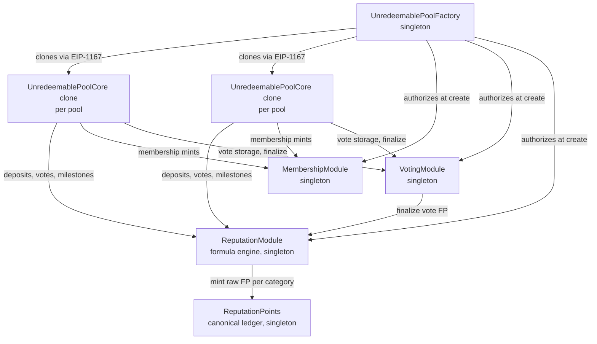
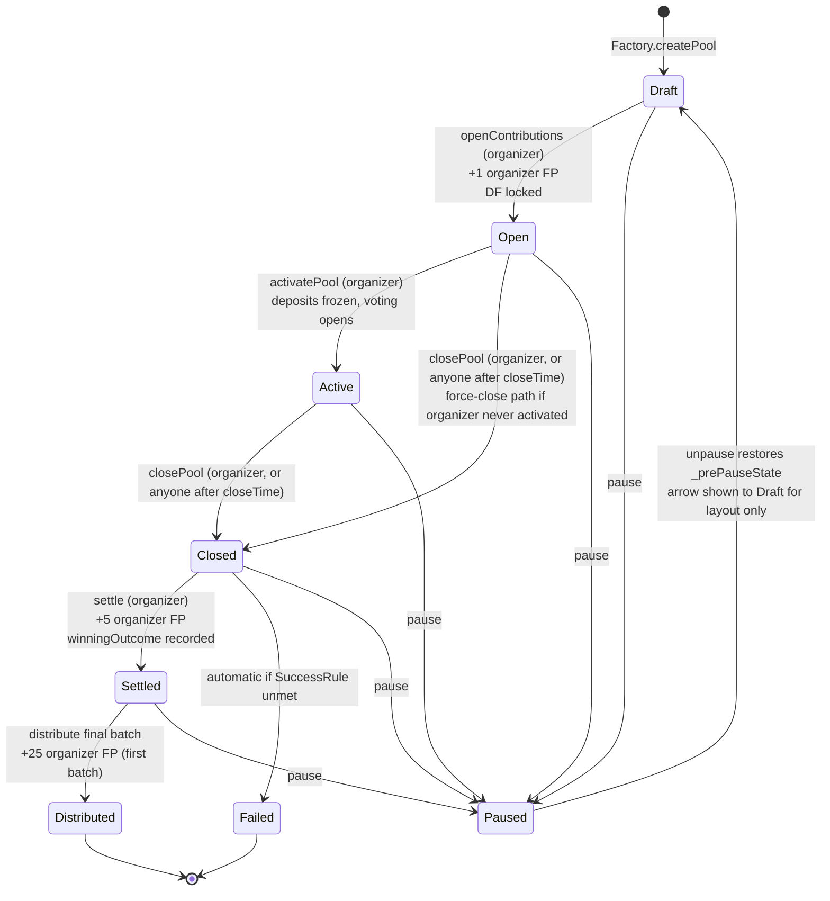
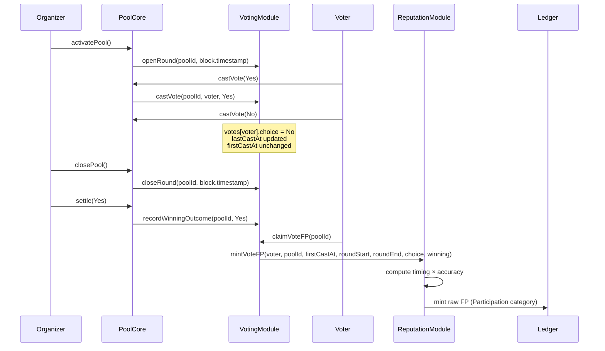
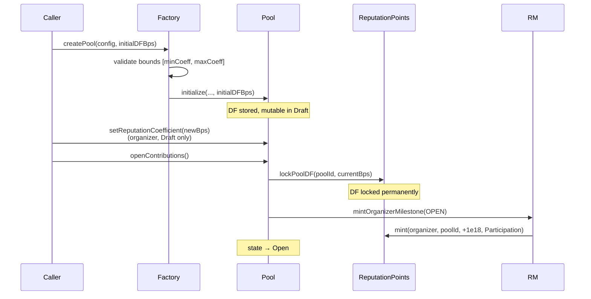
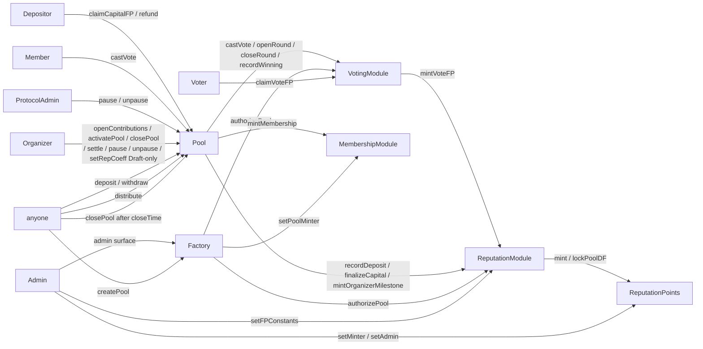

# Fish Protocol v1 — Smart Contracts Design

**Date:** 2026-05-18
**Status:** Spec — pending user approval before implementation
**Scope:** Full v1 protocol — Factory, Core, Membership, Voting, Reputation system. Unredeemable template.

---

## 1. Background

Fish Network is a reputation-based capital coordination system. Two halves:

- **Fish Pools** — structured environments for capital formation and execution.
- **Fish Points (FP)** — a non-transferable reputation system, computed as `FP_total = (FP_capital + FP_participation) × DF`, where `DF` is a per-pool discount factor (default 1.0×).

This document and the v1 implementation cover the **unredeemable** template only. Attestation-driven financial execution is out of scope.

### Current repo state

- Eight `.sol` files exist. The build is broken: `UnredeemablePoolFactory.sol` imports interfaces that don't exist and is misnamed (the contract inside is the Core, not Factory).
- Multiple type duplications (`SuccessRule` declared twice, two divergent `ReputationConfig` structs).
- No Factory contract exists despite the file claiming to be one.
- No Voting contract.
- `ReputationModule` doesn't implement the documented formulas (timing buckets, accuracy bonus, organizer milestones, day-divisor for capital).
- No `Settled`/`Distributed` lifecycle states.
- `types/UnredeemablePoolTypes.sol` has no SPDX header or pragma.
- No tests, no toolchain (per user preference — none will be added).

### Goals

1. Replace the half-implemented scaffold with a coherent v1 protocol.
2. Implement every documented behaviour: lifecycle through `Distributed`, time-held capital FP, timing/accuracy voting FP, organizer milestones, idempotency.
3. Introduce a **Discount Factor (DF)** as a per-pool multiplier, default 1.0× so doc examples stay unchanged.
4. Keep contract files lean — extract every shared type/interface/helper into its own file.
5. Update README + Fish Points docs to reflect DF and the implemented model.

### Non-goals (v1)

- Organizer-driven capital release for off-chain financial execution.
- Multi-proposal voting (single binary outcome per pool only).
- 2-step admin handoff, timelocks, on-chain multi-sig.
- Rolling 180-day score (view-layer concern, off-chain).
- FP burning / penalties (positive-only system per docs).
- Tests in this repo (no toolchain).

---

## 2. Design decisions (locked)

| # | Decision | Locked |
|---|---|---|
| 1 | Topology: cloned `PoolCore` instances + singleton modules (Membership / Voting / Reputation / ReputationPoints / Factory). | ✓ |
| 2 | Pool fires organizer FP **directly** to ReputationModule, not via Factory. Factory holds only anti-gaming bookkeeping. | ✓ |
| 3 | Voting model: single binary `Outcome { Yes, No }` per pool, vote updatable in `Active`, only final choice counts. | ✓ |
| 4 | Lifecycle: `Draft → Open → Active → Closed → Settled → Distributed`, branch `Closed → Failed`, orthogonal `Paused`. Open ≠ Active (deposits in Open, voting in Active, no overlap). | ✓ |
| 5 | Settlement = organizer-attested outcome + pro-rata on-chain distribution. | ✓ |
| 6 | FP_capital tracked per-deposit snapshot, finalized on withdraw / settle / refund (lazy claim on settle). | ✓ |
| 7 | Vote timing uses `firstCastAt` (early engagement wins; revoting doesn't shift the bucket). | ✓ |
| 8 | Discount Factor (DF) per-pool, set during `Draft`, immutable from `Open` onward. | ✓ |
| 9 | Storage is RAW: `capitalPoints` and `participationPoints` store pre-DF values; `effectiveTotal` cached as DF-scaled aggregate. Per-pool invariant: `poolTotal = (poolCap + poolPart) × DF`. | ✓ |
| 10 | LP units (deposit receipts) are non-transferable for v1 (legal positioning). | ✓ |
| 11 | Anti-gaming: cooldown applies at **Open**, not Draft. Paused pools count toward active limit. | ✓ |
| 12 | Modules each hold an immutable `factory` reference. Admin owns global settings; Factory owns per-pool registration. | ✓ |
| 13 | Organizer can vote in their own pool (intentional, not a bug). | ✓ |
| 14 | Libraries vendored (no OpenZeppelin / no npm). Pure `.sol` files only. | ✓ |
| 15 | Aggressive extraction: types, enums, interfaces, helpers all live in their own files. Contract files contain only contracts + errors. | ✓ |
| 16 | Documentation updates for DF + new model. README rewritten with mermaid diagrams. | ✓ |
| 17 | Commits in this repo never carry `Co-Authored-By:` trailers. | ✓ |

---

## 3. System architecture

### Contract topology



### Singletons

| Contract | Singleton? | Purpose |
|---|---|---|
| `UnredeemablePoolFactory` | ✓ | Deploy pool clones, enforce anti-gaming, authorize new pools on modules |
| `MembershipModule` | ✓ | Pool-scoped membership NFTs (verification signal) |
| `VotingModule` | ✓ | Per-pool vote registry + finalize trigger |
| `ReputationModule` | ✓ | All FP issuance arithmetic (capital, vote, organizer milestone) |
| `ReputationPoints` | ✓ | Mint-only, wallet-bound, non-transferable ledger; stores per-pool DF |
| `UnredeemablePoolCore` | ✗ | One EIP-1167 minimal-clone per pool |

---

## 4. Lifecycle state machine



Note: `Paused` is orthogonal. The arrow back to `Draft` is a diagram limitation — `unpause()` actually restores whichever state was current when `pause()` was called (stored in `_prePauseState`). Pause is not allowed from terminal states (`Distributed`, `Failed`).

### Allowed actions per state

| State | deposit | withdraw | vote | distribute | refund | claimVoteFP | claimCapFP |
|---|---|---|---|---|---|---|---|
| Draft | ✗ | ✗ | ✗ | ✗ | ✗ | ✗ | ✗ |
| Open | ✓ | ✓ | ✗ | ✗ | ✗ | ✗ | ✗ |
| Active | ✗ | ✓ | ✓ | ✗ | ✗ | ✗ | ✗ |
| Closed | ✗ | ✗ | ✗ | ✗ | ✗ | ✗ | ✗ |
| Settled | ✗ | ✗ | ✗ | ✓ | ✗ | ✓ | ✓ |
| Distributed | ✗ | ✗ | ✗ | ✗ | ✗ | ✓ | ✓ |
| Failed | ✗ | ✗ | ✗ | ✗ | ✓ | ✓ | ✗* |
| Paused | ✗ | ✗ | ✗ | ✗ | ✗ | ✗ | ✗ |

\* In `Failed`, FP_capital finalizes on `refund()` rather than via a separate claim.

### Transition triggers

| From → To | Trigger | Who | Side-effects |
|---|---|---|---|
| Draft → Open | `openContributions()` | organizer | Factory.registerPoolOpen (cooldown + max-active checks); ReputationPoints.lockPoolDF; ReputationModule.mintOrganizerMilestone(OPEN) |
| Open → Active | `activatePool()` | organizer | freeze deposits; VotingModule.openRound; record `activeStartTime` |
| Open → Closed | `closePool()` | organizer (always), anyone (after closeTime) | force-close path when organizer never activated; evaluate SuccessRule (almost always fails → Failed) |
| Active → Closed | `closePool()` | organizer (always), anyone (after closeTime) | evaluate SuccessRule; if success → routed to Closed-success branch; if fail → Failed |
| Closed → Settled | `settle(winningOutcome)` | organizer | snapshot `poolBalanceAtSettle`, `totalSupplyAtSettle`; VotingModule.recordWinningOutcome; ReputationModule.mintOrganizerMilestone(SETTLE) |
| Settled → Distributed | `distribute(offset, count)` final batch | anyone | pro-rata payout; first money-moving batch → ReputationModule.mintOrganizerMilestone(DISTRIBUTE); Factory.registerPoolFinalized |
| Closed → Failed | inside `closePool()` if SuccessRule unmet | (automatic) | Factory.registerPoolFinalized; depositors may `refund()` |
| any → Paused | `pause()` | organizer or protocolAdmin | snapshot prev state; halts everything |
| Paused → prev | `unpause()` | organizer or protocolAdmin | restores prev state |

---

## 5. Capital flow

### Deposit (`Open` only)

1. Validate amount within `[minContribution, maxContribution]` and that `totalAssetsCommitted + amount ≤ poolCap`.
2. Auto-mint membership NFT for `receiver` if absent.
3. `SafeERC20.safeTransferFrom(caller → pool, amount)`.
4. Mint `amount` LP units to `receiver` (non-transferable).
5. Append `Deposit{amount, depositedAt: block.timestamp, finalizedAt: 0}` to `userDeposits[receiver]`.
6. Call `ReputationModule.recordDeposit(receiver, poolId, depositId, amount, depositedAt)` — stores snapshot only, no FP minted.

### Withdraw (`Open`, `Active`)

1. Owner identifies their `depositId`; require `finalizedAt == 0`.
2. Set `finalizedAt = block.timestamp`.
3. Burn LP units; `totalAssetsCommitted -= amount`.
4. `SafeERC20.safeTransfer(caller, amount)`.
5. Call `ReputationModule.finalizeCapital(...)` — mints FP_capital immediately (eager because user is on-chain anyway).

### Settle (no per-user loop)

```solidity
function settle(Outcome winningOutcome) external onlyOrganizer inState(Closed) {
    require(success, "POOL:NOT_SUCCESS");
    settledAt = uint64(block.timestamp);
    poolBalanceAtSettle = IERC20(acceptedAsset).balanceOf(address(this));
    totalSupplyAtSettle = totalSupply;
    lifecycleState = LifecycleState.Settled;
    IVotingModule(votingModule).recordWinningOutcome(poolId, winningOutcome);
    IReputationModule(reputationModule).mintOrganizerMilestone(
        organizer, poolId, OrganizerMilestone.Settle
    );
    emit PoolSettled(poolId, winningOutcome, settledAt);
}
```

Snapshot the balance and supply once at settle — distribution math then uses those frozen values, immune to any later balance drift.

### Claim FP after settle

```solidity
function claimCapitalFP(uint256 depositId) external inState(Settled) {
    // Pool delegates to ReputationModule.finalizeCapital with finalizedAt = settledAt
}
```

Idempotent via `FishKeys.capitalFin(poolId, depositId)`.

### Distribute (paginated)

```solidity
function distribute(uint256 offset, uint256 count) external inState(Settled) {
    uint256 end = offset + count;
    require(end <= depositorCount, "POOL:OOB");
    for (uint256 i = offset; i < end; i++) {
        address depositor = depositors[i];
        if (distributed[depositor]) continue;
        uint256 units = depositorUnits[depositor];
        uint256 share = (units * poolBalanceAtSettle) / totalSupplyAtSettle;
        distributed[depositor] = true;
        SafeERC20.safeTransfer(acceptedAsset, depositor, share);
    }
    // First batch that moves money fires +25 organizer FP (idempotent in RepModule)
    if (!firstDistributePinged && processedCount() > 0) {
        firstDistributePinged = true;
        IReputationModule(reputationModule).mintOrganizerMilestone(
            organizer, poolId, OrganizerMilestone.Distribute
        );
    }
    if (processedCount() == depositorCount) {
        lifecycleState = LifecycleState.Distributed;
        IUnredeemablePoolFactory(factory).registerPoolFinalized(organizer);
        emit PoolDistributed(poolId);
    }
}
```

### Refund (`Failed` only)

Pulls capital back to depositor, finalizes FP_capital with `finalizedAt = block.timestamp` of the refund. Same idempotency key as withdraw (a deposit can only be exited once).

### Invariants

- `Σ deposited − Σ withdrawn − Σ refunded − Σ distributed == acceptedAsset.balanceOf(pool)` exactly (v1, no external top-ups).
- LP units mint only on deposit, burn only on withdraw/refund; never minted at distribute.
- `Deposit.finalizedAt` transitions `0 → non-zero` exactly once.
- LP unit `transfer` / `transferFrom` / `approve` revert (non-transferable).

---

## 6. Voting flow

### State on `VotingModule`

```solidity
struct Vote { Outcome choice; uint64 firstCastAt; uint64 lastCastAt; }
struct PoolVoting {
    uint64 roundStart;
    uint64 roundEnd;
    Outcome winning;
    bool finalized;
    address[] voterList;
    mapping(address => Vote) votes;
    mapping(address => bool) inVoterList;
    mapping(address => bool) fpClaimed;
}
mapping(uint256 => PoolVoting) internal _pools;
mapping(uint256 => address) public authorizedPool;  // poolId → pool clone address
```

### Lifecycle hooks



### Timing math

```
progress_bps = (firstCastAt - roundStart) * 10_000 / (roundEnd - roundStart)
progress_bps = min(progress_bps, 10_000)

if progress_bps <= earlyEndBps  (3300)  → timingMult = earlyMultBps    (15000)
elif progress_bps < lateStartBps (8000) → timingMult = standardMultBps (10000)
else                                    → timingMult = lateMultBps     (7500)
```

### Accuracy math

```
isCorrect = winning != None
         && choice  == winning
         && progress_bps < lateStartBps     // bonus requires not-late vote

bonus = isCorrect ? accuracyBonus : 0       // 2e18

fpRaw = (baseVote + bonus) * timingMult / 10_000   // baseVote = 1e18

mint(voter, poolId, fpRaw, FPCategory.Participation)
```

### Eligibility (at `castVote`)

- Pool state is `Active`.
- `MembershipModule.hasMembership(poolId, voter)` is true.
- `MembershipModule.mintedAt(poolId, voter) <= roundStart` (joined before round opened).

---

## 7. Reputation flow + Discount Factor

### Storage on `ReputationPoints`

```solidity
mapping(address => mapping(uint256 => uint256)) public rawCapital;
mapping(address => mapping(uint256 => uint256)) public rawParticipation;
mapping(address => uint256) public sumRawCapital;
mapping(address => uint256) public sumRawParticipation;
mapping(address => uint256) public effectiveTotal;   // Σ (rawCap + rawPart)·DF / 10_000 over pools

mapping(uint256 => uint16) public poolDF;            // bps, e.g. 10_000 = 1.0×
mapping(uint256 => bool)   public poolDFLocked;

address public admin;
address public immutable factory;
mapping(address => bool) public isMinter;            // only ReputationModule
```

### Mint path (raw only)

```solidity
function mint(address user, uint256 poolId, uint256 raw, FPCategory category)
    external onlyMinter
{
    require(poolDFLocked[poolId], "RP:DF_NOT_LOCKED");
    if (raw == 0) return;

    if (category == FPCategory.Capital) {
        rawCapital[user][poolId] += raw;
        sumRawCapital[user]      += raw;
    } else {
        rawParticipation[user][poolId] += raw;
        sumRawParticipation[user]      += raw;
    }

    uint256 effDelta = (raw * poolDF[poolId]) / 10_000;
    effectiveTotal[user] += effDelta;

    emit PointsMinted(user, poolId, raw, category, effDelta, effectiveTotal[user]);
}
```

### DF lifecycle



### Invariants

- Per pool: `getPoolTotal(u,p) == (getPoolCapital(u,p) + getPoolParticipation(u,p)) × poolDF[p] / 10_000`.
- Wallet level: `getTotalPoints(u) == Σ over pools p of (rawCap(u,p) + rawPart(u,p)) × poolDF[p] / 10_000`.
- `getCapitalPoints(u) + getParticipationPoints(u) ≠ getTotalPoints(u)` in general (only equal when every participated pool has DF = 1.0×).

### Idempotency keys (in `FishKeys` library)

| Mint event | Key |
|---|---|
| Capital finalize | `keccak256("FP:capital:fin", poolId, depositId)` |
| Vote FP | `keccak256("FP:vote", poolId, user)` |
| Organizer open | `keccak256("FP:org", poolId, uint8(OrganizerMilestone.Open))` |
| Organizer settle | `keccak256("FP:org", poolId, uint8(OrganizerMilestone.Settle))` |
| Organizer distribute | `keccak256("FP:org", poolId, uint8(OrganizerMilestone.Distribute))` |

`mapping(bytes32 => bool) public executed` on `ReputationModule`. Replay returns silently (no revert).

### FP constants (governance-mutable on `ReputationModule`)

| Constant | Default | Notes |
|---|---|---|
| `baseVote` | 1e18 | Base vote FP |
| `accuracyBonus` | 2e18 | Added if vote correct + not-late |
| `earlyEndBps` | 3300 | Round bucket: 0–33% |
| `lateStartBps` | 8000 | Round bucket: 80–100% |
| `earlyMultBps` | 15000 | 1.5× |
| `standardMultBps` | 10000 | 1.0× |
| `lateMultBps` | 7500 | 0.75× |
| `organizerOpenFP` | 1e18 | +1 milestone |
| `organizerSettleFP` | 5e18 | +5 milestone |
| `organizerDistributeFP` | 25e18 | +25 milestone |
| `capitalDayDivisor` | 30 | from docs: `× days_held / 30` |
| `minCoeffBps` | 1_000 | 0.1× — DF floor at create time |
| `maxCoeffBps` | 50_000 | 5.0× — DF ceiling at create time |

Updates affect future mints only; no retroactive recompute.

---

## 8. Anti-gaming + Factory

### Storage

```solidity
mapping(uint256 => address) public poolById;
mapping(address => uint256) public poolIdByAddress;
mapping(address => uint64) public lastOpenedAt;
mapping(address => uint16) public activePoolCount;
address[] public allPools;

address public membershipModule;
address public votingModule;
address public reputationModule;
address public reputationPoints;
address public poolImplementation;

uint64 public cooldownDuration = 14 days;
uint16 public maxActivePoolsPerOrganizer = 3;
uint16 public minCoeffBps = 1_000;
uint16 public maxCoeffBps = 50_000;
uint256 public nextPoolId = 1;

address public admin;
bool public createPaused;
```

### Hooks called by pools

```solidity
function registerPoolOpen(address organizer) external;
// reverts if cooldown active or maxActive reached
// updates lastOpenedAt, increments activePoolCount

function registerPoolFinalized(address organizer) external;
// decrements activePoolCount; fires on Distributed or Failed
```

Paused pools do NOT decrement — they still occupy a slot. This prevents pause-as-bypass.

### Admin surface

```solidity
function setModules(address membership, address voting, address rep, address points, address impl) external onlyAdmin;
function setCooldownDuration(uint64 newSeconds) external onlyAdmin;
function setMaxActivePools(uint16 newMax) external onlyAdmin;
function setCoefficientBounds(uint16 minBps, uint16 maxBps) external onlyAdmin;
function setCreatePaused(bool paused) external onlyAdmin;
function transferAdmin(address newAdmin) external onlyAdmin;  // single-step (v2: 2-step)
```

Each setter affects only **future** pools; existing pools keep their snapshotted addresses.

---

## 9. Auth model

### Roles

| Contract | Roles |
|---|---|
| Factory | `admin` |
| PoolCore (clone) | `organizer`, `factory`, `protocolAdmin` (all immutable post-init) |
| MembershipModule | `admin`, `factory` (immutable), `isPoolMinter[address]` |
| VotingModule | `admin`, `factory` (immutable), `authorizedPool[poolId]` |
| ReputationModule | `admin`, `factory` (immutable), `authorizedPool[poolId]` |
| ReputationPoints | `admin`, `factory` (immutable), `isMinter[address]` (only RepMod) |

### Permission matrix



### Cross-cutting plumbing

When the Factory creates a pool, it atomically calls four authorization functions on the modules. Each module trusts the Factory exclusively for per-pool registration; admin handles global settings separately.

### Admin separation

Each contract has its **own** `admin` address — they are not linked. `Factory.admin`, `MembershipModule.admin`, `VotingModule.admin`, `ReputationModule.admin`, and `ReputationPoints.admin` are five independent slots. The deployer typically sets all five to the same Safe / multisig at deploy time, but they can diverge if governance wants role separation. Each `admin` can rotate itself via its own contract's `setAdmin` / `transferAdmin` and cannot touch any other contract's admin.

---

## 10. File layout (target state)

```
contracts/
  UnredeemablePoolFactory.sol
  UnredeemablePoolCore.sol
  MembershipModule.sol
  voting/
    VotingModule.sol
  reputation/
    ReputationModule.sol
    ReputationPoints.sol
  interfaces/
    IUnredeemablePoolFactory.sol
    IUnredeemablePoolCore.sol
    IMembershipModule.sol
    IVotingModule.sol
    IReputationModule.sol
    IReputationPoints.sol
    IERC20.sol
    IERC20Metadata.sol
  types/
    PoolLifecycle.sol       (enum LifecycleState, enum SuccessRule)
    PoolConfig.sol          (struct UnredeemablePoolConfig, struct UnredeemableModuleSet)
    Voting.sol              (enum Outcome, struct Vote)
    Reputation.sol          (enum FPCategory, enum OrganizerMilestone, struct FPConstants)
    Deposit.sol             (struct Deposit)
  libraries/
    MinimalClones.sol       (kept as-is)
    SafeERC20.sol           (vendored)
    ReentrancyGuard.sol     (vendored)
    FishMath.sol            (applyBps, daysBetween, timingBucket, clampToBps)
    FishKeys.sol            (idempotency-key derivations)

[deleted: contracts/interfaces/IContributionModule.sol]
```

### Lean-contract rule

Every `.sol` file under `contracts/` (excluding `interfaces/`, `types/`, `libraries/`) contains:
- imports
- custom `error` declarations
- exactly one contract

No inline structs, enums, interfaces, or libraries.

### License header (every file)

```solidity
// SPDX-License-Identifier: Apache-2.0
pragma solidity ^0.8.24;
```

---

## 11. Cleanup of existing files

| File | Action | Reason |
|---|---|---|
| `contracts/UnredeemablePoolFactory.sol` | Split + rewrite | Misnamed (contains Core). Broken imports. |
| `contracts/MembershipModule.sol` | Patch | Add `mintedAt`, `factory` immutable, swap `owner` model for `admin + factory`. |
| `contracts/types/UnredeemablePoolTypes.sol` | Replace with `types/*.sol` | No SPDX, duplicates, mixed concerns. |
| `contracts/reputation/ReputationModule.sol` | Rewrite | Logic doesn't match docs. New formula model + idempotency. |
| `contracts/reputation/ReputationPoints.sol` | Rewrite | New raw + effective storage model; per-pool DF. |
| `contracts/libraries/MinimalClones.sol` | Keep | Correct as-is. |
| `contracts/interfaces/IUnredeemablePoolCore.sol` | Rewrite | Signature mismatch with implementation. |
| `contracts/interfaces/IMembershipModule.sol` | Patch | Add `mintedAt`, `factory`. |
| `contracts/interfaces/IReputationModule.sol` | Rewrite | New surface. |
| `contracts/interfaces/IReputationPoints.sol` | Rewrite | New surface. |
| `contracts/interfaces/IContributionModule.sol` | Delete | Unused phantom. |

### Cross-file consistency rules

1. No type or interface declared in two places.
2. No inline interfaces / structs / enums / libraries in contract files.
3. Every `.sol` starts with `// SPDX-License-Identifier: Apache-2.0` + `pragma solidity ^0.8.24`.
4. Constructor / initialize signatures match their interfaces verbatim.
5. One canonical `SuccessRule` and `LifecycleState`, in `types/PoolLifecycle.sol`.

---

## 12. Documentation updates

### `README.md` — full rewrite

Currently two lines. Replace with a detailed developer-facing README structured around mermaid diagrams.

Sections:
1. What this is (one paragraph).
2. Quick links to other docs.
3. System architecture (mermaid contract topology).
4. Pool lifecycle (mermaid state diagram).
5. FP issuance flow (mermaid sequence: deposit → withdraw → settle → claim).
6. Voting flow (mermaid sequence).
7. Discount factor (DF) — formula + bounds + immutability.
8. Repository layout (tree).
9. Build / use (Remix snippet — no toolchain).
10. Contracts at a glance (one-line per contract).
11. Roles & permissions (mermaid permission graph).
12. Anti-gaming (short prose).
13. License / contributing.

### `Points.md`

- Add a **Discount Factor (DF)** section before the Core Concept block.
- Update the formula box: `FP_total = (FP_capital + FP_participation) × DF` with `DF = 1.0` default.
- Note DF is set per-pool, mutable in `Draft`, immutable from `Open`, bounded `[0.1×, 5.0×]`.

### `FishPointsOverview.md`

Short paragraph near "Core Model" referencing DF and pointing to `Points.md`.

### `DeveloperDocs.md`

- Document new getters: `getCapitalPoints`, `getParticipationPoints`, `getTotalPoints`, `getPoolTotal`.
- Clarify raw vs effective semantics.
- Add `poolDF` to "Stability Guarantees".
- Update idempotency key examples to match `FishKeys` derivations.

### `PointsExamples.md`

Add Example 11 — same setup as Example 8, but with DF = 0.5×. Demonstrates how DF scales total without changing raw capital/participation.

### `Poolsreadme.md`

- Clarify `Open ≠ Active`: Open is deposits-only; Active is voting-only with deposits frozen.
- Add note about pro-rata distribution paginated via `distribute(offset, count)`.

### New deep-dive docs in `contracts/`

These three live in `contracts/` (next to the code they describe) so the top-level `README.md` stays a high-level overview rather than a 2000-line reference. README links to them.

#### `contracts/TestPlan.md`

Manual verification checklist (we have no in-repo toolchain). Sections:

- **Setup** — Recommended environments: Remix for one-off checks, local Foundry / Hardhat clone of the repo's `.sol` files for repeatable runs.
- **Per-contract smoke tests** — Constructor sanity, role gating, basic getters work.
- **Lifecycle happy path** — Draft → Open → Active → Closed → Settled → Distributed with deposits, votes, claims, and pro-rata payout. Expected FP for each participant at each step.
- **Failed pool path** — SuccessRule unmet → Failed → refund flow → FP_capital materializes on refund.
- **Force-close path** — Organizer abandons in Open after closeTime; anyone calls closePool; pool routes to Failed.
- **Pause/unpause** — From each non-terminal state; verify `_prePauseState` restores correctly.
- **Anti-gaming** — 14-day cooldown rejection; max-3-active rejection; paused pool still counts.
- **DF behavior** — Three pools with DF = 0.5×, 1.0×, 2.0×; verify per-pool and wallet-level totals match Section 7 invariants. DF lock at Open is irreversible.
- **Idempotency** — Every key in the table cannot double-mint; replayed calls return silently.
- **Capital math** — Per-deposit time-held tracking: deposit at t0, withdraw at t0+15d → 50% of base FP. Multiple deposits from same wallet accumulate independently.
- **Voting math** — Early correct, early incorrect, late correct, late incorrect, revote-then-correct — all five buckets from `PointsExamples.md`.
- **Invariants** — Acceptance criteria from Section 13 spot-checked manually after each scenario.
- **Negative tests** — Unauthorized calls revert with the correct error; wrong-state actions revert; ERC20 transfer failures bubble up.

#### `contracts/statemachine.md`

Deep dive on the lifecycle. Sections:

- Expanded mermaid state diagram (more detail than the README version).
- Each transition: trigger function, caller, preconditions, side-effects, events emitted, idempotency keys touched.
- Pause semantics: orthogonal mode, `_prePauseState` snapshot, terminal-state immunity.
- Force-close path from Open and Active when closeTime has elapsed.
- Why Open ≠ Active (deposits vs voting separation — kills late-deposit-for-early-vote-bonus race).
- Failed branch and its FP implications (participation FP yes, accuracy bonus no, capital FP on refund).
- Settle → Distribute payment math snapshot reasoning.
- Anti-patterns: things that look like valid transitions but aren't.

#### `contracts/storagelayout.md`

Per-contract storage layout reference. Sections:

- One subsection per contract: slot-by-slot layout, packing reasoning, gas cost notes.
- Immutable vs storage variables called out explicitly.
- Mapping key composition rules (`mapping(address => mapping(uint256 => ...))`).
- Clone vs implementation distinction: clones share implementation code but each has its own storage; immutables baked at clone time vs at implementation time.
- DF and idempotency-key storage on `ReputationPoints` / `ReputationModule`.
- Upgrade considerations: once a clone is deployed, its storage layout is frozen. Future v2 cannot reuse slot positions if they want to upgrade in place.

These three are static reference docs — they describe the design as implemented, not the design process. They get committed alongside the contracts in the same phase as the README rewrite.

---

## 13. Acceptance criteria

A reviewer should be able to verify the following without writing tests:

1. Every `.sol` file under `contracts/` has SPDX + pragma 0.8.24.
2. Every shared type / interface / helper lives in its own file under `types/`, `interfaces/`, or `libraries/`. No contract file contains an inline `struct`, `enum`, `interface`, or `library`.
3. No type / enum is declared more than once across the repo.
4. Every interface's function signatures match the corresponding implementation byte-for-byte.
5. The state diagram in Section 4 corresponds 1:1 with `LifecycleState` transitions in `UnredeemablePoolCore.sol`.
6. Every FP mint passes through `ReputationPoints.mint(user, poolId, raw, category)` — no other mint path exists.
7. Every FP mint event has an idempotency key derived via `FishKeys`.
8. `poolDF` cannot be modified after `lockPoolDF` is called (function reverts; no setter exists for locked pools).
9. The DF default of `10_000` in pool creation produces FP values identical to the doc's pre-DF examples.
10. README contains at least five mermaid diagrams covering topology, lifecycle, FP flow, voting, and permissions.
11. `contracts/TestPlan.md`, `contracts/statemachine.md`, and `contracts/storagelayout.md` exist and cover the topics listed in Section 12.

---

## 14. Risks & known v2 candidates

| Risk | Status | v2 plan |
|---|---|---|
| Single-step admin transfer | Accepted | 2-step ownership |
| No on-chain organizer Sybil prevention | Accepted | KYC / attestation layer |
| Pool implementation immutable per clone | Accepted | Upgrade pattern when needed |
| `Failed` pools grant `FP_capital` based on time-to-refund | Per docs | Reassess if it incentivizes bad pools |
| Gas cost of `distribute` for huge pools | Mitigated by pagination | None |
| `getTotalPoints` aggregation cached only on mint | Acceptable (DF immutable) | None |
| No organizer-driven release / return of capital for off-chain execution | Out of scope | Not addressed in v1 |

---

## 15. Implementation phasing

Implementation will be planned in the writing-plans skill output. For reference, suggested ordering:

1. **Types + libraries** (`types/*`, `libraries/FishMath.sol`, `libraries/FishKeys.sol`, `libraries/SafeERC20.sol`, `libraries/ReentrancyGuard.sol`).
2. **Interfaces** (all 8 interface files).
3. **ReputationPoints** (storage rewrite, raw + effective + DF).
4. **ReputationModule** (formula engine, idempotency).
5. **MembershipModule** (patch: `mintedAt`, `factory` immutable).
6. **VotingModule** (new).
7. **UnredeemablePoolCore** (lifecycle, capital, integration with all modules).
8. **UnredeemablePoolFactory** (clone deployment, anti-gaming, module wiring).
9. **Documentation** (Points.md, FishPointsOverview.md, DeveloperDocs.md, PointsExamples.md, Poolsreadme.md).
10. **README rewrite** with mermaid diagrams.
11. **New deep-dive docs** in `contracts/`: `TestPlan.md`, `statemachine.md`, `storagelayout.md`.
12. **Delete** obsolete files (`IContributionModule.sol`, old `UnredeemablePoolTypes.sol` after extraction).

Each phase is independently reviewable. No phase requires changes to a prior phase except where a later phase reveals an interface gap.

---

## 16. Out-of-scope reference

Items deliberately deferred:

- Tests (no toolchain in repo).
- Deploy scripts / addresses.
- Subgraph / indexer code.
- Frontend integrations.
- Multi-proposal voting.
- 180-day rolling score view.
- FP burning / slashing.
- Cross-chain considerations.
